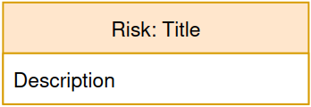
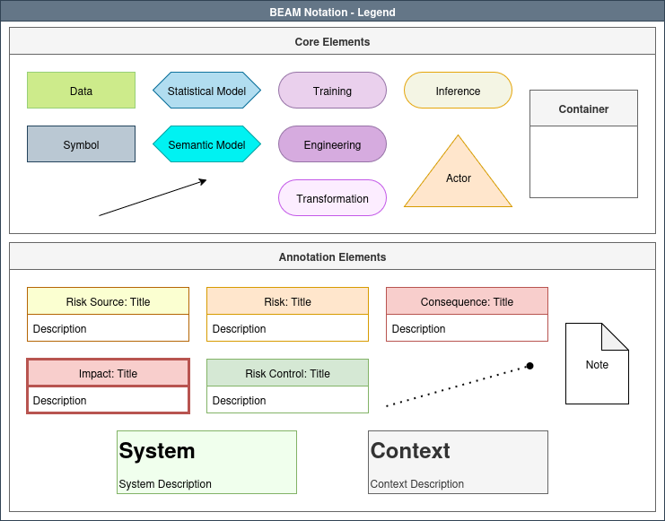
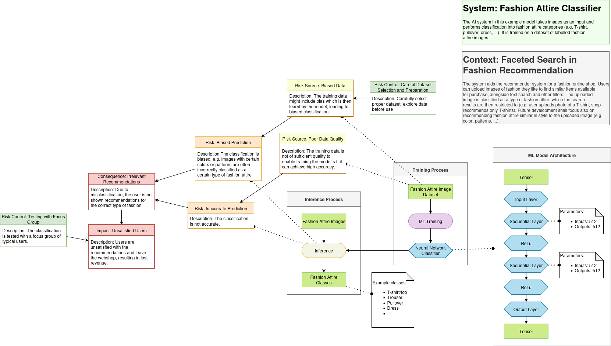

# BEAM Visual Notation - User Manual

_Author: Alexander Prock_  
_Contact: alexander.prock[at]wu.ac.at_

This documentation revolves around the visual notation of the _Boxology Extensive Annotation Model (BEAM)_. It extends the boxology presented by [van Bekkum and colleagues](#van_bekkum).
BEAM extends the boxology in two ways:

1. with elements to capture engineering-relevant information to enable the use of BEAM during AI system design and development
2. with elements to add a risk and mitigation perspective

In this document, the current version of the BEAM notation is described for the user perspective. It is based on a more extensive technical documentation of a previous version of BEAM (before semantic versioning was used), originally written by Bernhard Kollmann alongside his [master thesis](https://semantic-systems.org/wp-content/uploads/2024/11/Kollmann.pdf).

A prototype of the BEAM notation was developed as a library for the diagramming tool [draw.io](draw.io).

## BEAM Core Elements

The core elements in the table below can be used to represent the building blocks of (hybrid) AI systems.
The connection between elements can be represented using the workflow connector (black arrow).

| Name | Purpose | Shape | Example | In draw.io |
|---|---|---|---|---|
| `Data` | any form of non-symbolic data flowing through the system | green rectancle | textual data, images  |  |
| `Symbol` | any form of symbolic resource | grey rectangle | knowledge graphs, taxonomies      |  |
| `Statistical Model` | machine learning model | blue hexagon | neural network |  |
| `Semantic Model` | semantic/symbolic model | turquoise hexagon | ontology, rule-learner |  |
| `Training` | training process of a (ML) model | purple rounded rectangle | gradient descent, backpropagation |  |
| `Engineering` | engineering process, often by human actor | dark purple rounded rectangle | construction of an ontology by a knowledge engineer |  |
| `Inference` | inference process using a model | light orange rounded rectangle | classification using an ML model or ontology reasoning  |  |
| `Transformation` | any kind of process in which data/symbols are transformed without generating new knowledge | pink rounded rectangle            | data cleaning, data augmentation       |  |
| `Actor` | any actor in the system, not necessarily human | orange rectangle | user, engineer |   |
| `Container` | logical grouping of elements, e.g. to denote a subsystem or a complex process | white box with grey title box | sytem, subsystem, complex process |  |
| `Workflow Connector` | (i) connection between core elements to indicate the workflow, (ii) between elements within the risk perspective | directed solid black arrow | data/symbolic input/output, usage of a model, interaction of actor, between Risk Source and Risk, Risk and Consequence, Consequence and Impact or Risk Control and any of the other elements of the risk perspective |  |

## BEAM Annotation Elements

In addition to the functional building blocks represented by the core elements, various annotations can be attached to systems represented in BEAM, as well as their components.

| Name | Purpose | Shape | Example | In draw.io |
|---|---|---|---|---|
| `Annotation Connector` | attachment of annotation elements to system elements | dotted arrow with round arrowhead | any connection of an annotation element to a core element |  |
| `Risk` | risk associated with the system, its components or environment | white box with orange title area and textual description | inaccurate prediction, privacy violation |  |
| `Risk Source` | risk source represented with the system, its components or environment | white box with yellow title area and textual description | poor data quality, malicious behavior |  |
| `Consequence` | consequence of a risk in case it materializes | white box with red title area and textual description | offensive behavior of language model |  |
| `Impact` | effects of a consequence on specific stakeholders | white box with red title area, thick border and textual description | discrimination against certain groups, monetary loss, damage to reputation |  |
| `Risk Control` | risk controls and risk mitigation strategies | white box with green title area and textual description  | training data selection process, any measure to mitigate risk |  |
| `Note` | arbitrary comments | white box with folded corner | any free-text comment |  |
| `System Description` | textual representation of the depicted system as a whole | light-green text box with heading | What does the system do? What are the goals/capabilities/limitations? What is the scope? |  |
| `Context Description` | textual representation of the context the depicted system is operated in | light-grey text box with heading | Which use cases does the system have? Who uses it? In which organization? |  |

## Legend and Example 

The legend provided by the BEAM library includes all elements:

An example AI system represented in BEAM notation (for a more thorough explanation of this example, see the instructions PDF file):

## draw.io - How-To

### Loading the BEAM Library

> 1. In the toolbar: File
> 2. Open Library from
> 3. In case the library was downloaded, select "Device"
> 4. Select XML File to load

### Layers

In draw.io, elements and edges can be assigned to different layers. 
This feature provides great flexibility, e.g. the system architecture and data flow can be on one layer, and risks and mitigation strategies can be on another.
The visibility of layers can be toggled separately, which enables showing different perspectives of the same model.
The layer toolbox can be activated via View > Layers, see below.

In the layer toolbox, layers can be added, edited and removed, as well as reordered.

To assign one or more elements and connectors to a layer, first select them and then click the three-dots-menu to select the layer to assign them to.

### Properties Used

The properties of an element can be viewed and edited in draw.io's right sidebar in the `Style` tab after selecting the element.
Elements provided by the library (and its legend) have sensible default values for these properties.
For representing simple AI systems, the properties of its elements might not even need to be altered.

| Name | Description |
|---|---|
| `Tree Folding`    | For Workflow Elements to extend/collapse attached details |
| `Ignore Edge`     | To indicate if an arrow shall be hidden in case of tree folding |
| `Container`       | Allows to place other elements within the container and to display or hide them |
| `Collapsible`     | Allows to collapse/unfold elements. Is automatically activated when an element receives the container property |

#### Tree Folding

It is often required to fit additional information in the diagram to have different granularities. For different use cases/views it should also be possible to hide this additional information, e.g. for a high-level overview.

draw.io provides the **Tree Folding** property on elements for this. Elements that have this property receive a small minus/plus icon to hide/show attached details. 
When the minus icon is clicked, the outgoing connectors (arrows) will be checked. For each of the connectors, the property **Ignore Edge** is checked. Should the connector have Ignore Edge set to True, the target element will be ignored for the folding and remain visible. Should Ignore Edge be set to False, the target element will be considered as a part of the source element and hidden after clicking the minus icon.

Note: Unfortunately, draw.io does not support tree folding for annotation details directly attached
to container elements (which have the property Collapsible).

Tree Folding property in draw.io:

Example of an elmement in folded and unfolded form:

#### Ignore Edge

The ignore edge property in draw.io essentially tells the connection that it should not listen to signals from other elements, such as the tree folding property. Thus, it is relevant in the diagram to distinguish between connections of the workflow, comments, and non workflow elements attached to other elements. Additionally, one distinction to the property ***collapsible*** is to be made. Foldable trees extend the elements folded beyond the borders of the tree element.

Ignore Edge property in draw.io:

#### Container

Containers in draw.io can be used to place other elements in the container element. On top of a visual assignment, the elements placed within a container are also considered as child nodes of the container and thus will be hidden if the container is collapsed.

Container property in draw.io:

#### Collapsible

A collapsible element allows an element to be collapsed or expanded using the + or - symbol provided when the collapsible element is set to true in the top left corner (corresponding to the current state). Furthermore, the collapsible property is a mandatory property of the ***container*** property. Consequently, once the container property is set to true, the collapsible property is automatically set to true. It can be manually unchecked afterwards if desired.

Collapsible property in draw.io:

### Attaching Details to Elements 

In some cases, attaching textual annotations may not be sufficient for describing necessary details. Therefore, the option to attach further information to an element is proposed. This option allows arbitrary information to be attached to any element. For example, if required, the structure of a neural network could be displayed in a container, which in turn could be attached as further information to a ML Model element. Furthermore, this option can be used "recursively" on elements, e.g. sticking with the neural network example, each hidden layer could also have a list of settings attached (see the fashion attire example model). It is important to note that the mapping of this kind of annotation to the semantic representation of BEAM is limited.
