# Extended Boxology

This documentation revolves around extending the Boxology V2 presented by [Van Bekkum and colleagues](#van_bekkum). The need to do so arises from drawbacks found in literature for many commonly used diagram types. 

The lack of options option to append arbitrary annotations, not having enough elements to represent the actual process of an ML System in the required level of granulirity, or providing different views for different stakeholder are a some points of critique found in literature for not representing ML Systems realistic enough [[2]](#koenigstorfer22), [[3]](#micheli23). Contrary, flexible formats often face problems like ambiguity, and high cost of learning a new diagram in a new context [[4]](#koukovini14).

The extended version of Boxology aims to address these issues. With the above mentioned problems in mind, the extension focuses on the following requirements:

- Transparency
- A balance between Flexibility and Low Cost of Learning
- Scalability
- Modularity
- Granularity
- Usability for further conversions, reproducibility, and querying

To complete the tasks, the system will be tested in <span style="colour:orange"> Draw.io [[5]](#drawio) </span>. Consequently, the tutorial that follows in the next few paragraphs is based on working in Draw.io. However, as this document is about suggesting extensions to the existing annotation, the suggestions can also be used in other diagram editing tools. However, the Python extraction & structuring script in this repository is also set up to work with exported Draw.io XML files and probably won't work with other XML structures.

## Content

1. [TLDR](#tldr)
2. [Introduction](#intro)
3. [Draw.io - Howto](#howto)
4. [Overview - Boxology V2](#overv_box)
5. [New Elements introduced](#new_elem)
6. [Properties Used](#props_used)
7. [Attaching Details to Elements](#attach_details)
8. [Diagram Requirements](#dia_req)
    1. [Mandatory Requirements](#mand_req)
    2. [Requirements for Custom Elements](#cust_req)
9. [MR Output](#mr_out)
10. [Settings](#settings)
11. [Other Extension](#other_ext)
12. [References](#refs)
13. [XML of the default elemnts](#xml_def_elem)


## TLDR <a name="tldr"></a>

This section summarises the main points. However, as many details are omitted, please refer to the full explanation in the relevant chapter if anything is unclear. Furthermore, the description is written from the perspective of the default settings. Given the flexibility envisaged, many rules can be adapted to suit various needs. More details on changing the settings can be found in the [Settings](#Settings).

### Default Elements from Boxology V2:

|Name|Purpose|In Draw.io|
|--|--|--|
|`Rectangle`|Data or Symbol||
|`Hexagon`|ML Model||
|`Triangle`|Actor||
|`Processing`|Processing Task like Data Preparation|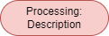|
|`Connectors`|Connectors between workflow elements||
|`Grey container `|ML System or component of ML System||

### Additional Elements Proposed

|Name|Purpose|In Draw.io|
|--|--|--|
|`List/Enumeration `|Attaching textual information to an elemnt||
|`Note`|Comments|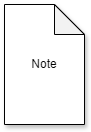|
|`Textbox`|Project Description / Other extensive text descriptions|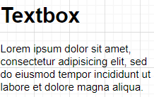|
|`ML Component`|Structures in a detail annotation (For example, if the structure of a CNN is to be attached as a detail to a ML Model)||
|`Symbol`|Symbols (to distinguish between data and symbols)||
|`Connectors (Directed Arrows) with the property "ignore edge: True"`|Connection between workflow elements||
|`Connectors in light blue without the property "ignore edge: True" or "ignore edge: False"`|Connection  from element to detail|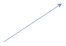|
|`Dotted Connector`|A connection that is not relevant to the workflow and is not a direct detail of an element, but is associated with the linked element. (e.g., for attaching notes)|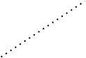|

### Other changes:

- The default boxology uses short textual description for some elements, such as `model:semantic` for a ml model elemnt. For the proposed notation of this work, the distinctions between elements originates from other elements introduced in the mandatory requirements following shortly.
- The label can be any arbitrary text and does not require a prefix (But it can also be kept and used by convention)

### Properties Used

|Name|Description|
|--|--|
|`Foldable Tree`|For Workflow Elements to extend/collapse attached details|
|`Ignore Edge`|To indicate a workflow or detail connection|
|`Container`|Allows to place other elements within the container and to display or hide them|
|`Collapsible`|Allows to collapse/unfold elements. Is automatically activated when an element receives the container property|
|`Sensitive`|Flag to set for an element to indicate that sensitive information is used at this step of the workflow|
|`Custom Properties`|For properties not covered by the standard Draw.io properties (assginable via selecting the element -> edit -> edit data)|


### Mandatory Requirements

- **A legend**
    - A container 
    - Gray Fill colour + white text (<span style="color:#647687 ">fillColor=#647687</span>; <span style="color:#FFFFFF">fontColor=#FFFFFF</span>)
    - Custom property ***element: legend***
    - Has to have every other element with name (label), right shape, and the custom property ***element: {{element_name}}*** in it
    - Must not be in another container
    - Must not have any connectors (wil be ignored)

- **Features used to distinguish between elements**:
    - Colour (Hex code without opacity or gradient colour)
    - Shape (Style of the element)
    - Custom property with the key ***element***

- **Connectors**
    - At least one workflow is to be displayed
    - If attachement of details is used - workflow connectors have to be distinguishable by setting the ***ignore edge*** property of the connector to ***True***

- **Elements in or outside of a (system container)**
    - Important to distinguish between workflows and other associated information
    - Everything within a system container (apart from comments & texts) is considered part of this particular system (or system component)
    - Everything outside without any connection to a container will be considered general information and thus can not be associated with elements in the container or the container itself (again execpt comments & text connected with a dotted line)


### Custom or Additional Elements

- Have to be added to the legend
- The same element must not be used to describe multiple purposes (i.e., per default settings, the very same element can not be used to have different purposes in the diagram)

### Using the Python Implementation

- Export the diagram as XML
- Can either used the ***main*** function directly by providing the absolute path to the XML exported, or used via the CLI tool
- If required, the settings in the ***config.yaml*** can be adapted, or the options provided by the cli can be used

**------------------------------ End of TLDR -----------------------------------**

## Introduction

As briefly illustrated in the abstract, the extension aims to address unmet needs identified in the literature and by a real use case. Furthermore, the Python implementation provides an output file in the background, which is similar to a simple structured JSON file. The purpose of the JSON file is to provide a gateway for further analysis and processing. For example, as a machine-readable format, the data structure it contains can be easily read and converted to other formats as required, and as a serialised format it can be sent to most APIs. In addition, once read, the data itself can be queried using simple means.

As for the choice of Draw.io, apart from general requirements such as intuitive use, a free (and ideally open source) diagramming tool that is well known and provides features such as the ability to extend shapes, load custom shapes if required, allow the manipulation of existing shapes, as well as the ability to save and load pre-defined shapes and templates is required. An additional key requirement is the ability to save and load the diagram in a machine-readable format for further processing.

While for using the notation, Draw.io is no necessity, the Python implementation found in this repository is tailored to work with Draw.io XML files (or more specifically, the mxGraph notation [[6]](#mxgraph). Thus, first the new notation will be presented. Subsequently, starting with the introduction of the newly proposed elements, each aspect of the process will be shown in form of brief examples. More practically speaking, apart from the general elaboration, the ...

- Functioning in Draw.io
- Snippet of the exported XML file

will be elaborated, if considered advantageous for comprehension.


## Draw.io - Howto ... <a name="howto"></a>

This section provides a short, general overview of how the different settings and techniques used in the following sections work.

### Acticate Additional Editing/Visualization Tools

> 1. In the toolbar: View

### Loading a Custom Library of Shapes

> 1. In the toolbar: File
> 2. Load Library
> 3. Select XML File to load

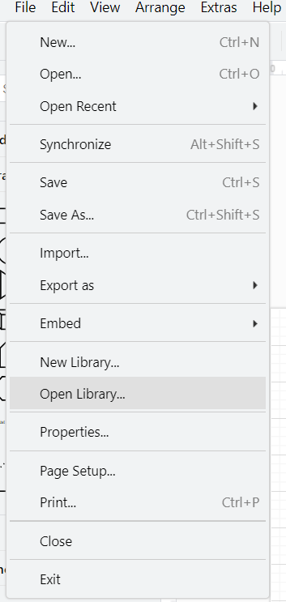

### Assign Colour

> a.
> 1. Select Element
> 2. In the menu on the right: Fill with the according colour (Background patterns ignored by the code )


> b.
>
> 1. Select Element
> 2. Right Click
> 3. Select "Edit Style"
> 4. Assign "fillColor=" the according hex colour

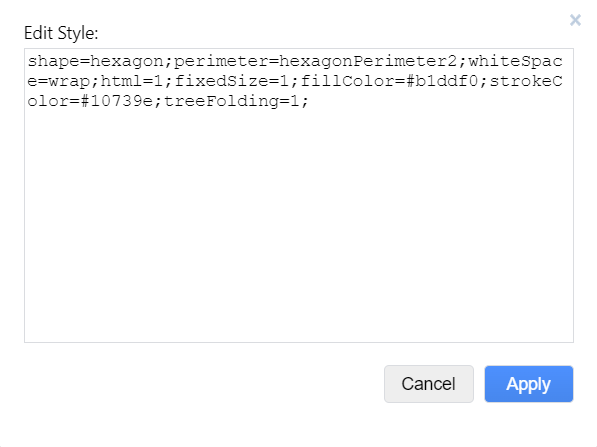


### Select Default Properties for an Element

> a.
>
> 1. Select Element
> 2. In the menu on the right: Click **"Property"**

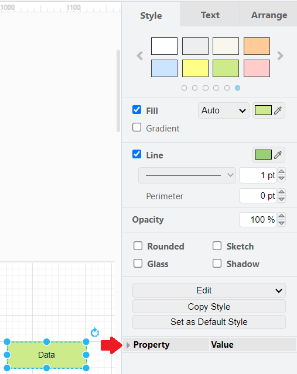

> b.
>
> 1. Select Element
> 2. Right Click
> 3. Select "Edit Style"
> 4. Assign the required parameters with the according value


### Assign Custom Properties 

> a.
>
> 1. Select Element
> 2. Right Click
> 3. Select "Edit Data"
> 4. Assign the required custom properties

> b.
>
> 1. Select Element
> 2. Keyboard Shortcut: ctrl + M


## Overview - Boxology V2 <a name="overv_box"></a>

This section summarizes the elements of the boxology V2 by [Van Bekkum and colleagues](#van_bekkum). Each description of an element features an example image, a short description, all proerties disginguishing it from other elements (i.e., colour, shape and the custom identification property called "Element property"), as well as other default properties commonly associated with the element.

Example of the elements of boxology V2 containing all elements:

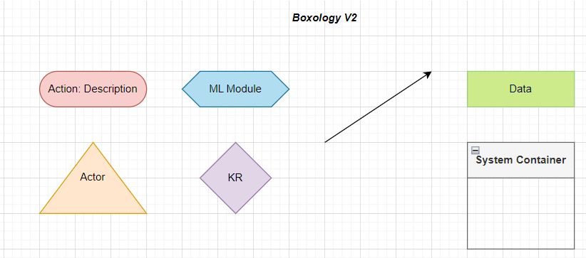

Example of a use case using the original boxology notation

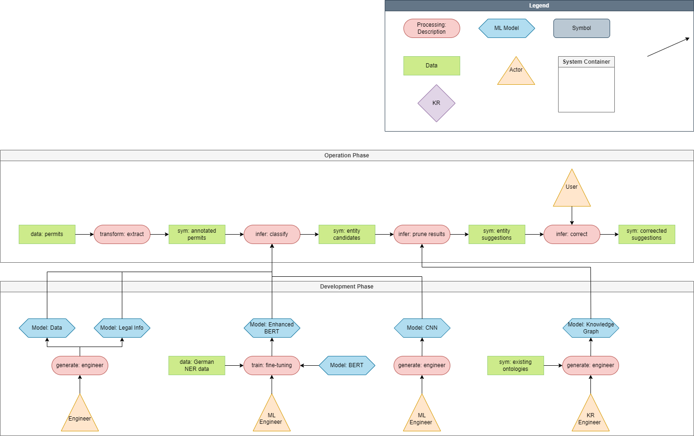

### ML Model


The Machine Learning (ML) Module represents any Machine Learning component implemented. In a real life application, this element for instance can be used to denominate a Neural Network or Random Forest. 

> Colour: <span style="color:#B1DDF0"> #B1DDF0 </span>
>
> Shape: <span style="shape:hexagon"> hexagon </span>
>
> Element property: ml_module

Default properties:

- statisticalModel
- version
- evaluationMetrics
- parameter
- mlTasks

### Actor


Describes any actor in the system. Said actor does not necessarily have to be human.

> Colour: <span style="color:#ffe6cc"> Orange - #ffe6cc</span>
>
> Shape: Triangle
>
> Element property: actor

Default properties:

- name
- organisation

### Data


The data or symbol element represents any form of data or information flowing through the system. Since both symbols and data can be represented with this element, it does not matter too much whether the designated characters are actually symbolic, sub-symbolic or non-symbolic.

> Colour: <span style="color:#cdeb8b"> #cdeb8b </span>
>
> Shape: Rectangle without rounded corners (rounded=0 in the XML file)
>
> Element property: data

Default properties:

- license
- version
- type: Literal =
  - structured
  - semi-structured
  - unstructered
- format: Literal = 
  - Json
  - Csv
  - Xml
  - Tiff
- downloadURL
- format

### Processing


Describes an processing action performed. The process is not tied to an actor and can, for example, be performed automatically by a script or ML component. The Boxology notation usually consists of the verb of the process and the context or description, separated by a colon. Some examples would be: `infer:deduce`.

> Colour: <span style="color:#f8cecc"> #f8cecc </span>
>
> Shape: Stadium (rounded=1 in the XML file)
>
> Element property: Process

Default properties:

- actionType: Literal =
  - Infernece
  - Training
  - Enigneering: Literal =
    - DataPreparation
    - DataAnalysis
    - DataCleaning
    - DataMovement
    - DataRetrieval
    - DataVisualization
- timestamp

### Knowledeg Resource

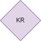

A knowledge resource describes a form of specified and established information source, like an ontology or thesaurus.

> Colour: <span style="color:"> </span>
>
> Shape: Rhombus
>
> Element property: kr

### System Container 


The container element is used to show which elements belong to the same system or system component. For scalability purposes, a diagram may consist of multiple system components, with directed arrows representing the workflow between these components. Also, for readability, this element has been changed from the original all grey background to a grey filled headline box with a transparent background.

> Colour: <span style="color:#f5f5f5"> Grey - #f5f5f5 </span>
>
> Shape: Swimlane
>
> Element property: system

Default properties:

- task
- domain
- organisation
- team
- risks


### (Directed) Workflow Connection


Shows the order of the workflow. Looking at the representation in the XML file, it should be noted that the classic arrow has hardly any distinguishing features. The main indication is the difference of the node and the style of the representation. It is also intended to allow the diagram to expand and hide certain information. For example, to keep the workflow connection visible at all times, the connector property ***Ignore Edge*** has to be set to `True`

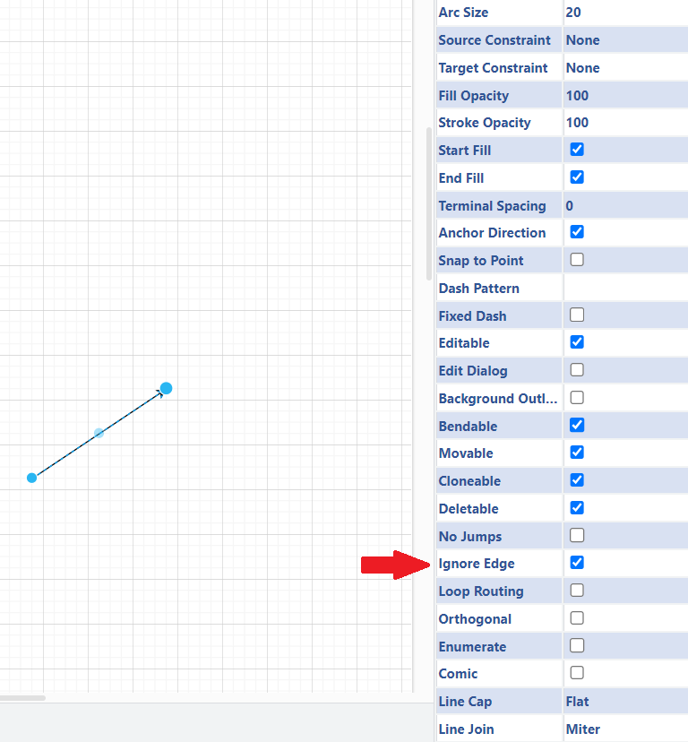

The differnces are depicted in the following example:

```xml
<!-- A XML node of a data element (could be replaced by any other element which is not a connector)-->
<object label="data 1" element="data" id="id">
    <mxCell style="rounded=0;whiteSpace=wrap;html=1;fillColor=#cdeb8b;strokeColor=#36393d;" parent="parent id" vertex="1">
        <mxGeometry x="40" y="200" width="110" height="40" as="geometry" />
    </mxCell>
</object>

<!-- The XML representation of a connector-->
<mxCell id="id" value="" style="endArrow=classic;html=1;rounded=0;" parent="parent id" source="source id" target="target id" edge="1">
    <mxGeometry width="50" height="50" relative="1" as="geometry">
    <mxPoint x="630" y="350" as="sourcePoint" />
    <mxPoint x="680" y="300" as="targetPoint" />
    </mxGeometry>
</mxCell>
```

Connectors can however easily be identified by checking for the source and target properties in the mxCell node,as well as the mxPoint nodes.

> Colour: <span style="color:"> --- </span>
>
> Shape: Arrow (endArrow=classic as sytel information in XML file)
>
> Element property: workflow_connector


## New Elements Proposed <a name="new_elem"></a>

This section covers the elements that will act as extensions to better meet the needs identified. As new elements introduce new behaviour in the diagrams created, a more detailed description will be provided if said elements are anticipated in unituitive scenarios. Furthermore, for elements that are similar to the original boxology, the differences will be illustrated. 

In addition to new elements, some new behavioural features are also planned. In particular, the need for more granularity has led to the proposal of new extensions to the workflow. Namely, the following extensions would be introduced:

- The ability to attach new element(s) that are not part of the workflow, to attach (arbitrary) information to a workflow element.
- The option to post annotations and other comments via notes and textboxes
-  The ability to fold/collapse and unfold/expand elements (the visual aspect is for either using Draw.io directly, or using an embedded version of Draw.io in other applications such as Confluence (REFERENCE HERE)to present a diagram. The information, whether visible or not, is still stored in the background)
- New types of connectors to visually distinguish between the different information streams
- An abstract element to represent different "sub-components" of ML Models


Examples of all elements:

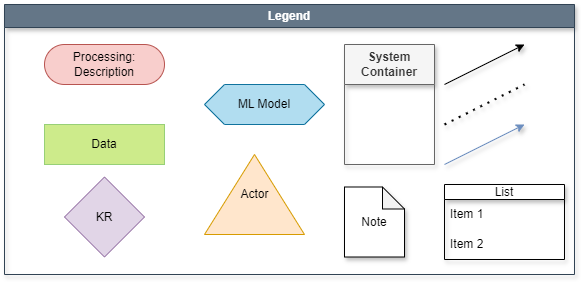

Exmple of an element with further informative elements attached:

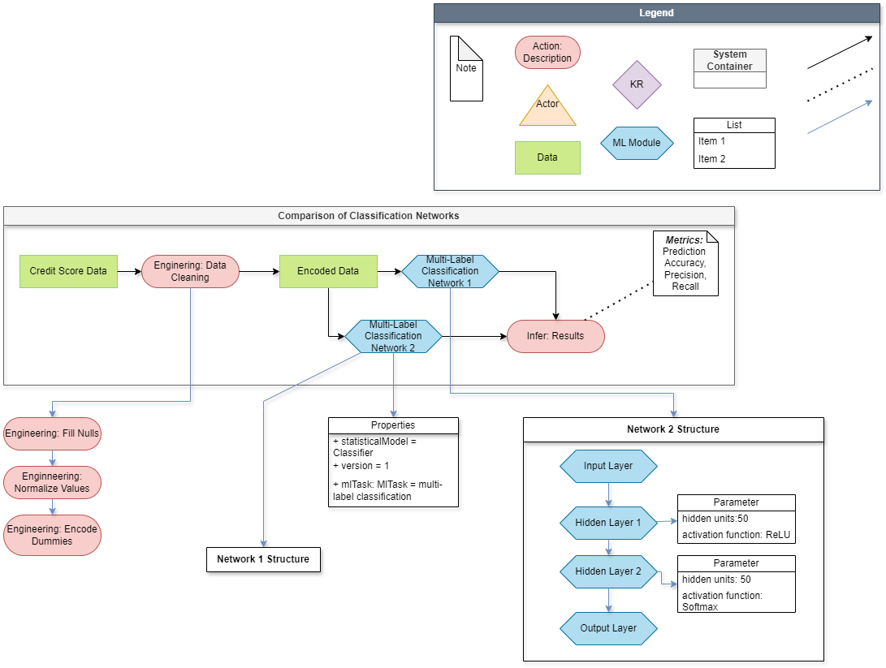

## Elements

### Note


The note shape can be used to attach arbitrary comments to any element other than connectors. Per se, there is no maximum length of chars for the comment, but strings exceeding the shape width will be hidden. To attach more descriptive texts, the [Text Shape](#text_shape) has been introduced as part of the extended notation as well. To connect a comment, the [dotted connector](#dot_con) is used.

> Colour: <span style="color:"> --- </span>
>
> Shape: note
>
> Element property: note

### Textbox


Similarly to the note, a textbox allows to attach arbitrary strings. Unlike to the note, it is designed to contain more information usually features a heading. However, likewise to the comment, it is connected to other elements via the  [dotted connector](#dot_con).

> Colour: <span style="color:"> --- </span>
>
> Shape: text
>
> Element property: textbox

### Dotted Connector <a name="dot_con"></a>


The dotted connector is used to indicate that some form of comment or other strictly textual information is attached to an element. The purpose of the separate connector in this case is twofold. Firstly, it is a visual aid to help understand diagrams more quickly. Secondly, the connector is used in a similar way to comments in code. Any attached note or text box is ignored by the code, and is only not checked in terms of upstream or downstream workflow, and if it is part of an element extension to another element.  

Another detail worth mentioning is the arrowhead. While the dotted connector does not have an arrowhead by default, it still has a source and a target in the background. Finally, note that Draw.io does not have a *"dotted"* representation in the background. The dotted pattern comes from the two style parameters ***dashed=1*** and the ***dashPattern***.

mxCell showing how the dotted connector is represented in the XML format:

```xml
<!-- Despite the style format of endArrow=none, the connection between the elements is still managed via a source and target property -->
<mxCell id="id" value="" style="endArrow=none;dashed=1;html=1;dashPattern=1;rounded=0;startArrow=classic;startFill=0;" parent="parent id" source="source element id" target="target element id" edge="1">
    <mxGeometry width="50" height="50" relative="1" as="geometry">
    <mxPoint x="33" y="518" as="sourcePoint" />
    <mxPoint x="670" y="120" as="targetPoint" />
</mxGeometry>
```

> Colour: <span style="color:"> --- </span>
>
> Shape: Dashed Arrow (endArrow=none;dashed=1;html=1;dashPattern=1 in XML file)
>
> Element property: dotted_con

The differences between the normal connector and the dotted connector:

|Characteristic|Normal Connector|Dotted Connector|
|--|--|--|
|Directed (by default)|Yes|No|
|Distinctive style params|No|dashed, dashPattern, startArrow|

<!-- ### ML Component


The ML Component acts as a kind of "umbrella" element that can be used to name any component of an ML Model that needs to be highlighted individually (rather than the whole system). For example, this element can be used to represent hidden layers with properties if the structure of the neural network is to be attached to the ML Model element in the workflow.   -->


<!-- > Colour: <span style="color:#fff2cc">Yellow -  #fff2cc </span>
>
> Shape: parallelogram
>
> Element property: ml_component -->

### List


The List element does exactly what its name suggests. It helps to list facts and other aspects of another element when the information is needed. The most common use during testing was to attach metadata and hyperparameters of ML Models to the respective elements.

 One special characteristic is to be annotated: The list is per se not designed to act as a dictionary containing a key value-pair. This mechanic would have to be adopted by convention, for example with a common seperator between information key and value (e.g. ":" or "="). While this separator is not relevant for the notation or the code, it will most likely help when the data is to be queried for specific aspects the element which is described by said information.

> Colour: <span style="color:#"> --- </span>
>
> Shape: swimlane
>
> Element property: list

<!-- ### Symbol


The symbols primary purpose is to help distinguish further between different types of data available and thus helps to be more specific in the diagram.

> Colour: <span style="color:#bac8d3"> Dark Blue - #bac8d3</span>
>
> Shape: Rectangle (rounded=1 in XML file)
>
> Element property: symbol -->

### Information Attachement Connector

This type of connector is used to point to further information and other details attached to the source element of the connector. The connector is distinguishable by its <span style="color:#dae8fc"> light blue color </span>. However, to allow for more granularity and scalability, it is envisioned to allow the "main element" to display/hide its information. Thus, it is important for this type of connector that the connector-property ***Ignore Edge*** is set to `False`.   

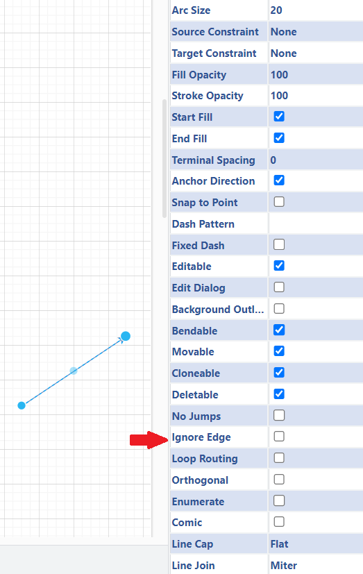

> Colour: <span style="color:#dae8fc"> Light Blue - #dae8fc</span>
>
> Shape: Arrow  (endArrow=classic in XML file)
>
> Element property: info_con


## Properties Used <a name="props_used"></a>

This section covers all the properties used in Draw.io to distinguish elements more effectively, create a more interactive diagram, or to further increase scalability.

### Tree Folding

 To cater the requirement of granularity, it often is required to fit additional information in the diagram. Thus, the scripts are distinguishing between elements with the **foldable tree** property set **True** and the elements which do not have this property at assigned as all (Apparently, there is no scenario where a "foldable tree: False" occurs). Should an element have this property and the value is True (to be safe), the outgoing connectors (arrows) will be checked (i.e., the connectors having the element ID as source). For each connector, the property **ignore edges** is searched. Should said property be found in the style information ("ignoreEdge=1"), the target element will be ignored. Should said property not be found however, the target element is considred as a part of the source element. After finding such an element, the source elment will receive the attribute **"is_parent_node: True"**, and the child node the complementary attributes  **"is_child_node: True"**, as well as  **"parent_node: {ID of Parent Node}"**.

This distinction will be relevant for the output file, as it allows to provide an array of all child nodes, as well as each easily searchable child nodes. The Tree Folding parameter is used to assign other "sub-elements" to one element. Said "sub-elements" can then be folded or unfolded by presssing the top right **+** (folded form) or **-** (unfolded form) button.

Example containig both cases 

```xml
<!-- Machine learning component acting as source element for multiple other elements -->
<mxCell id="v8YKDCOuNpq5yinIDZXA-1" value="ML 1" style="shape=hexagon;perimeter=hexagonPerimeter2;whiteSpace=wrap;html=1;fixedSize=1;treeFolding=1;fillColor=#dae8fc;strokeColor=#6c8ebf;" vertex="1" parent="c_aptXmKF2BzEkDTGsZr-70">
  <mxGeometry x="350" y="190" width="120" height="60" as="geometry" />
</mxCell>

<!-- Element called "Symbol" being the next element of the workflow-->
</mxCell>
<object label="Symbol" placeholders="1" output_type="categorical" needs_mapping="False" charset="UTF8" id="c_aptXmKF2BzEkDTGsZr-35">
  <mxCell style="rounded=1;whiteSpace=wrap;html=1;fillColor=#bac8d3;strokeColor=#23445d;" parent="c_aptXmKF2BzEkDTGsZr-70" vertex="1">
    <mxGeometry x="550" y="200" width="120" height="40" as="geometry" />
</mxCell>

<!-- The connector between the ML component and the symbol element -->
<mxCell id="c_aptXmKF2BzEkDTGsZr-36" value="" 
  style="endArrow=classic;html=1;rounded=0;ignoreEdge=1;" 
  parent="c_aptXmKF2BzEkDTGsZr-70" 
  source="v8YKDCOuNpq5yinIDZXA-1" 
  target="c_aptXmKF2BzEkDTGsZr-35" 
  edge="1">
  <mxGeometry width="50" height="50" relative="1" as="geometry">
    <mxPoint x="500" y="370" as="sourcePoint" />
    <mxPoint x="550" y="320" as="targetPoint" />
  </mxGeometry> <!-- Please not the in the style "ignoreEdge=1" property -->
</mxCell>

<!-- Contrary, here is a connector having the ML component as source, but no "ignoreEdge=1" as part of the style property-->
<mxCell id="c_aptXmKF2BzEkDTGsZr-26" value="" style="endArrow=classic;html=1;rounded=0;" parent="c_aptXmKF2BzEkDTGsZr-70" source="v8YKDCOuNpq5yinIDZXA-1" target="c_aptXmKF2BzEkDTGsZr-25" edge="1">
  <mxGeometry width="50" height="50" relative="1" as="geometry">
    <mxPoint x="380" y="370" as="sourcePoint" />
    <mxPoint x="430" y="320" as="targetPoint" />
  </mxGeometry>

<!-- And here is its target, which is now considered a child node of the ML component -->
<mxCell id="c_aptXmKF2BzEkDTGsZr-25" value="ML 1 structure" style="swimlane;whiteSpace=wrap;html=1;startSize=23;fillColor=#d5e8d4;    strokeColor=#82b366;" parent="c_aptXmKF2BzEkDTGsZr-70" vertex="1">
  <mxGeometry x="550" y="270" width="370" height="200" as="geometry">
  <mxRectangle x="360" y="280" width="120" height="30" as="alternateBounds" />
  </mxGeometry>
</mxCell>

<!-- Given that this element is a container element displaying the ML structure, here are the elements assigned to the container in addition-->
<mxCell id="c_aptXmKF2BzEkDTGsZr-29" value="Input" style="rounded=0;whiteSpace=wrap;html=1;" parent="c_aptXmKF2BzEkDTGsZr-25" vertex="1">
  <mxGeometry x="20" y="78.5" width="60" height="44.5" as="geometry" />
</mxCell>

<mxCell id="c_aptXmKF2BzEkDTGsZr-27" value="HL 1" style="shape=parallelogram;perimeter=parallelogramPerimeter;whiteSpace=wrap;html=1;fixedSize=1;" parent="c_aptXmKF2BzEkDTGsZr-25" vertex="1">
  <mxGeometry x="110" y="77" width="80" height="46" as="geometry" />
</mxCell>

<mxCell id="c_aptXmKF2BzEkDTGsZr-31" value="HL 2" style="shape=parallelogram;perimeter=parallelogramPerimeter;whiteSpace=wrap;html=1;fixedSize=1;" parent="c_aptXmKF2BzEkDTGsZr-25" vertex="1">
  <mxGeometry x="200" y="75.5" width="80" height="46" as="geometry" />
</mxCell>

<mxCell id="c_aptXmKF2BzEkDTGsZr-32" value="Output" style="rounded=1;whiteSpace=wrap;html=1;" parent="c_aptXmKF2BzEkDTGsZr-25" vertex="1">
  <mxGeometry x="300" y="78.5" width="60" height="43" as="geometry" />
</mxCell>
```

Tree Folding property in Draw.io:


Example of an elmement in folded and unfolded form:


### Ignore Edge

The ignore edge property in Draw.io essentially tells the connection that it should not listen to signals from other elements, such as the tree folding property. Thus, it is relevant in the diagram to distinguish between connections of the workflow, comments, and non workflow elements attached to other elements. Additionally, one distinction to the property ***collapsible*** is to be made. Foldable trees extend the elements folded beyond the borders of the tree element.

Ignore Edge property in Draw.io:


### Container

Containers in Draw.io can be used to place other elements in the container element. On top of a visual assignment, the elements placed within a container are also considered as child nodes of the container in the XML file

Example of a container and an element in the container in the XML file:

```xml
<!-- Example of a container Element -->
<mxCell id="id-1" value="{(System)} Example - Classification Network 1" style="swimlane;whiteSpace=wrap;html=1;fillColor=#dae8fc;strokeColor=#6c8ebf;" parent="1" vertex="1">
    <mxGeometry x="-190" y="20" width="1240" height="670" as="geometry" />
</mxCell>

<!-- Element assigned to the container, as the parent matches the parent id of the container element-->
<object label="data 1" Element="data" id="id-2">
    <mxCell style="rounded=0;whiteSpace=wrap;html=1;fillColor=#cdeb8b;strokeColor=#36393d;" parent="id-1" vertex="1">
        <mxGeometry x="40" y="200" width="110" height="40" as="geometry" />
    </mxCell>
</object>
```

Container property in Draw.io:


### Collapsible

A collapsible element allows an element to be collapsed or expanded using the + or - symbol provided when the collapsible element is set to true in the top left corner (corresponding to the current state). Furthermore, the collapsible property is a mandatory property of the ***container*** property. Consequently, once the container property is set to true, the collapsible property is automatically set to true. It can be manually unchecked afterwards if desired.

Collapsible property in Draw.io:


### Custom Properties

So far, all the properties presented are part of the standard Draw.io implementation. However, in some cases it may be more advantageous to attach multiple properties to the same element, rather than having to attach each detail via a separate connection. Therefore, the extension also offers custom properties as an extension. Custom properties have several advantages. Firstly, a property is assigned directly to an element, and as such does not need to be established in the background via connecting ids. Second, it is only visible when you hover over the element in a Draw.io application, while its content is always available in the background. As a result, this is another way to save space, alongside folding and collapsing. Third, as a property, the property name can be used as a key to directly search the stored values, rather than having to split strings in other instances, as with the style property. 

Assigning custom properties in Draw.io:

1.


2.


3. 

Select Element & ctrl + m


### Sensitive

Sensitive is a custom property designed to indicate whether sensitve information is used by the element. 


## Attaching Details to Elements <a name="attach_details"></a>

In some cases, assigning custom properties may still not be enough to display some information accurately. Therefore, the option to attach further information to an element is proposed. This option allows arbitrary information to be attached to any element. For example, if required, the structure of a neural network could be displayed in a container, which in turn could be attached as further information to a machine learning module. Furthermore, this option can be used "recursively" on elements. Elements that are already part of an information can therefore have elements attached to them. Sticking with the neural network example, each hidden layer could also have a list of settings attached. 

One detail to note about this attachment strategy is validation. When the information is extracted in the background, only the connection between the workflow element and its attached element(s) is checked. However, any information attached to elements already attached to the workflow element is not checked for validity. The rationale behind this decision is not to limit the options of the diagram creator. For example, the attachment of the neural network structure can be shown in its own sub-process. However, in order not to confuse the connections used in that sub-process, a new type of connector would have to be implemented. It is probably almost impossible to cover every conceivable case. As a result, the design decision was made against full testing. This leaves the disadvantage of not addressing the challenges of standardisation. However, as flexibility has been prioritised, standardisation will unfortunately have to be established by convention of diagram designers.

<!-- 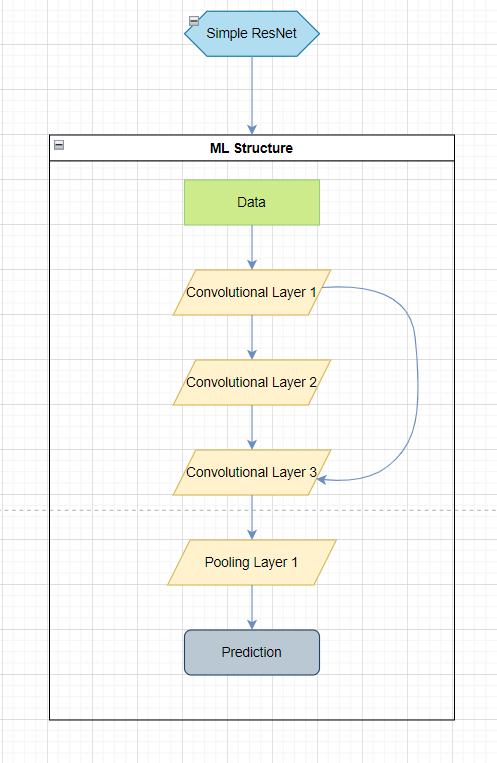 -->

### Other changes

In addition to the differences just mentioned, there are a few other minor changes in the design choices. Firstly, with the introduction of additional distinctive elements, the prefixes of the original boxology would become obsolete. For example, the `data` prefix to each data/symbol element would no longer be necessary, as symbols now have their own distinctive element. However, to be as compatible as possible with the original notation, the elements can still be labelled with a prefix. 

For the proposed extension, the label has no effect on recognising the element in the code (if the file comes from Draw.io). However, one caveat should be noted. With the introduction of the symbol element, any element distinguished with the prefix `symbol` from the original documentation would be recognised as a data element in the background. 

Furthermore, for some properties, only a pre-defined selection of possible options is envisioned. These elements are marked by using the UML style adaptation of enumerations: Thus, the type is added (seperated via colon) and the options are attached to the element containing the property via a list.

Example of an ML Model with default properties and a property having literals as options:

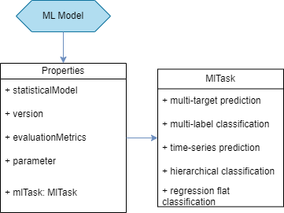

## Requirements of the Diagram

This section covers all the elements mandatory to implement, as well as the rules to adhere to to use SemSys in the default setting. If any described scenario is designed to be adaptable in the settings, it will be indicated by highlighting the `default settings`.

### Mandatory Requirements


#### Legend

The legend is a crucial element to include in the diagram. The legend defines the purpose of each shape. Therefore, each shape used must be defined once in the legend. If multiple instances of the same shape occur, the meaning of the shape with the ID with the highest sequential number is used. Conversely, if any shape is not listed in the legend, an error will be raised (this is particularly important for compound/grouped shapes, as each shape in the compound must be labeled separately). Per `default settings`, the legend **does not allow to change the shapes of the original boxology!**

Each diagram must feature a legend. It is also important to note that, by default, the legend must obey several special rules. First, the legend must not be located in a container or part of another system component. The program is designed to search for the (general) legend as the first task after the element tree has been constructed. While it is possible to mark the legend as such, even if it is inside a container, the shapes the legend describes would be understood as elements of the system the legend is part of, without any way of distinguishing them from actual system components. Furthermore, in future development, it might be necessary to assign different meanings to the same shape in the same overall system. Although the first drawback just described still applies, it would still be easier to assign a general meaning to a shape and "overwrite" this meaning if necessary.

As for letting the legend be recognized as such, the property **"element: legend"** should be assigned to the container. Additionally, the container is supposed to have the colour <span style="color:#647687"> grey for the container heading (fillColor=#647687)</span> and  white for the font colour (fontColor=#FFFFFF). One optional addition for quick comprehension would be to label the container as **"legend"**. However, the system will only look at the labels of all containers at the "top-level" if the first two requirements were not met. In this case, a warning is going to be raised. Finally, each shape stored in the legend should be labeled with the desired name of the component, as the label will be used to create the keys of the output file in the `default settings`.


#### Element recognition

Per `default settings`, each element must posess the following distinctive characteristics:

1. The shape assigned in the legend
2. The colour, if any colour is set in the legend
3. The property "element" with the according shape label
4. The property "sensitive" with ***True*** or ***False*** set

#### Connections between elements

The flow of boxology needs to be marked in some way. Draw.io offers the simple solution of drawing arrows. The important aspect here is the source and the target to which the arrow points. These two points are represented in the XML file in the form of properties with the IDs of the source and target as values. They are also used by SemSys to draw "inferences" on the diagram. These conclusions are relevant for two scenarios in particular. Firstly, the flow of the system structure can be displayed and queried by following the "chain of ids". If not, the second scenario seems to be the case. This second scenario would be that the arrows are a connection to more elements that are part of a ***foldable tree***, which will be explained in the next paragraph.

Example of an output XML file

```xml
<mxCell id="..." value="" style="endArrow=classic;html=1;rounded=0;" 
  parent="..." 
  source="c_aptXmKF2BzEkDTGsZr-41" 
  target="c_aptXmKF2BzEkDTGsZr-45" edge="1"> <!-- Example of source and target properties-->
  <mxGeometry width="50" height="50" relative="1" as="geometry">
    <mxPoint x="440" y="490" as="sourcePoint" />
    <mxPoint x="490" y="440" as="targetPoint" />
    </mxGeometry>
</mxCell>
```

### Requirements for Custom Elements <a name="cust_req"></a>

For the extended Boxology implementation, the focus was on keeping the mandatory requirements to a minimum. This results in an open system and the possibility to implement own elements. The Python implementation will only check for the legend, the settings (to be discussed later) if there is at least one system and at least one workflow in the system. Otherwise, the advanced box is designed to be customized as needed. New shapes can be introduced by adding them to the legend. Existing elements can also be adapted as required. For example, if a shape fulfils a different role, it would be possible to disable the default option of requiring the core elements of the original Boxology and adapt the legend as required.


## Machine Readable Output <a name="mr_out"></a>

This section aims to briefly illustrate what the code produces in the background, how that output is structured, and how it can be used. Some of the requirements introduced earlier are in preparation for the second objective of this repository, the first of which is to propose the extended notation. The second goal is to provide the content of the diagram in a machine-readable output that can be easily converted to other formats for further use (such as RDF files or to easily upload the data to databases), that allows the textual notation of the diagram to be queried, and that allows the diagram to be quickly loaded on other machines. In particular, the connections and custom properties are designed to meet the above requirements.  

To provide a brief overview of the desired target output, a small example of how the information of the diagram is converted to the desired output will be shown in the following example outputs.

1. A small example diagram (The legend and data required were omitted in the XML snippet of this example to keep the example outputs as short as possible)

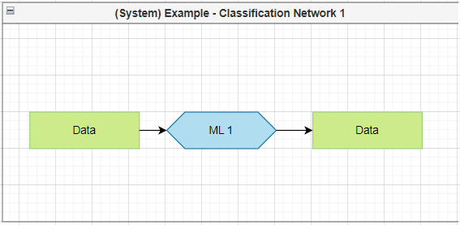

2. When exported as XML, a file following the rules of <span style="color:orange"> [mxGraph](REFERENCE HERE)  </span> will be produced. The first step of the Python script is to search for the root node(s) (Multiple root nodes are produced, if multiple pages are used).

```xml
<!-- Note: the three dots are metadata of the environment the diagram was produced in-->
<?xml version="..." encoding="UTF-8"?>
<mxfile host="Electron" modified="..." agent="..." etag="..." version="..." type="...">
  <diagram name="Page-1" id="diagram id">
    <mxGraphModel dx="2649" dy="879" grid="1" gridSize="10" guides="1" tooltips="1" connect="1" arrows="1" fold="1" page="1" pageScale="1" pageWidth="1169" pageHeight="827" math="0" shadow="0">
      <root> <!-- This is the root node searched for -->
        <mxCell id="0" />
        <mxCell id="1" parent="0" />
        <mxCell id="id_1" value="(System) Example - Classification Network 1" style="swimlane;whiteSpace=wrap;html=1;fillColor=#dae8fc;strokeColor=#6c8ebf;" vertex="1" parent="1">
          <mxGeometry x="-200" width="1240" height="640" as="geometry" />
        </mxCell>
        <mxCell id="id_2" value="ML 1" style="rounded=1;whiteSpace=wrap;html=1;container=0;collapsible=1;movableLabel=1;treeFolding=1;treeMoving=1;" vertex="1" parent="id_1">
          <mxGeometry x="350" y="200" width="120" height="40" as="geometry">
            <mxPoint x="6" y="-5" as="offset" />
          </mxGeometry>
          ...
        <!-- Until the end of the root tag is detected -->
      </root>
```

3. Once the roots are found, the subsequent step is to iterate through every node and look for the system container(s). Per page, the information contained in this system containers acts as the basis for all other elements stored in the container.

```xml
<!-- Specifically this node in this example -->
<mxCell id="id_1" value="(System) Example - Classification Network 1" style="swimlane;whiteSpace=wrap;html=1;fillColor=#dae8fc;strokeColor=#6c8ebf;" vertex="1" parent="1">
    <mxGeometry x="-200" width="1240" height="640" as="geometry" />
</mxCell>
```

> This information will be used to create the basis of the machine readable file. Per default, a JSON file will be produced. The result of this step looks approximately like:

```json
{"diagram_page_1": {
    "system_1": {
        "id": "id_2",
        "label": "(System) Example - Classification Network 1",
        "style": "swimlane;whiteSpace=wrap;html=1;...",
        "parent": "1",
        "vertex": "1",
        "x": "320",
        "y": "160",
        "width": "320",
        "height": "150",
        "as": "geometry",
        }
    }
}
```

4. Next, all child nodes and some other useful properties are attached the system container

```json
{"diagram_page_1": {
    "system_1": {
        "id": "id_2",
        "label": "(System) Example - Classification Network 1",
        "style": "swimlane;whiteSpace=wrap;html=1;...",
        "parent": "1",
        "vertex": "1",
        "x": "320",
        "y": "160",
        "width": "320",
        "height": "150",
        "as": "geometry",
        "is_parent_node": true,
        "is_child_node": false,
        "child_nodes": {
            "ml_module_1": {"id": "id_2", "value": "ML 1", "style": "..."}
            }
        }
    }
}
```

5. Once all nodes are attached and the full tree is extracted, the validation checks will be conducted. In this case, as the legend was omitted, first an Exception about the missing legend would be raised

```python
raise Exception(f'In diagram {diagram_node}, no legend was found.')
```

Assuming a legend is provided, the next step is to extract all the information stored in the legend. A temporary file containing all the information for this runtime is created. (In this case, a yaml file was chosen, as it allows to write comments)

```yaml
system:
    shape: swimlane
    fillColor: "#000000"  # The extra double quotes allow to keep the number symbol
    fontColor: "#FFFFFFF"
ml_module:
    shape: hexagon
    fillColor: "#B1DDF0"
...
```


6. Finally, all checks implemented will run. The program checks if every element adheres to the current rules in the settings, and if there is at least one system depicted.


## Setings <a name="settings"> </a>

In this section, the adjustable settings in the config file are covered. To further enhance flexibility, most of the rules presented in previous sections are adjustible in the config. The repository itself is shipped with the `default settings` kept in mind during development. Following this paragraph, a table with settings considered the most relevant to be adjusted can be found.

The `default settings`:

|Setting|Short Description|Value Type|Selectable Options|Default|
|--|--|--|--|--|
|`strict_core_boxology`|Defines if the elements presented in the original boxology are to be adhered|Boolean|True, False|True|
|`mandatory_elem_prop`|Defines if every element has to have an element property|Boolean|True, False|True|
|`mandatory_elem_colour`|Defines if every element has to stick to the colour in the legend|Boolean|TrueTrue, False||
|`mandatory_elem_shape`|Defines if the designated shape in the legend has to be the shape|Boolean|True, False|True|
|`elem_prefix`|Defines the prefixes (in a dictionary) used to create the key of an element (None uses the value of the ***element property***)|None, dict|None|


## Other Potential Extensions <a name="extensions"></a>

Here are some additional ideas potentially helpful to design the diagrams in Draw.io, which were either considered too unituitive to learn quickly. For more detailed diagrams, these options would likely by suitable alternatives. 

- Using linking of elements
- Using multiple layers to show different parts of the diagram, or even to designate layers to own types of streams (e.g., one layer which shows the workflow, one layer which focuses on the data and how it changes in the workflow, one layer to highlight actors and their activities, ...)
- Using multiple pages


## References 

[1] van Bekkum, M., de Boer, M., van Harmelen, F., Meyer-Vitali, A., & Teije, A. T. (2021). Modular design patterns for hybrid learning and reasoning systems: a taxonomy, patterns and use cases. Applied Intelligence, 51(9), 6528-6546. <a name="van_bekkum"></a>

[2] Königstorfer, F., & Thalmann, S. (2022). AI Documentation: A path to accountability. Journal of Responsible Technology, 11, 100043. <a name="koenigstorfer22"></a>

[3] Micheli, M., Hupont, I., Delipetrev, B., & Soler-Garrido, J. (2023). The landscape of data and AI documentation approaches in the European policy context. Ethics and Information Technology, 25(4), 56. <a name="micheli23"></a>

[4] Koukovini, M. N., Papagiannakopoulou, E. I., Lioudakis, G. V., Dellas, N., Kaklamani, D. I., & Venieris, I. S. (2014). An ontology‐based approach towards comprehensive workflow modelling. IET software, 8(2), 73-85. <a name="kuokovini14"></a>

[5] Draw.io (2023). JGraph Ltd. Available at: https://www.drawio.com/

[6] mxGraph (2020).  JGraph Ltd. Available at: https://jgraph.github.io/mxgraph/

## The Default Template

In the following XML file, the created default template can be copied, saved as XML File and loaded as Draw.io library (File -> Open Library).


```xml
<mxlibrary>[
  {
    "xml": "&lt;mxGraphModel&gt;&lt;root&gt;&lt;mxCell id=\"0\"/&gt;&lt;mxCell id=\"1\" parent=\"0\"/&gt;&lt;object label=\"ML Model\" element=\"MlModel\" sensitive=\"False\" id=\"2\"&gt;&lt;mxCell style=\"shape=hexagon;perimeter=hexagonPerimeter2;whiteSpace=wrap;html=1;fixedSize=1;fillColor=#b1ddf0;strokeColor=#10739e;\" vertex=\"1\" parent=\"1\"&gt;&lt;mxGeometry width=\"120\" height=\"40\" as=\"geometry\"/&gt;&lt;/mxCell&gt;&lt;/object&gt;&lt;/root&gt;&lt;/mxGraphModel&gt;",
    "w": 120,
    "h": 40,
    "aspect": "fixed",
    "title": "Ml Model"
  },
  {
    "xml": "&lt;mxGraphModel&gt;&lt;root&gt;&lt;mxCell id=\"0\"/&gt;&lt;mxCell id=\"1\" parent=\"0\"/&gt;&lt;object label=\"Processing: Description\" element=\"processing\" sensitive=\"False\" id=\"2\"&gt;&lt;mxCell style=\"rounded=1;whiteSpace=wrap;html=1;arcSize=50;fillColor=#f8cecc;strokeColor=#b85450;\" vertex=\"1\" parent=\"1\"&gt;&lt;mxGeometry width=\"120\" height=\"40\" as=\"geometry\"/&gt;&lt;/mxCell&gt;&lt;/object&gt;&lt;/root&gt;&lt;/mxGraphModel&gt;",
    "w": 120,
    "h": 40,
    "aspect": "fixed",
    "title": "Processing"
  },
  {
    "xml": "&lt;mxGraphModel&gt;&lt;root&gt;&lt;mxCell id=\"0\"/&gt;&lt;mxCell id=\"1\" parent=\"0\"/&gt;&lt;object label=\"Data\" element=\"data\" sensitive=\"False\" id=\"2\"&gt;&lt;mxCell style=\"rounded=0;whiteSpace=wrap;html=1;fillColor=#cdeb8b;strokeColor=#97D077;\" vertex=\"1\" parent=\"1\"&gt;&lt;mxGeometry width=\"120\" height=\"40\" as=\"geometry\"/&gt;&lt;/mxCell&gt;&lt;/object&gt;&lt;/root&gt;&lt;/mxGraphModel&gt;",
    "w": 120,
    "h": 40,
    "aspect": "fixed",
    "title": "Data"
  },
  {
    "xml": "&lt;mxGraphModel&gt;&lt;root&gt;&lt;mxCell id=\"0\"/&gt;&lt;mxCell id=\"1\" parent=\"0\"/&gt;&lt;object label=\"Actor\" element=\"actor\" sensitive=\"False\" id=\"2\"&gt;&lt;mxCell style=\"verticalLabelPosition=middle;verticalAlign=middle;html=1;shape=mxgraph.basic.acute_triangle;dx=0.5;labelPosition=center;align=center;fillColor=#ffe6cc;strokeColor=#d79b00;\" vertex=\"1\" parent=\"1\"&gt;&lt;mxGeometry width=\"100\" height=\"80\" as=\"geometry\"/&gt;&lt;/mxCell&gt;&lt;/object&gt;&lt;/root&gt;&lt;/mxGraphModel&gt;",
    "w": 100,
    "h": 80,
    "aspect": "fixed",
    "title": "Actor"
  },
  {
    "xml": "&lt;mxGraphModel&gt;&lt;root&gt;&lt;mxCell id=\"0\"/&gt;&lt;mxCell id=\"1\" parent=\"0\"/&gt;&lt;object label=\"System Container\" element=\"system\" sensitive=\"False\" id=\"2\"&gt;&lt;mxCell style=\"swimlane;whiteSpace=wrap;html=1;fillColor=#f5f5f5;fontColor=#333333;strokeColor=#666666;startSize=40;shadow=1;\" vertex=\"1\" parent=\"1\"&gt;&lt;mxGeometry width=\"90\" height=\"120\" as=\"geometry\"/&gt;&lt;/mxCell&gt;&lt;/object&gt;&lt;/root&gt;&lt;/mxGraphModel&gt;",
    "w": 90,
    "h": 120,
    "aspect": "fixed",
    "title": "System"
  },
  {
    "xml": "&lt;mxGraphModel&gt;&lt;root&gt;&lt;mxCell id=\"0\"/&gt;&lt;mxCell id=\"1\" parent=\"0\"/&gt;&lt;object label=\"Note\" element=\"note\" sensitive=\"False\" id=\"2\"&gt;&lt;mxCell style=\"shape=note;whiteSpace=wrap;html=1;backgroundOutline=1;darkOpacity=0.05;size=22;shadow=1;\" vertex=\"1\" parent=\"1\"&gt;&lt;mxGeometry width=\"60\" height=\"70\" as=\"geometry\"/&gt;&lt;/mxCell&gt;&lt;/object&gt;&lt;/root&gt;&lt;/mxGraphModel&gt;",
    "w": 60,
    "h": 70,
    "aspect": "fixed",
    "title": "NOte"
  },
  {
    "xml": "&lt;mxGraphModel&gt;&lt;root&gt;&lt;mxCell id=\"0\"/&gt;&lt;mxCell id=\"1\" parent=\"0\"/&gt;&lt;object label=\"\" element=\"worfklow_connector\" sensitive=\"False\" id=\"2\"&gt;&lt;mxCell style=\"endArrow=classic;html=1;rounded=0;ignoreEdge=1;shadow=1;\" edge=\"1\" parent=\"1\"&gt;&lt;mxGeometry width=\"50\" height=\"50\" relative=\"1\" as=\"geometry\"&gt;&lt;mxPoint y=\"40\" as=\"sourcePoint\"/&gt;&lt;mxPoint x=\"80\" as=\"targetPoint\"/&gt;&lt;/mxGeometry&gt;&lt;/mxCell&gt;&lt;/object&gt;&lt;/root&gt;&lt;/mxGraphModel&gt;",
    "w": 80,
    "h": 40,
    "aspect": "fixed",
    "title": "Workflow Connector"
  },
  {
    "xml": "&lt;mxGraphModel&gt;&lt;root&gt;&lt;mxCell id=\"0\"/&gt;&lt;mxCell id=\"1\" parent=\"0\"/&gt;&lt;object label=\"\" element=\"dotted_connector\" sensitive=\"False\" id=\"2\"&gt;&lt;mxCell style=\"endArrow=none;dashed=1;html=1;dashPattern=1 3;strokeWidth=2;rounded=0;shadow=1;\" edge=\"1\" parent=\"1\"&gt;&lt;mxGeometry width=\"50\" height=\"50\" relative=\"1\" as=\"geometry\"&gt;&lt;mxPoint y=\"40\" as=\"sourcePoint\"/&gt;&lt;mxPoint x=\"80\" as=\"targetPoint\"/&gt;&lt;/mxGeometry&gt;&lt;/mxCell&gt;&lt;/object&gt;&lt;/root&gt;&lt;/mxGraphModel&gt;",
    "w": 80,
    "h": 40,
    "aspect": "fixed",
    "title": "Dotted Connector"
  },
  {
    "xml": "&lt;mxGraphModel&gt;&lt;root&gt;&lt;mxCell id=\"0\"/&gt;&lt;mxCell id=\"1\" parent=\"0\"/&gt;&lt;object label=\"\" element=\"info_attach_con\" sensitive=\"False\" id=\"2\"&gt;&lt;mxCell style=\"endArrow=classic;html=1;rounded=0;strokeColor=#6c8ebf;fillColor=#dae8fc;shadow=1;\" edge=\"1\" parent=\"1\"&gt;&lt;mxGeometry width=\"50\" height=\"50\" relative=\"1\" as=\"geometry\"&gt;&lt;mxPoint y=\"40\" as=\"sourcePoint\"/&gt;&lt;mxPoint x=\"80\" as=\"targetPoint\"/&gt;&lt;/mxGeometry&gt;&lt;/mxCell&gt;&lt;/object&gt;&lt;/root&gt;&lt;/mxGraphModel&gt;",
    "w": 80,
    "h": 40,
    "aspect": "fixed",
    "title": "Information Attachement Connector"
  },
  {
    "xml": "&lt;mxGraphModel&gt;&lt;root&gt;&lt;mxCell id=\"0\"/&gt;&lt;mxCell id=\"1\" parent=\"0\"/&gt;&lt;object label=\"Legend\" element=\"legend\" sensitive=\"False\" id=\"2\"&gt;&lt;mxCell style=\"swimlane;whiteSpace=wrap;html=1;fillColor=#647687;strokeColor=#314354;fontColor=#ffffff;shadow=1;\" vertex=\"1\" parent=\"1\"&gt;&lt;mxGeometry width=\"570\" height=\"270\" as=\"geometry\"/&gt;&lt;/mxCell&gt;&lt;/object&gt;&lt;object label=\"Data\" element=\"data\" sensitive=\"False\" id=\"3\"&gt;&lt;mxCell style=\"rounded=0;whiteSpace=wrap;html=1;fillColor=#cdeb8b;strokeColor=#97D077;\" vertex=\"1\" parent=\"2\"&gt;&lt;mxGeometry x=\"40\" y=\"120\" width=\"120\" height=\"40\" as=\"geometry\"/&gt;&lt;/mxCell&gt;&lt;/object&gt;&lt;object label=\"KR\" element=\"kr\" sensitive=\"False\" id=\"4\"&gt;&lt;mxCell style=\"rhombus;whiteSpace=wrap;html=1;fillColor=#e1d5e7;strokeColor=#9673a6;\" vertex=\"1\" parent=\"2\"&gt;&lt;mxGeometry x=\"60\" y=\"172.5\" width=\"80\" height=\"80\" as=\"geometry\"/&gt;&lt;/mxCell&gt;&lt;/object&gt;&lt;object label=\"\" element=\"worfklow_connector\" sensitive=\"False\" id=\"5\"&gt;&lt;mxCell style=\"endArrow=classic;html=1;rounded=0;ignoreEdge=1;shadow=1;\" edge=\"1\" parent=\"2\"&gt;&lt;mxGeometry width=\"50\" height=\"50\" relative=\"1\" as=\"geometry\"&gt;&lt;mxPoint x=\"440\" y=\"80\" as=\"sourcePoint\"/&gt;&lt;mxPoint x=\"520\" y=\"40\" as=\"targetPoint\"/&gt;&lt;/mxGeometry&gt;&lt;/mxCell&gt;&lt;/object&gt;&lt;object label=\"System Container\" element=\"system\" sensitive=\"False\" id=\"6\"&gt;&lt;mxCell style=\"swimlane;whiteSpace=wrap;html=1;fillColor=#f5f5f5;fontColor=#333333;strokeColor=#666666;startSize=40;shadow=1;\" vertex=\"1\" parent=\"2\"&gt;&lt;mxGeometry x=\"340\" y=\"40\" width=\"90\" height=\"120\" as=\"geometry\"/&gt;&lt;/mxCell&gt;&lt;/object&gt;&lt;object label=\"List\" element=\"list\" sensitive=\"False\" id=\"7\"&gt;&lt;mxCell style=\"swimlane;fontStyle=0;childLayout=stackLayout;horizontal=1;startSize=15;horizontalStack=0;resizeParent=1;resizeParentMax=0;resizeLast=0;collapsible=1;marginBottom=0;whiteSpace=wrap;html=1;shadow=1;\" vertex=\"1\" parent=\"2\"&gt;&lt;mxGeometry x=\"440\" y=\"180\" width=\"120\" height=\"75\" as=\"geometry\"/&gt;&lt;/mxCell&gt;&lt;/object&gt;&lt;mxCell id=\"8\" value=\"Item 1\" style=\"text;strokeColor=none;fillColor=none;align=left;verticalAlign=middle;spacingLeft=4;spacingRight=4;overflow=hidden;points=[[0,0.5],[1,0.5]];portConstraint=eastwest;rotatable=0;whiteSpace=wrap;html=1;\" vertex=\"1\" parent=\"7\"&gt;&lt;mxGeometry y=\"15\" width=\"120\" height=\"30\" as=\"geometry\"/&gt;&lt;/mxCell&gt;&lt;mxCell id=\"9\" value=\"Item 2\" style=\"text;strokeColor=none;fillColor=none;align=left;verticalAlign=middle;spacingLeft=4;spacingRight=4;overflow=hidden;points=[[0,0.5],[1,0.5]];portConstraint=eastwest;rotatable=0;whiteSpace=wrap;html=1;\" vertex=\"1\" parent=\"7\"&gt;&lt;mxGeometry y=\"45\" width=\"120\" height=\"30\" as=\"geometry\"/&gt;&lt;/mxCell&gt;&lt;object label=\"Note\" element=\"note\" sensitive=\"False\" id=\"10\"&gt;&lt;mxCell style=\"shape=note;whiteSpace=wrap;html=1;backgroundOutline=1;darkOpacity=0.05;size=22;shadow=1;\" vertex=\"1\" parent=\"2\"&gt;&lt;mxGeometry x=\"340\" y=\"182.5\" width=\"60\" height=\"70\" as=\"geometry\"/&gt;&lt;/mxCell&gt;&lt;/object&gt;&lt;object label=\"\" element=\"dotted_connector\" sensitive=\"False\" id=\"11\"&gt;&lt;mxCell style=\"endArrow=none;dashed=1;html=1;dashPattern=1 3;strokeWidth=2;rounded=0;shadow=1;\" edge=\"1\" parent=\"2\"&gt;&lt;mxGeometry width=\"50\" height=\"50\" relative=\"1\" as=\"geometry\"&gt;&lt;mxPoint x=\"440\" y=\"120\" as=\"sourcePoint\"/&gt;&lt;mxPoint x=\"520\" y=\"80\" as=\"targetPoint\"/&gt;&lt;/mxGeometry&gt;&lt;/mxCell&gt;&lt;/object&gt;&lt;object label=\"\" element=\"info_attach_con\" sensitive=\"False\" id=\"12\"&gt;&lt;mxCell style=\"endArrow=classic;html=1;rounded=0;strokeColor=#6c8ebf;fillColor=#dae8fc;shadow=1;\" edge=\"1\" parent=\"2\"&gt;&lt;mxGeometry width=\"50\" height=\"50\" relative=\"1\" as=\"geometry\"&gt;&lt;mxPoint x=\"440\" y=\"160\" as=\"sourcePoint\"/&gt;&lt;mxPoint x=\"520\" y=\"120\" as=\"targetPoint\"/&gt;&lt;/mxGeometry&gt;&lt;/mxCell&gt;&lt;/object&gt;&lt;object label=\"ML Model\" element=\"MlModel\" sensitive=\"False\" id=\"13\"&gt;&lt;mxCell style=\"shape=hexagon;perimeter=hexagonPerimeter2;whiteSpace=wrap;html=1;fixedSize=1;fillColor=#b1ddf0;strokeColor=#10739e;\" vertex=\"1\" parent=\"2\"&gt;&lt;mxGeometry x=\"200\" y=\"80\" width=\"120\" height=\"40\" as=\"geometry\"/&gt;&lt;/mxCell&gt;&lt;/object&gt;&lt;object label=\"Processing: Description\" element=\"processing\" sensitive=\"False\" id=\"14\"&gt;&lt;mxCell style=\"rounded=1;whiteSpace=wrap;html=1;arcSize=50;fillColor=#f8cecc;strokeColor=#b85450;\" vertex=\"1\" parent=\"2\"&gt;&lt;mxGeometry x=\"40\" y=\"40\" width=\"120\" height=\"40\" as=\"geometry\"/&gt;&lt;/mxCell&gt;&lt;/object&gt;&lt;object label=\"Actor\" element=\"actor\" sensitive=\"False\" id=\"15\"&gt;&lt;mxCell style=\"verticalLabelPosition=middle;verticalAlign=middle;html=1;shape=mxgraph.basic.acute_triangle;dx=0.5;labelPosition=center;align=center;fillColor=#ffe6cc;strokeColor=#d79b00;\" vertex=\"1\" parent=\"2\"&gt;&lt;mxGeometry x=\"200\" y=\"150\" width=\"100\" height=\"80\" as=\"geometry\"/&gt;&lt;/mxCell&gt;&lt;/object&gt;&lt;/root&gt;&lt;/mxGraphModel&gt;",
    "w": 570,
    "h": 270,
    "aspect": "fixed",
    "title": "Legend"
  },
  {
    "xml": "&lt;mxGraphModel&gt;&lt;root&gt;&lt;mxCell id=\"0\"/&gt;&lt;mxCell id=\"1\" parent=\"0\"/&gt;&lt;object label=\"List\" element=\"list\" sensitive=\"False\" id=\"2\"&gt;&lt;mxCell style=\"swimlane;fontStyle=0;childLayout=stackLayout;horizontal=1;startSize=15;horizontalStack=0;resizeParent=1;resizeParentMax=0;resizeLast=0;collapsible=1;marginBottom=0;whiteSpace=wrap;html=1;shadow=1;\" vertex=\"1\" parent=\"1\"&gt;&lt;mxGeometry width=\"120\" height=\"75\" as=\"geometry\"/&gt;&lt;/mxCell&gt;&lt;/object&gt;&lt;mxCell id=\"3\" value=\"Item 1\" style=\"text;strokeColor=none;fillColor=none;align=left;verticalAlign=middle;spacingLeft=4;spacingRight=4;overflow=hidden;points=[[0,0.5],[1,0.5]];portConstraint=eastwest;rotatable=0;whiteSpace=wrap;html=1;\" vertex=\"1\" parent=\"2\"&gt;&lt;mxGeometry y=\"15\" width=\"120\" height=\"30\" as=\"geometry\"/&gt;&lt;/mxCell&gt;&lt;mxCell id=\"4\" value=\"Item 2\" style=\"text;strokeColor=none;fillColor=none;align=left;verticalAlign=middle;spacingLeft=4;spacingRight=4;overflow=hidden;points=[[0,0.5],[1,0.5]];portConstraint=eastwest;rotatable=0;whiteSpace=wrap;html=1;\" vertex=\"1\" parent=\"2\"&gt;&lt;mxGeometry y=\"45\" width=\"120\" height=\"30\" as=\"geometry\"/&gt;&lt;/mxCell&gt;&lt;/root&gt;&lt;/mxGraphModel&gt;",
    "w": 120,
    "h": 75,
    "aspect": "fixed",
    "title": "List"
  },
  {
    "xml": "&lt;mxGraphModel&gt;&lt;root&gt;&lt;mxCell id=\"0\"/&gt;&lt;mxCell id=\"1\" parent=\"0\"/&gt;&lt;object label=\"Data\" element=\"data\" sensitive=\"False\" id=\"2\"&gt;&lt;mxCell style=\"rounded=0;whiteSpace=wrap;html=1;fillColor=#cdeb8b;strokeColor=#97D077;treeFolding=1;\" vertex=\"1\" parent=\"1\"&gt;&lt;mxGeometry x=\"20\" width=\"120\" height=\"40\" as=\"geometry\"/&gt;&lt;/mxCell&gt;&lt;/object&gt;&lt;object label=\"\" element=\"info_attachement_connector\" sensitive=\"False\" id=\"3\"&gt;&lt;mxCell style=\"endArrow=classic;html=1;rounded=0;strokeColor=#6c8ebf;fillColor=#dae8fc;shadow=1;\" edge=\"1\" source=\"2\" target=\"4\" parent=\"1\"&gt;&lt;mxGeometry width=\"50\" height=\"50\" relative=\"1\" as=\"geometry\"&gt;&lt;mxPoint x=\"310\" y=\"170\" as=\"sourcePoint\"/&gt;&lt;mxPoint x=\"320\" y=\"80\" as=\"targetPoint\"/&gt;&lt;/mxGeometry&gt;&lt;/mxCell&gt;&lt;/object&gt;&lt;object label=\"Properties\" element=\"list\" sensitive=\"False\" id=\"4\"&gt;&lt;mxCell style=\"swimlane;fontStyle=0;childLayout=stackLayout;horizontal=1;startSize=20;horizontalStack=0;resizeParent=1;resizeParentMax=0;resizeLast=0;collapsible=1;marginBottom=0;whiteSpace=wrap;html=1;treeFolding=1;shadow=1;\" vertex=\"1\" parent=\"1\"&gt;&lt;mxGeometry y=\"80\" width=\"160\" height=\"340\" as=\"geometry\"&gt;&lt;mxRectangle x=\"260\" y=\"240\" width=\"100\" height=\"30\" as=\"alternateBounds\"/&gt;&lt;/mxGeometry&gt;&lt;/mxCell&gt;&lt;/object&gt;&lt;mxCell id=\"5\" value=\"+ license\" style=\"text;strokeColor=none;fillColor=none;align=left;verticalAlign=middle;spacingLeft=4;spacingRight=4;overflow=hidden;points=[[0,0.5],[1,0.5]];portConstraint=eastwest;rotatable=0;whiteSpace=wrap;html=1;\" vertex=\"1\" parent=\"4\"&gt;&lt;mxGeometry y=\"20\" width=\"160\" height=\"30\" as=\"geometry\"/&gt;&lt;/mxCell&gt;&lt;mxCell id=\"6\" value=\"+ version\" style=\"text;strokeColor=none;fillColor=none;align=left;verticalAlign=middle;spacingLeft=4;spacingRight=4;overflow=hidden;points=[[0,0.5],[1,0.5]];portConstraint=eastwest;rotatable=0;whiteSpace=wrap;html=1;\" vertex=\"1\" parent=\"4\"&gt;&lt;mxGeometry y=\"50\" width=\"160\" height=\"30\" as=\"geometry\"/&gt;&lt;/mxCell&gt;&lt;mxCell id=\"7\" value=\"+ type: Datatype&amp;amp;nbsp;\" style=\"text;strokeColor=none;fillColor=none;align=left;verticalAlign=middle;spacingLeft=4;spacingRight=4;overflow=hidden;points=[[0,0.5],[1,0.5]];portConstraint=eastwest;rotatable=0;whiteSpace=wrap;html=1;\" vertex=\"1\" parent=\"4\"&gt;&lt;mxGeometry y=\"80\" width=\"160\" height=\"20\" as=\"geometry\"/&gt;&lt;/mxCell&gt;&lt;mxCell id=\"8\" value=\"+ wasGeneratedBy\" style=\"text;strokeColor=none;fillColor=none;align=left;verticalAlign=middle;spacingLeft=4;spacingRight=4;overflow=hidden;points=[[0,0.5],[1,0.5]];portConstraint=eastwest;rotatable=0;whiteSpace=wrap;html=1;\" vertex=\"1\" parent=\"4\"&gt;&lt;mxGeometry y=\"100\" width=\"160\" height=\"30\" as=\"geometry\"/&gt;&lt;/mxCell&gt;&lt;mxCell id=\"9\" value=\"+ description\" style=\"text;strokeColor=none;fillColor=none;align=left;verticalAlign=middle;spacingLeft=4;spacingRight=4;overflow=hidden;points=[[0,0.5],[1,0.5]];portConstraint=eastwest;rotatable=0;whiteSpace=wrap;html=1;\" vertex=\"1\" parent=\"4\"&gt;&lt;mxGeometry y=\"130\" width=\"160\" height=\"30\" as=\"geometry\"/&gt;&lt;/mxCell&gt;&lt;mxCell id=\"10\" value=\"+ format\" style=\"text;strokeColor=none;fillColor=none;align=left;verticalAlign=middle;spacingLeft=4;spacingRight=4;overflow=hidden;points=[[0,0.5],[1,0.5]];portConstraint=eastwest;rotatable=0;whiteSpace=wrap;html=1;\" vertex=\"1\" parent=\"4\"&gt;&lt;mxGeometry y=\"160\" width=\"160\" height=\"30\" as=\"geometry\"/&gt;&lt;/mxCell&gt;&lt;mxCell id=\"11\" value=\"+ downloadURL\" style=\"text;strokeColor=none;fillColor=none;align=left;verticalAlign=middle;spacingLeft=4;spacingRight=4;overflow=hidden;points=[[0,0.5],[1,0.5]];portConstraint=eastwest;rotatable=0;whiteSpace=wrap;html=1;\" vertex=\"1\" parent=\"4\"&gt;&lt;mxGeometry y=\"190\" width=\"160\" height=\"30\" as=\"geometry\"/&gt;&lt;/mxCell&gt;&lt;mxCell id=\"12\" value=\"+ publisher\" style=\"text;strokeColor=none;fillColor=none;align=left;verticalAlign=middle;spacingLeft=4;spacingRight=4;overflow=hidden;points=[[0,0.5],[1,0.5]];portConstraint=eastwest;rotatable=0;whiteSpace=wrap;html=1;\" vertex=\"1\" parent=\"4\"&gt;&lt;mxGeometry y=\"220\" width=\"160\" height=\"30\" as=\"geometry\"/&gt;&lt;/mxCell&gt;&lt;mxCell id=\"13\" value=\"+ releaseDate\" style=\"text;strokeColor=none;fillColor=none;align=left;verticalAlign=middle;spacingLeft=4;spacingRight=4;overflow=hidden;points=[[0,0.5],[1,0.5]];portConstraint=eastwest;rotatable=0;whiteSpace=wrap;html=1;\" vertex=\"1\" parent=\"4\"&gt;&lt;mxGeometry y=\"250\" width=\"160\" height=\"30\" as=\"geometry\"/&gt;&lt;/mxCell&gt;&lt;mxCell id=\"14\" value=\"+ keyword\" style=\"text;strokeColor=none;fillColor=none;align=left;verticalAlign=middle;spacingLeft=4;spacingRight=4;overflow=hidden;points=[[0,0.5],[1,0.5]];portConstraint=eastwest;rotatable=0;whiteSpace=wrap;html=1;\" vertex=\"1\" parent=\"4\"&gt;&lt;mxGeometry y=\"280\" width=\"160\" height=\"30\" as=\"geometry\"/&gt;&lt;/mxCell&gt;&lt;mxCell id=\"15\" value=\"+ title\" style=\"text;strokeColor=none;fillColor=none;align=left;verticalAlign=middle;spacingLeft=4;spacingRight=4;overflow=hidden;points=[[0,0.5],[1,0.5]];portConstraint=eastwest;rotatable=0;whiteSpace=wrap;html=1;\" vertex=\"1\" parent=\"4\"&gt;&lt;mxGeometry y=\"310\" width=\"160\" height=\"30\" as=\"geometry\"/&gt;&lt;/mxCell&gt;&lt;object label=\"DataType\" element=\"list\" sensitive=\"False\" id=\"16\"&gt;&lt;mxCell style=\"swimlane;fontStyle=0;childLayout=stackLayout;horizontal=1;startSize=25;horizontalStack=0;resizeParent=1;resizeParentMax=0;resizeLast=0;collapsible=1;marginBottom=0;whiteSpace=wrap;html=1;shadow=1;\" vertex=\"1\" parent=\"1\"&gt;&lt;mxGeometry x=\"200\" y=\"192.5\" width=\"160\" height=\"115\" as=\"geometry\"/&gt;&lt;/mxCell&gt;&lt;/object&gt;&lt;mxCell id=\"17\" value=\"+ Structured\" style=\"text;strokeColor=none;fillColor=none;align=left;verticalAlign=middle;spacingLeft=4;spacingRight=4;overflow=hidden;points=[[0,0.5],[1,0.5]];portConstraint=eastwest;rotatable=0;whiteSpace=wrap;html=1;\" vertex=\"1\" parent=\"16\"&gt;&lt;mxGeometry y=\"25\" width=\"160\" height=\"30\" as=\"geometry\"/&gt;&lt;/mxCell&gt;&lt;mxCell id=\"18\" value=\"+ semi-structured\" style=\"text;strokeColor=none;fillColor=none;align=left;verticalAlign=middle;spacingLeft=4;spacingRight=4;overflow=hidden;points=[[0,0.5],[1,0.5]];portConstraint=eastwest;rotatable=0;whiteSpace=wrap;html=1;\" vertex=\"1\" parent=\"16\"&gt;&lt;mxGeometry y=\"55\" width=\"160\" height=\"30\" as=\"geometry\"/&gt;&lt;/mxCell&gt;&lt;mxCell id=\"19\" value=\"+ unstructured\" style=\"text;strokeColor=none;fillColor=none;align=left;verticalAlign=middle;spacingLeft=4;spacingRight=4;overflow=hidden;points=[[0,0.5],[1,0.5]];portConstraint=eastwest;rotatable=0;whiteSpace=wrap;html=1;\" vertex=\"1\" parent=\"16\"&gt;&lt;mxGeometry y=\"85\" width=\"160\" height=\"30\" as=\"geometry\"/&gt;&lt;/mxCell&gt;&lt;object label=\"\" element=\"info_attachement_connector\" sensitive=\"False\" id=\"20\"&gt;&lt;mxCell style=\"endArrow=classic;html=1;rounded=0;strokeColor=#6c8ebf;fillColor=#dae8fc;shadow=1;\" edge=\"1\" source=\"4\" target=\"16\" parent=\"1\"&gt;&lt;mxGeometry width=\"50\" height=\"50\" relative=\"1\" as=\"geometry\"&gt;&lt;mxPoint x=\"230\" y=\"90\" as=\"sourcePoint\"/&gt;&lt;mxPoint x=\"350\" y=\"10\" as=\"targetPoint\"/&gt;&lt;/mxGeometry&gt;&lt;/mxCell&gt;&lt;/object&gt;&lt;/root&gt;&lt;/mxGraphModel&gt;",
    "w": 360,
    "h": 420,
    "aspect": "fixed",
    "title": "Data w. Default Properties"
  },
  {
    "xml": "&lt;mxGraphModel&gt;&lt;root&gt;&lt;mxCell id=\"0\"/&gt;&lt;mxCell id=\"1\" parent=\"0\"/&gt;&lt;object label=\"ML Model\" element=\"ml_model\" sensitive=\"False\" id=\"2\"&gt;&lt;mxCell style=\"shape=hexagon;perimeter=hexagonPerimeter2;whiteSpace=wrap;html=1;fixedSize=1;fillColor=#b1ddf0;strokeColor=#10739e;treeFolding=1;portConstraint=none;connectable=1;\" vertex=\"1\" parent=\"1\"&gt;&lt;mxGeometry x=\"20\" width=\"120\" height=\"40\" as=\"geometry\"/&gt;&lt;/mxCell&gt;&lt;/object&gt;&lt;object label=\"Properties\" element=\"list\" sensitive=\"False\" id=\"3\"&gt;&lt;mxCell style=\"swimlane;fontStyle=0;childLayout=stackLayout;horizontal=1;startSize=20;horizontalStack=0;resizeParent=1;resizeParentMax=0;resizeLast=0;collapsible=1;marginBottom=0;whiteSpace=wrap;html=1;treeFolding=1;shadow=1;\" vertex=\"1\" parent=\"1\"&gt;&lt;mxGeometry y=\"80\" width=\"160\" height=\"190\" as=\"geometry\"/&gt;&lt;/mxCell&gt;&lt;/object&gt;&lt;mxCell id=\"4\" value=\"+ statisticalModel\" style=\"text;strokeColor=none;fillColor=none;align=left;verticalAlign=middle;spacingLeft=4;spacingRight=4;overflow=hidden;points=[[0,0.5],[1,0.5]];portConstraint=eastwest;rotatable=0;whiteSpace=wrap;html=1;\" vertex=\"1\" parent=\"3\"&gt;&lt;mxGeometry y=\"20\" width=\"160\" height=\"30\" as=\"geometry\"/&gt;&lt;/mxCell&gt;&lt;mxCell id=\"5\" value=\"+ version\" style=\"text;strokeColor=none;fillColor=none;align=left;verticalAlign=middle;spacingLeft=4;spacingRight=4;overflow=hidden;points=[[0,0.5],[1,0.5]];portConstraint=eastwest;rotatable=0;whiteSpace=wrap;html=1;\" vertex=\"1\" parent=\"3\"&gt;&lt;mxGeometry y=\"50\" width=\"160\" height=\"30\" as=\"geometry\"/&gt;&lt;/mxCell&gt;&lt;mxCell id=\"6\" value=\"+ evaluationMetrics\" style=\"text;strokeColor=none;fillColor=none;align=left;verticalAlign=middle;spacingLeft=4;spacingRight=4;overflow=hidden;points=[[0,0.5],[1,0.5]];portConstraint=eastwest;rotatable=0;whiteSpace=wrap;html=1;\" vertex=\"1\" parent=\"3\"&gt;&lt;mxGeometry y=\"80\" width=\"160\" height=\"30\" as=\"geometry\"/&gt;&lt;/mxCell&gt;&lt;mxCell id=\"7\" value=\"+ parameter\" style=\"text;strokeColor=none;fillColor=none;align=left;verticalAlign=middle;spacingLeft=4;spacingRight=4;overflow=hidden;points=[[0,0.5],[1,0.5]];portConstraint=eastwest;rotatable=0;whiteSpace=wrap;html=1;\" vertex=\"1\" parent=\"3\"&gt;&lt;mxGeometry y=\"110\" width=\"160\" height=\"30\" as=\"geometry\"/&gt;&lt;/mxCell&gt;&lt;mxCell id=\"8\" value=\"+ mlTask: MlTask\" style=\"text;strokeColor=none;fillColor=none;align=left;verticalAlign=middle;spacingLeft=4;spacingRight=4;overflow=hidden;points=[[0,0.5],[1,0.5]];portConstraint=eastwest;rotatable=0;whiteSpace=wrap;html=1;\" vertex=\"1\" parent=\"3\"&gt;&lt;mxGeometry y=\"140\" width=\"160\" height=\"50\" as=\"geometry\"/&gt;&lt;/mxCell&gt;&lt;object label=\"\" element=\"info_attachement_connector\" sensitive=\"False\" id=\"9\"&gt;&lt;mxCell style=\"endArrow=classic;html=1;rounded=0;strokeColor=#6c8ebf;fillColor=#dae8fc;shadow=1;\" edge=\"1\" source=\"2\" target=\"3\" parent=\"1\"&gt;&lt;mxGeometry width=\"50\" height=\"50\" relative=\"1\" as=\"geometry\"&gt;&lt;mxPoint x=\"280\" y=\"170\" as=\"sourcePoint\"/&gt;&lt;mxPoint x=\"400\" y=\"90\" as=\"targetPoint\"/&gt;&lt;/mxGeometry&gt;&lt;/mxCell&gt;&lt;/object&gt;&lt;object label=\"MlTask\" element=\"list\" sensitive=\"False\" id=\"10\"&gt;&lt;mxCell style=\"swimlane;fontStyle=0;childLayout=stackLayout;horizontal=1;startSize=25;horizontalStack=0;resizeParent=1;resizeParentMax=0;resizeLast=0;collapsible=1;marginBottom=0;whiteSpace=wrap;html=1;shadow=1;\" vertex=\"1\" parent=\"1\"&gt;&lt;mxGeometry x=\"200\" y=\"87.5\" width=\"160\" height=\"175\" as=\"geometry\"/&gt;&lt;/mxCell&gt;&lt;/object&gt;&lt;mxCell id=\"11\" value=\"+ multi-target prediction\" style=\"text;strokeColor=none;fillColor=none;align=left;verticalAlign=middle;spacingLeft=4;spacingRight=4;overflow=hidden;points=[[0,0.5],[1,0.5]];portConstraint=eastwest;rotatable=0;whiteSpace=wrap;html=1;\" vertex=\"1\" parent=\"10\"&gt;&lt;mxGeometry y=\"25\" width=\"160\" height=\"30\" as=\"geometry\"/&gt;&lt;/mxCell&gt;&lt;mxCell id=\"12\" value=\"+ multi-label classification\" style=\"text;strokeColor=none;fillColor=none;align=left;verticalAlign=middle;spacingLeft=4;spacingRight=4;overflow=hidden;points=[[0,0.5],[1,0.5]];portConstraint=eastwest;rotatable=0;whiteSpace=wrap;html=1;\" vertex=\"1\" parent=\"10\"&gt;&lt;mxGeometry y=\"55\" width=\"160\" height=\"30\" as=\"geometry\"/&gt;&lt;/mxCell&gt;&lt;mxCell id=\"13\" value=\"+ time-series prediction\" style=\"text;strokeColor=none;fillColor=none;align=left;verticalAlign=middle;spacingLeft=4;spacingRight=4;overflow=hidden;points=[[0,0.5],[1,0.5]];portConstraint=eastwest;rotatable=0;whiteSpace=wrap;html=1;\" vertex=\"1\" parent=\"10\"&gt;&lt;mxGeometry y=\"85\" width=\"160\" height=\"30\" as=\"geometry\"/&gt;&lt;/mxCell&gt;&lt;mxCell id=\"14\" value=\"+ hierarchical classification\" style=\"text;strokeColor=none;fillColor=none;align=left;verticalAlign=middle;spacingLeft=4;spacingRight=4;overflow=hidden;points=[[0,0.5],[1,0.5]];portConstraint=eastwest;rotatable=0;whiteSpace=wrap;html=1;\" vertex=\"1\" parent=\"10\"&gt;&lt;mxGeometry y=\"115\" width=\"160\" height=\"30\" as=\"geometry\"/&gt;&lt;/mxCell&gt;&lt;mxCell id=\"15\" value=\"+ regression flat classification\" style=\"text;strokeColor=none;fillColor=none;align=left;verticalAlign=middle;spacingLeft=4;spacingRight=4;overflow=hidden;points=[[0,0.5],[1,0.5]];portConstraint=eastwest;rotatable=0;whiteSpace=wrap;html=1;\" vertex=\"1\" parent=\"10\"&gt;&lt;mxGeometry y=\"145\" width=\"160\" height=\"30\" as=\"geometry\"/&gt;&lt;/mxCell&gt;&lt;object label=\"\" element=\"info_attachement_connector\" sensitive=\"False\" id=\"16\"&gt;&lt;mxCell style=\"endArrow=classic;html=1;rounded=0;strokeColor=#6c8ebf;fillColor=#dae8fc;shadow=1;\" edge=\"1\" source=\"3\" target=\"10\" parent=\"1\"&gt;&lt;mxGeometry width=\"50\" height=\"50\" relative=\"1\" as=\"geometry\"&gt;&lt;mxPoint x=\"230\" y=\"380\" as=\"sourcePoint\"/&gt;&lt;mxPoint x=\"350\" y=\"300\" as=\"targetPoint\"/&gt;&lt;/mxGeometry&gt;&lt;/mxCell&gt;&lt;/object&gt;&lt;/root&gt;&lt;/mxGraphModel&gt;",
    "w": 360,
    "h": 270,
    "aspect": "fixed",
    "title": "Ml Model&amp;nbsp;&amp;nbsp;w. Default Properties"
  },
  {
    "xml": "&lt;mxGraphModel&gt;&lt;root&gt;&lt;mxCell id=\"0\"/&gt;&lt;mxCell id=\"1\" parent=\"0\"/&gt;&lt;object label=\"Actor\" element=\"actor\" sensitive=\"False\" id=\"2\"&gt;&lt;mxCell style=\"triangle;whiteSpace=wrap;html=1;rotation=-90;horizontal=1;textDirection=vertical-lr;fillColor=#ffe6cc;strokeColor=#d79b00;\" vertex=\"1\" parent=\"1\"&gt;&lt;mxGeometry x=\"40\" width=\"80\" height=\"90\" as=\"geometry\"/&gt;&lt;/mxCell&gt;&lt;/object&gt;&lt;object label=\"Properties\" element=\"list\" sensitive=\"False\" id=\"3\"&gt;&lt;mxCell style=\"swimlane;fontStyle=0;childLayout=stackLayout;horizontal=1;startSize=20;horizontalStack=0;resizeParent=1;resizeParentMax=0;resizeLast=0;collapsible=1;marginBottom=0;whiteSpace=wrap;html=1;shadow=1;\" vertex=\"1\" parent=\"1\"&gt;&lt;mxGeometry y=\"120\" width=\"160\" height=\"80\" as=\"geometry\"/&gt;&lt;/mxCell&gt;&lt;/object&gt;&lt;mxCell id=\"4\" value=\"+ name\" style=\"text;strokeColor=none;fillColor=none;align=left;verticalAlign=middle;spacingLeft=4;spacingRight=4;overflow=hidden;points=[[0,0.5],[1,0.5]];portConstraint=eastwest;rotatable=0;whiteSpace=wrap;html=1;\" vertex=\"1\" parent=\"3\"&gt;&lt;mxGeometry y=\"20\" width=\"160\" height=\"30\" as=\"geometry\"/&gt;&lt;/mxCell&gt;&lt;mxCell id=\"5\" value=\"+ organisation\" style=\"text;strokeColor=none;fillColor=none;align=left;verticalAlign=middle;spacingLeft=4;spacingRight=4;overflow=hidden;points=[[0,0.5],[1,0.5]];portConstraint=eastwest;rotatable=0;whiteSpace=wrap;html=1;\" vertex=\"1\" parent=\"3\"&gt;&lt;mxGeometry y=\"50\" width=\"160\" height=\"30\" as=\"geometry\"/&gt;&lt;/mxCell&gt;&lt;object label=\"\" element=\"info_attachement_connector\" sensitive=\"False\" id=\"6\"&gt;&lt;mxCell style=\"endArrow=classic;html=1;rounded=0;strokeColor=#6c8ebf;fillColor=#dae8fc;\" edge=\"1\" source=\"2\" target=\"3\" parent=\"1\"&gt;&lt;mxGeometry width=\"50\" height=\"50\" relative=\"1\" as=\"geometry\"&gt;&lt;mxPoint x=\"-180\" y=\"360\" as=\"sourcePoint\"/&gt;&lt;mxPoint x=\"-60\" y=\"280\" as=\"targetPoint\"/&gt;&lt;/mxGeometry&gt;&lt;/mxCell&gt;&lt;/object&gt;&lt;/root&gt;&lt;/mxGraphModel&gt;",
    "w": 160,
    "h": 200,
    "aspect": "fixed",
    "title": "Actor&amp;nbsp;w. Default Properties"
  },
  {
    "xml": "&lt;mxGraphModel&gt;&lt;root&gt;&lt;mxCell id=\"0\"/&gt;&lt;mxCell id=\"1\" parent=\"0\"/&gt;&lt;object label=\"Processing: Description\" element=\"process\" sensitive=\"False\" id=\"2\"&gt;&lt;mxCell style=\"rounded=1;whiteSpace=wrap;html=1;arcSize=50;fillColor=#f8cecc;strokeColor=#b85450;treeFolding=1;treeMoving=1;\" vertex=\"1\" parent=\"1\"&gt;&lt;mxGeometry x=\"20\" width=\"120\" height=\"40\" as=\"geometry\"/&gt;&lt;/mxCell&gt;&lt;/object&gt;&lt;object label=\"\" element=\"info_attachement_connector\" sensitive=\"False\" id=\"3\"&gt;&lt;mxCell style=\"endArrow=classic;html=1;rounded=0;strokeColor=#6c8ebf;fillColor=#dae8fc;shadow=1;\" edge=\"1\" source=\"2\" target=\"4\" parent=\"1\"&gt;&lt;mxGeometry width=\"50\" height=\"50\" relative=\"1\" as=\"geometry\"&gt;&lt;mxPoint x=\"20\" y=\"270\" as=\"sourcePoint\"/&gt;&lt;mxPoint x=\"40\" y=\"80\" as=\"targetPoint\"/&gt;&lt;/mxGeometry&gt;&lt;/mxCell&gt;&lt;/object&gt;&lt;object label=\"Properties\" element=\"list\" sensitive=\"False\" id=\"4\"&gt;&lt;mxCell style=\"swimlane;fontStyle=0;childLayout=stackLayout;horizontal=1;startSize=20;horizontalStack=0;resizeParent=1;resizeParentMax=0;resizeLast=0;collapsible=0;marginBottom=0;whiteSpace=wrap;html=1;treeFolding=1;shadow=1;\" vertex=\"1\" parent=\"1\"&gt;&lt;mxGeometry y=\"80\" width=\"160\" height=\"90\" as=\"geometry\"/&gt;&lt;/mxCell&gt;&lt;/object&gt;&lt;mxCell id=\"5\" value=\"+ actionType: EnigneeringTask\" style=\"text;strokeColor=none;fillColor=none;align=left;verticalAlign=middle;spacingLeft=4;spacingRight=4;overflow=hidden;points=[[0,0.5],[1,0.5]];portConstraint=eastwest;rotatable=0;whiteSpace=wrap;html=1;treeFolding=0;\" vertex=\"1\" collapsed=\"1\" parent=\"4\"&gt;&lt;mxGeometry y=\"20\" width=\"160\" height=\"40\" as=\"geometry\"/&gt;&lt;/mxCell&gt;&lt;mxCell id=\"6\" value=\"+ timestamp\" style=\"text;strokeColor=none;fillColor=none;align=left;verticalAlign=middle;spacingLeft=4;spacingRight=4;overflow=hidden;points=[[0,0.5],[1,0.5]];portConstraint=eastwest;rotatable=0;whiteSpace=wrap;html=1;\" vertex=\"1\" parent=\"4\"&gt;&lt;mxGeometry y=\"60\" width=\"160\" height=\"30\" as=\"geometry\"/&gt;&lt;/mxCell&gt;&lt;object label=\"EngineeringTask\" element=\"list\" sensitive=\"False\" id=\"7\"&gt;&lt;mxCell style=\"swimlane;fontStyle=0;childLayout=stackLayout;horizontal=1;startSize=20;horizontalStack=0;resizeParent=1;resizeParentMax=0;resizeLast=0;collapsible=1;marginBottom=0;whiteSpace=wrap;html=1;shadow=1;\" vertex=\"1\" parent=\"1\"&gt;&lt;mxGeometry x=\"200\" y=\"25\" width=\"160\" height=\"200\" as=\"geometry\"&gt;&lt;mxRectangle x=\"260\" y=\"650\" width=\"140\" height=\"40\" as=\"alternateBounds\"/&gt;&lt;/mxGeometry&gt;&lt;/mxCell&gt;&lt;/object&gt;&lt;mxCell id=\"8\" value=\"+ DataPreparation\" style=\"text;strokeColor=none;fillColor=none;align=left;verticalAlign=middle;spacingLeft=4;spacingRight=4;overflow=hidden;points=[[0,0.5],[1,0.5]];portConstraint=eastwest;rotatable=0;whiteSpace=wrap;html=1;\" vertex=\"1\" parent=\"7\"&gt;&lt;mxGeometry y=\"20\" width=\"160\" height=\"30\" as=\"geometry\"/&gt;&lt;/mxCell&gt;&lt;mxCell id=\"9\" value=\"+ DataAnalysis\" style=\"text;strokeColor=none;fillColor=none;align=left;verticalAlign=middle;spacingLeft=4;spacingRight=4;overflow=hidden;points=[[0,0.5],[1,0.5]];portConstraint=eastwest;rotatable=0;whiteSpace=wrap;html=1;\" vertex=\"1\" parent=\"7\"&gt;&lt;mxGeometry y=\"50\" width=\"160\" height=\"30\" as=\"geometry\"/&gt;&lt;/mxCell&gt;&lt;mxCell id=\"10\" value=\"+ DataCleaning\" style=\"text;strokeColor=none;fillColor=none;align=left;verticalAlign=middle;spacingLeft=4;spacingRight=4;overflow=hidden;points=[[0,0.5],[1,0.5]];portConstraint=eastwest;rotatable=0;whiteSpace=wrap;html=1;\" vertex=\"1\" parent=\"7\"&gt;&lt;mxGeometry y=\"80\" width=\"160\" height=\"30\" as=\"geometry\"/&gt;&lt;/mxCell&gt;&lt;mxCell id=\"11\" value=\"+ DataMovement\" style=\"text;strokeColor=none;fillColor=none;align=left;verticalAlign=middle;spacingLeft=4;spacingRight=4;overflow=hidden;points=[[0,0.5],[1,0.5]];portConstraint=eastwest;rotatable=0;whiteSpace=wrap;html=1;\" vertex=\"1\" parent=\"7\"&gt;&lt;mxGeometry y=\"110\" width=\"160\" height=\"30\" as=\"geometry\"/&gt;&lt;/mxCell&gt;&lt;mxCell id=\"12\" value=\"+ DataRetrieval\" style=\"text;strokeColor=none;fillColor=none;align=left;verticalAlign=middle;spacingLeft=4;spacingRight=4;overflow=hidden;points=[[0,0.5],[1,0.5]];portConstraint=eastwest;rotatable=0;whiteSpace=wrap;html=1;\" vertex=\"1\" parent=\"7\"&gt;&lt;mxGeometry y=\"140\" width=\"160\" height=\"30\" as=\"geometry\"/&gt;&lt;/mxCell&gt;&lt;mxCell id=\"13\" value=\"+ DataVisualization\" style=\"text;strokeColor=none;fillColor=none;align=left;verticalAlign=middle;spacingLeft=4;spacingRight=4;overflow=hidden;points=[[0,0.5],[1,0.5]];portConstraint=eastwest;rotatable=0;whiteSpace=wrap;html=1;\" vertex=\"1\" parent=\"7\"&gt;&lt;mxGeometry y=\"170\" width=\"160\" height=\"30\" as=\"geometry\"/&gt;&lt;/mxCell&gt;&lt;object label=\"\" element=\"info_attachement_connector\" sensitive=\"False\" id=\"14\"&gt;&lt;mxCell style=\"endArrow=classic;html=1;rounded=0;strokeColor=#6c8ebf;fillColor=#dae8fc;shadow=1;\" edge=\"1\" source=\"4\" target=\"7\" parent=\"1\"&gt;&lt;mxGeometry width=\"50\" height=\"50\" relative=\"1\" as=\"geometry\"&gt;&lt;mxPoint x=\"220\" y=\"80\" as=\"sourcePoint\"/&gt;&lt;mxPoint x=\"340\" as=\"targetPoint\"/&gt;&lt;/mxGeometry&gt;&lt;/mxCell&gt;&lt;/object&gt;&lt;/root&gt;&lt;/mxGraphModel&gt;",
    "w": 360,
    "h": 225,
    "aspect": "fixed",
    "title": "Processing&amp;nbsp;w. Default Properties"
  },
  {
    "xml": "&lt;mxGraphModel&gt;&lt;root&gt;&lt;mxCell id=\"0\"/&gt;&lt;mxCell id=\"1\" parent=\"0\"/&gt;&lt;object label=\"System Container\" element=\"system\" sensitive=\"False\" id=\"2\"&gt;&lt;mxCell style=\"swimlane;whiteSpace=wrap;html=1;fillColor=#f5f5f5;fontColor=#333333;strokeColor=#666666;treeFolding=0;shadow=1;\" vertex=\"1\" parent=\"1\"&gt;&lt;mxGeometry width=\"280\" height=\"200\" as=\"geometry\"&gt;&lt;mxRectangle x=\"520\" y=\"600\" width=\"140\" height=\"30\" as=\"alternateBounds\"/&gt;&lt;/mxGeometry&gt;&lt;/mxCell&gt;&lt;/object&gt;&lt;object label=\"\" element=\"info_attachement_connector\" sensitive=\"False\" id=\"3\"&gt;&lt;mxCell style=\"endArrow=classic;html=1;rounded=0;strokeColor=#6c8ebf;fillColor=#dae8fc;shadow=1;\" edge=\"1\" source=\"2\" target=\"4\" parent=\"1\"&gt;&lt;mxGeometry width=\"50\" height=\"50\" relative=\"1\" as=\"geometry\"&gt;&lt;mxPoint x=\"400\" y=\"230\" as=\"sourcePoint\"/&gt;&lt;mxPoint x=\"340\" y=\"100\" as=\"targetPoint\"/&gt;&lt;/mxGeometry&gt;&lt;/mxCell&gt;&lt;/object&gt;&lt;object label=\"Properties\" element=\"list\" sensitive=\"False\" id=\"4\"&gt;&lt;mxCell style=\"swimlane;fontStyle=0;childLayout=stackLayout;horizontal=1;startSize=20;horizontalStack=0;resizeParent=1;resizeParentMax=0;resizeLast=0;collapsible=1;marginBottom=0;whiteSpace=wrap;html=1;shadow=1;\" vertex=\"1\" parent=\"1\"&gt;&lt;mxGeometry x=\"320\" y=\"15\" width=\"160\" height=\"170\" as=\"geometry\"/&gt;&lt;/mxCell&gt;&lt;/object&gt;&lt;mxCell id=\"5\" value=\"+ task\" style=\"text;strokeColor=none;fillColor=none;align=left;verticalAlign=middle;spacingLeft=4;spacingRight=4;overflow=hidden;points=[[0,0.5],[1,0.5]];portConstraint=eastwest;rotatable=0;whiteSpace=wrap;html=1;\" vertex=\"1\" parent=\"4\"&gt;&lt;mxGeometry y=\"20\" width=\"160\" height=\"30\" as=\"geometry\"/&gt;&lt;/mxCell&gt;&lt;mxCell id=\"6\" value=\"+ domain\" style=\"text;strokeColor=none;fillColor=none;align=left;verticalAlign=middle;spacingLeft=4;spacingRight=4;overflow=hidden;points=[[0,0.5],[1,0.5]];portConstraint=eastwest;rotatable=0;whiteSpace=wrap;html=1;\" vertex=\"1\" parent=\"4\"&gt;&lt;mxGeometry y=\"50\" width=\"160\" height=\"30\" as=\"geometry\"/&gt;&lt;/mxCell&gt;&lt;mxCell id=\"7\" value=\"+ organisation\" style=\"text;strokeColor=none;fillColor=none;align=left;verticalAlign=middle;spacingLeft=4;spacingRight=4;overflow=hidden;points=[[0,0.5],[1,0.5]];portConstraint=eastwest;rotatable=0;whiteSpace=wrap;html=1;\" vertex=\"1\" parent=\"4\"&gt;&lt;mxGeometry y=\"80\" width=\"160\" height=\"30\" as=\"geometry\"/&gt;&lt;/mxCell&gt;&lt;mxCell id=\"8\" value=\"+ team\" style=\"text;strokeColor=none;fillColor=none;align=left;verticalAlign=middle;spacingLeft=4;spacingRight=4;overflow=hidden;points=[[0,0.5],[1,0.5]];portConstraint=eastwest;rotatable=0;whiteSpace=wrap;html=1;\" vertex=\"1\" parent=\"4\"&gt;&lt;mxGeometry y=\"110\" width=\"160\" height=\"30\" as=\"geometry\"/&gt;&lt;/mxCell&gt;&lt;mxCell id=\"9\" value=\"+ risks\" style=\"text;strokeColor=none;fillColor=none;align=left;verticalAlign=middle;spacingLeft=4;spacingRight=4;overflow=hidden;points=[[0,0.5],[1,0.5]];portConstraint=eastwest;rotatable=0;whiteSpace=wrap;html=1;\" vertex=\"1\" parent=\"4\"&gt;&lt;mxGeometry y=\"140\" width=\"160\" height=\"30\" as=\"geometry\"/&gt;&lt;/mxCell&gt;&lt;/root&gt;&lt;/mxGraphModel&gt;",
    "w": 480,
    "h": 200,
    "aspect": "fixed",
    "title": "System&amp;nbsp;w. Default Properties"
  }
]</mxlibrary>

```