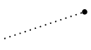
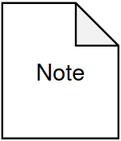
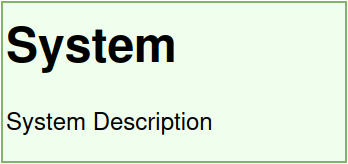
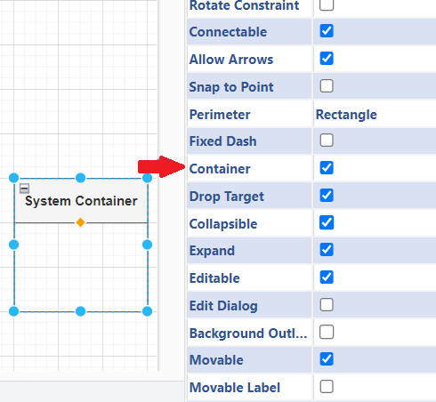

# BEAM Notation - Version 3 - User Manual

_Authors: Bernhard Kollmann (original version), Alexander Prock (adaptation for version 3)_  
_Contact: alexander.prock[at]wu.ac.at_

This documentation revolves around the _Boxology´s Extensive Annotation for Machine Learning Systems (BEAM)_. It extends the original Boxology presented by [Van Bekkum and colleagues](#van_bekkum).
The need for extension arises from drawbacks found in literature for many commonly used diagram types. 
In this document, version 3 of the BEAM notation is described for the user perspective. It is based on the [more extensive technical documentation for version 2](./beam_v2/beam_technical_documentation.md).

The lack of options to append arbitrary annotations, not having enough elements to represent the actual process of an ML System in the required level of granularity, or providing different views for different stakeholders are some points of critique found in literature for not representing ML Systems realisticly enough [[2]](#koenigstorfer22), [[3]](#micheli23). Contrarily, flexible formats often face problems like ambiguity, and high cost of learning a new style of diagram in a new context [[4]](#koukovini14).

The extended version of Boxology aims to address these issues. With the above mentioned problems in mind, the extension focuses on the following requirements:

- Transparency
- A balance between Flexibility and Low Cost of Learning
- Scalability
- Modularity
- Granularity
- Usability for further conversions, reproducibility, and querying

To complete the tasks, the system will be tested in  draw.io [[5]](#drawio). Consequently, the tutorial that follows in the next few paragraphs is based on working in draw.io. However, as this document is about suggesting extensions to the existing annotation, the suggestions can also be used in other diagram editing tools.

## Content

1. [TLDR](#tldr)
2. [Introduction](#intro)
3. [draw.io - How-To](#howto)
4. [Overview - BEAM Notation v3](#overv_box)
5. [Properties Used](#props_used)
6. [Attaching Details to Elements](#attach_details)
7. [Diagram Requirements](#requirements)
    1. [Mandatory Requirements](#mand_req)
    2. [Requirements for Custom Elements](#cust_req)
8. [References](#references)

## TL;DR 

This section summarises the main points. However, as many details are omitted, please refer to the full explanation in the relevant chapter if anything is unclear.

### BEAM v3 Core Elements

The core elements in the table below can be used to represent the building blocks of (hybrid) AI systems.
The connection between elements can be represented using the workflow connector (black arrow).

| Name | Shape | Example | In draw.io |
|---|---|---|---|
| `Data`                                      | green rectancle                   | textual data, images  |  |
| `Symbol`                                    | grey rectangle                    | knowledge graphs, taxonomies      |  |
| `ML Model`                                  | blue hexagon                      | neural network        |  |
| `Knowledge Representation & Reasoning (KR)` | turquoise hexagon                 | ontology reasoner, rule-learner     |  |
| `Process`                                   | pink rounded rectangle            | data cleaning, data augmentation      |  |
| `ML Inference`                              | light orange rounded rectangle    | (special case of Process for ML Inference to make it more prominent graphically, could also be a specific type of inference) |  |
| `ML Training`                               | purple rounded rectangle          | (special case of Process for ML Training to make it more prominent graphically, could also be a specific type of training, e.g. supervised learning)  |  |
| `Actor`                                     | orange rectangle                  | user, engineer        |   |
| `System Container`                          | white box with grey title box     | sytem, subsystem, complex process |  |
| `Workflow Connector`                        | directed solid black arrow        | data/symbolic input/output, usage of a model, interaction of actor |  |

### BEAM v3 Annotation Elements

In addition to the functional building blocks represented by the core elements, various annotations can be attached to systems represented in BEAM, as well as their components.

| Name | Shape | Example | In draw.io |
|---|---|---|---|
| `Annotation Connector`                      | dotted arrow with round arrowhead             | any connection of an annotation element or further details |  |
| `Risk (Text)`                               | white box with red title area and elements    | bias in training data, poor output quality |  |
| `Risk (List)`                               | red box with folded corner                    | any risk with multiple details (source & severity are just examples) |  |
| `Risk Mitigation (Text)`                    | white box with green title area and elements  | training data selection process, any measure to mitigate risk |  |
| `Risk Mitigation (List)`                    | green box with folded corner                  | any measure to mitigate risk with multiple details (strategy & scope are just examples) |  |
| `Note`                                      | white box with folded corner                  | any free-text comment |  |
| `List/Enumeration`                          | white box with title and elements             | list of parameters, settings |  |
| `System Description`                        | light-green text box with heading                         | What does the system do? What are the goals/capabilities/limitations? What is the scope? |  |
| `Context Description`                       | light-grey text box with heading                         | Which use cases does the system have? Who uses it? In which organization? |  |

### Properties Used

The properties of an element can be viewed and edited in draw.io's right sidebar in the `Style` tab after selecting the element, see a more detailed description in the respective section below.
Elements provided by the library (and its legend) have sensible default values for these properties.
For representing simple AI systems, the properties of its elements might not even need to be altered.

| Name | Description |
|---|---|
| `Foldable Tree`     | For Workflow Elements to extend/collapse attached details |
| `Ignore Edge`       | To indicate a workflow or annotation connection |
| `Container`         | Allows to place other elements within the container and to display or hide them |
| `Collapsible`       | Allows to collapse/unfold elements. Is automatically activated when an element receives the container property |
| `Sensitive`         | Flag to set for an element to indicate that sensitive information is used at this step of the workflow |
| `Custom Properties` | For properties not covered by the standard draw.io properties (assginable via selecting the element -> Edit -> Edit data) |

### Mandatory Requirements

- **A legend (as provided by the library)**
    - A container 
    - Gray Fill colour + white text (fillColor=#647687; fontColor=#FFFFFF)
    - Custom property ***element: legend***
    - Has to have every other element with name (label), right shape, and the custom property ***element: {{element_name}}*** in it
    - Must not be in another container
    - Must not have any connectors (will be ignored)

- **Features used to distinguish between elements**:
    - Colour (Hex code without opacity or gradient colour)
    - Shape (Style of the element)
    - Custom property with the key ***element***

- **Connectors**
    - At least one workflow is to be displayed
    - If attachement of details is used - workflow connectors have to be distinguishable by setting the ***ignore edge*** property of the connector to ***True***

### Custom or Additional Elements

- Have to be added to the legend
- The same element must not be used to describe multiple purposes

**----------------------------------- End of TL;DR -----------------------------------**

## Introduction

As briefly illustrated in the abstract, the extension posed by BEAM aims to address unmet needs identified in the literature and by a real use case. 
As for the choice of draw.io, several factors were considered: intuitive use, being a free and open-source diagramming tool, being well-known and its provision of required features such as the ability to extend shapes, load custom shapes, allow the manipulation of existing shapes, as well as the ability to save and load pre-defined shapes as templates. An additional key requirement is the ability to save and load the diagram in a machine-readable format for further processing.

## draw.io - How-To

This section provides a short, general overview of how the different settings and techniques used in the following sections work.

### Activate Additional Editing/Visualization Tools

> 1. In the toolbar: View

### Loading a Custom Library of Shapes

> 1. In the toolbar: File
> 2. Open Library from
> 3. In case the library was downloaded, select "Device"
> 4. Select XML File to load

### Select Default Properties for an Element

> 1. Select Element
> 2. In the menu on the right: Click **"Property"**

### Assign Custom Properties 

> a.
>
> 1. Select Element
> 2. Right Click
> 3. Select "Edit Data"
> 4. Assign the required custom properties

> b.
>
> 1. Select Element
> 2. Keyboard Shortcut: CTRL + M

## Overview - BEAM Notation v3 

This section summarizes the elements of the BEAM notation in version 3, based on the boxology by [Van Bekkum and colleagues](#van_bekkum). Each description of an element features an example image, a short description, all proerties disginguishing it from other elements (i.e., colour, shape and the custom identification property called "Element property"), as well as other default properties commonly associated with the element.

The legend provided by the BEAM library includes all elements:

An example AI system represented in BEAM notation (for a more thorough explanation of this example, see the instructions PDF file):

### ML Model

The Machine Learning (ML) Module represents any Machine Learning component implemented. In a real life application, this element for instance can be used to denominate a Neural Network or Random Forest. 

> Colour:  #B1DDF0 
>
> Shape:  hexagon 
>
> Element property: ml_model

### Knowledge Representation & Reasoning

This element depicts either a knowledge represenation component, e.g. an ontology, or a reasoning component, e.g. an ontology reasoner or a rule learner.

> Colour:  #00F2F2 
>
> Shape: Hexagon
>
> Element property: kr

### Data

The data element represents any form of non-symbolic data flowing through the system, e.g. tabular input data.

> Colour:  #cdeb8b 
>
> Shape: Rectangle without rounded corners (rounded=0 in the XML file)
>
> Element property: data

### Symbol

The symbol element represents any form of symbolic resource, e.g. a knowledge graph.

> Colour:  #BAC8D3 
>
> Shape: Rectangle without rounded corners (rounded=0 in the XML file)
>
> Element property: symbol

### Process

Describes a process, e.g. data preparation. The process is not tied to an actor and can, for example, be performed automatically by a script or ML component. 

> Colour:  #FCEDFF 
>
> Shape: Stadium (rounded=1 in the XML file)
>
> Element property: process

### ML Inference

The ML inference element is a special kind of process that represents the inference process in an ML system.

> Colour:  #F4F5E4 
>
> Shape: Stadium (rounded=1 in the XML file)
>
> Element property: process

### ML Training

The ML training element is a special kind of process that represents the training process in an ML system.

> Colour:  #E1D5E7 
>
> Shape: Stadium (rounded=1 in the XML file)
>
> Element property: process

### Actor

Describes any actor in the system. Said actor does not necessarily have to be human.

> Colour:  Orange - #ffe6cc
>
> Shape: Triangle
>
> Element property: actor

### System Container 

The container element is used to show which elements belong to the same system or system component, e.g. a subsystem or a complex process. For scalability purposes, a diagram may consist of multiple system components, with directed arrows representing the workflow between these components. Also, for readability, this element has been changed from the original all grey background to a grey filled headline box with a transparent background.

> Colour:  Grey - #f5f5f5 
>
> Shape: Swimlane
>
> Element property: system

### Workflow Connection

This is the main type of connection used in BEAM. It shows the order of the workflow. Looking at the representation in the XML file, it should be noted that the classic arrow has hardly any distinguishing features. The main indication is the difference of the node and the style of the representation. It is also intended to allow the diagram to expand and hide certain information. For example, to keep the workflow connection visible at all times, the connector property ***Ignore Edge*** has to be set to `True`.

> Colour:  --- 
>
> Shape: Arrow (endArrow=classic as style information in XML file)
>
> Element property: workflow_connector

### Annotation Connector 

The annotation connector is used to indicate that some form of comment or other annotation information is attached to an element. The purpose of having a different connector in this case is twofold. Firstly, it is a visual aid to help understand diagrams more quickly as workflow and annotation can be distinguished easily. Secondly, downstream processing of the exported BEAM model can easily distinguish annotation from workflow (annotations will be ignored, similar to comments in program code). It can also connect a more detailed model of the inner structure of an element, e.g. in the example at the start of the section, there is a separate container representing the inner structure of the ML Model. The container is thereby connected to the ML Model with an annotation connector.

Another detail worth mentioning is the arrowhead. In draw.io all arrows have a source and a target regardless of having an arrowhead. To depict the direction of the annotation connection, it was decided to have a round arrowhead at the side of the annotation. Finally, note that draw.io does not have a *"dotted"* representation in the background. The dotted pattern comes from the two style parameters ***dashed=1*** and the ***dashPattern***.

> Colour:  --- 
>
> Shape: Dashed Arrow (endArrow=none;dashed=1;html=1;dashPattern=1 in XML file)
>
> Element property: dotted_con

### Note

The note shape can be used to attach arbitrary comments to any element other than connectors.

> Colour:  --- 
>
> Shape: note
>
> Element property: note

### List

The List element does exactly what its name suggests. It helps to list facts and other aspects of another element when the information is needed. The most common use during testing was to attach metadata and hyperparameters of ML Models to the respective elements.

One special characteristic is to be annotated: The list is per se not designed to act as a dictionary containing key-value pairs. This mechanic would have to be adopted by convention, for example with a common seperator between information key and value (e.g. ":" or "="). While this separator is not relevant for the notation, it will most likely help when the BEAM model is to be queried for specific aspects in a downstream application.

> Colour:  --- 
>
> Shape: swimlane
>
> Element property: list

### Risk (Text)

The red note shape can be used to attach textual information about risks to components or systems.

> Colour:  #F8CECC 
>
> Shape: note
>
> Element property: risk_note

### Risk (List)

In addtion to the Risk (Text) element, risks can also be represented similar to the List element.
The two list entries given in the library are examples, other entries can be added and the original ones can be edited or removed.

> Colour:  F8CECC 
>
> Shape: swimlane
>
> Element property: risk_list

### Risk Mitigation (Text)

The green note shape can be used to attach textual information about risk mitigation to components or systems.

> Colour:  #D5E8D4 
>
> Shape: note
>
> Element property: risk_mitigation_note

### Risk Mitigation (List)

In addtion to the Risk Mitigation (Text) element, risk mitigation can also be represented similar to the List element.
The two list entries given in the library are examples, other entries can be added and the original ones can be edited or removed.

> Colour:  #D5E8D4 
>
> Shape: swimlane
>
> Element property: risk_mitigation_list

### System Description

This element can be used to add a textual representation of the depicted system as a whole.

> Colour:  #F0FFED 
>
> Shape: text
>
> Element property: system_description

### Context Description

This element can be used to add a textual representation of the context the depicted system is operated in.

> Colour:  #F5F5F5 
>
> Shape: text
>
> Element property: context_description

## Properties Used 

This section covers all the properties used in draw.io to distinguish elements more effectively, create a more interactive diagram, or to further increase scalability.

### Tree Folding

 To cater the requirement of granularity, it often is required to fit additional information in the diagram. Thus, the scripts are distinguishing between elements with the **foldable tree** property set **True** and the elements which do not have this property at assigned as all (Apparently, there is no scenario where a "foldable tree: False" occurs). Should an element have this property and the value is True (to be safe), the outgoing connectors (arrows) will be checked (i.e., the connectors having the element ID as source). For each connector, the property **ignore edges** is searched. Should said property be found in the style information ("ignoreEdge=1"), the target element will be ignored. Should said property not be found however, the target element is considred as a part of the source element. After finding such an element, the source element will receive the attribute **"is_parent_node: True"**, and the child node the complementary attributes  **"is_child_node: True"**, as well as  **"parent_node: {ID of Parent Node}"**.

This distinction will be relevant for the output file, as it allows to provide an array of all child nodes, as well as each easily searchable child nodes. The Tree Folding parameter is used to assign other "sub-elements" to one element. Said "sub-elements" can then be folded or unfolded by presssing the top right **+** (folded form) or **-** (unfolded form) button.

Tree Folding property in draw.io:

Example of an elmement in folded and unfolded form:

### Ignore Edge

The ignore edge property in draw.io essentially tells the connection that it should not listen to signals from other elements, such as the tree folding property. Thus, it is relevant in the diagram to distinguish between connections of the workflow, comments, and non workflow elements attached to other elements. Additionally, one distinction to the property ***collapsible*** is to be made. Foldable trees extend the elements folded beyond the borders of the tree element.

Ignore Edge property in draw.io:

### Container

Containers in draw.io can be used to place other elements in the container element. On top of a visual assignment, the elements placed within a container are also considered as child nodes of the container in the XML file.

Container property in draw.io:

### Collapsible

A collapsible element allows an element to be collapsed or expanded using the + or - symbol provided when the collapsible element is set to true in the top left corner (corresponding to the current state). Furthermore, the collapsible property is a mandatory property of the ***container*** property. Consequently, once the container property is set to true, the collapsible property is automatically set to true. It can be manually unchecked afterwards if desired.

Collapsible property in draw.io:

### Custom Properties

So far, all the properties presented are part of the standard draw.io implementation. However, in some cases it may be more advantageous to attach multiple properties to the same element, rather than having to attach each detail via a separate connection. Therefore, the BEAM notation also allows custom properties as an extension. Custom properties have several advantages. Firstly, a property is assigned directly to an element, and as such does not need to be established in the background via connecting ids. Second, it is only visible when you hover over the element in a draw.io application, while its content is always available in the background. As a result, this is another way to save space, alongside folding and collapsing. Third, as a property, the property name can be used as a key to directly search the stored values, rather than having to split strings in other instances, as with the style property. 

Assigning custom properties in draw.io is possible in three ways:

1. Right click on the element > Edit Data

2. Via the toolbar

3. Select Element and press CTRL + m

### Sensitive

Sensitive is a custom property designed to indicate whether sensitve information is used by the element. 

## Attaching Details to Elements 

In some cases, assigning custom properties may still not be enough to display some information accurately. Therefore, the option to attach further information to an element is proposed. This option allows arbitrary information to be attached to any element. For example, if required, the structure of a neural network could be displayed in a container, which in turn could be attached as further information to a machine learning module. Furthermore, this option can be used "recursively" on elements. Elements that are already part of an information can therefore have elements attached to them. Sticking with the neural network example, each hidden layer could also have a list of settings attached. 

One detail to note about this attachment strategy is validation. When the information is extracted in the background, only the connection between the workflow element and its attached element(s) is checked. However, any information attached to elements already attached to the workflow element is not checked for validity. The rationale behind this decision is not to limit the options of the diagram creator. For example, the attachment of the neural network structure can be shown in its own sub-process. However, in order not to confuse the connections used in that sub-process, a new type of connector would have to be implemented. It is probably almost impossible to cover every conceivable case. As a result, the design decision was made against full testing. This leaves the disadvantage of not addressing the challenges of standardisation. However, as flexibility has been prioritised, standardisation will unfortunately have to be established by convention of diagram designers.

## Requirements of the Diagram 

### Mandatory Requirements 

#### Legend

The legend is a crucial element to include in the diagram. The legend defines the purpose of each shape. Therefore, each shape used must be defined once in the legend. The legend **does not allow to change the shapes of the original boxology!**

Each diagram must feature a legend. It is also important to note that, by default, the legend must obey several special rules. First, the legend must not be located in a container or part of another system component.

As for letting the legend be recognized as such, the property **"element: legend"** should be assigned to the container. Additionally, the container is supposed to have the colour  grey for the container heading (fillColor=#647687) and  white for the font colour (fontColor=#FFFFFF).

#### Element recognition

Each element must posess the following distinctive characteristics:

1. The shape assigned in the legend
2. The colour, if any colour is set in the legend
3. The property "element" with the according shape label
4. The property "sensitive" with ***True*** or ***False*** set

### Requirements for Custom Elements 

For the extended Boxology implementation, the focus was on keeping the mandatory requirements to a minimum. This results in an open system and the possibility to implement own elements. New shapes can be introduced by adding them to the legend.

## References 

[1] van Bekkum, M., de Boer, M., van Harmelen, F., Meyer-Vitali, A., & Teije, A. T. (2021). Modular design patterns for hybrid learning and reasoning systems: a taxonomy, patterns and use cases. Applied Intelligence, 51(9), 6528-6546. 

[2] Königstorfer, F., & Thalmann, S. (2022). AI Documentation: A path to accountability. Journal of Responsible Technology, 11, 100043. 

[3] Micheli, M., Hupont, I., Delipetrev, B., & Soler-Garrido, J. (2023). The landscape of data and AI documentation approaches in the European policy context. Ethics and Information Technology, 25(4), 56. 

[4] Koukovini, M. N., Papagiannakopoulou, E. I., Lioudakis, G. V., Dellas, N., Kaklamani, D. I., & Venieris, I. S. (2014). An ontology‐based approach towards comprehensive workflow modelling. IET software, 8(2), 73-85. 

[5] draw.io (2023). JGraph Ltd. Available at: https://www.drawio.com/

[6] mxGraph (2020).  JGraph Ltd. Available at: https://jgraph.github.io/mxgraph/
