# Preamble

Hello dear reader,

The following tutorial is the result of a project on how to adequately document AI systems. In short, the following notation is intended to be a first step towards providing a simple yet expressive notation for representing AI systems. To this end, the notation is an extension of a boxology used.

To get a first idea of how well the proposed notation works in practice, I would like to ask you to follow the steps of the tutorial and the examples provided, and to plot your projects developed in the Data Science Lab using the instructions provided. In the tutorial you will find some examples and instructions on how to set up a test environment with Draw.io.

Furthermore, it would be particularly helpful to see how the possibilities offered by the extension of the original boxology affect working with the notation compared to using the original elements. In order to assess this, a short questionnaire will follow at a later date. 

The setup for working with the notation can be found in the tutorial file provided. 

Thank you for your time and effort.


# Boxology´s Extensive Annotation for Machine Learning Systems

This document covers the most important aspects for a proposed extension of the Boxology V2 presented by [Van Bekkum and colleagues](#van_bekkum) [[1]](#van_bekkum). Boxology´s Extensive Annotation for Machine Learning Systems (BEAM for short) aims to fulfil some of the requirements that are currently either sparsly met or not met at all in the literature.

Some example of such requirements would be the lack of options option to append quasi arbitrary annotations, not having enough elements to represent the actual process of an ML System in the required level of granulirity, or providing different views for different stakeholder are a some points of critique found in literature for not representing ML Systems realistic enough [[2]](#koenig23), [[3]](#mich23). Contrary, flexible formats often face problems like ambiguity, and high cost of learning a new diagram in a new context [[4]](#kuok14).

With the above mentioned problems in mind, the extension focuses on the following requirements found:

> - Transparency
> - A balance between Flexibility and Low Cost of Learning
> - Scalability
> - Modularity
> - Granularity
> - Usability for further conversions, reproducibility, and querying

The system was tested in Draw.io [[5]](#drawio). Consequently, the tutorial that follows in the next few paragraphs is based on working in Draw.io. As this document is about suggesting extensions to the existing annotation, the suggestions can also be used in other diagram editing tools. However, the extraction & structuring scripts also set up in the scope of the thesis are designed to work with exported Draw.io XML files and probably won't work with other XML structures.

## Content

1. [Introduction to Draw.io](#intro_drawio)
2. [Quick Start Examples](#qs_ex)
2. [Original Boxology Elements](#og_elems)
3. [Proposed Extensions](#ext)
    1. [Elements](#ext_elems)
    2. [Attaching Details](#ext_det)
4. [Requirements](#rq)
5. [References](#ref)
6. [Library](#lib)


## Introduction to Draw.io <a name="intro_drawio"></a>

This section covers the basics of creating diagrams and using annotation. Draw.io itself is an open source tool available to everyone in two ways. The first is to use the online editor, while the second is to download the tool and work locally on a device (both availabe at: [[5]](#drawio)). 

To get the library, one has to either copy the [library](#library) xml snippet attach at the bottom of the tutorial (For most applications that can display Markdown files, a "copy to clipboard" option should appear in the top right-hand corner when you hover over the area), or download the xml file from the repository (Name: `beam_lib.xml`).


### Load the library

Once Draw.io has been set up, the library can be importet by selecting `File` in the top toolbar and `Open Library` in the subsequently appearing Dropdown Menu.


The library ought appear in the top left before the default options of shapes.


### Assign Colour

Colour can be assigned by one of two options:

> a.
> 1. Select Element
> 2. In the menu on the right: Fill with the according colour

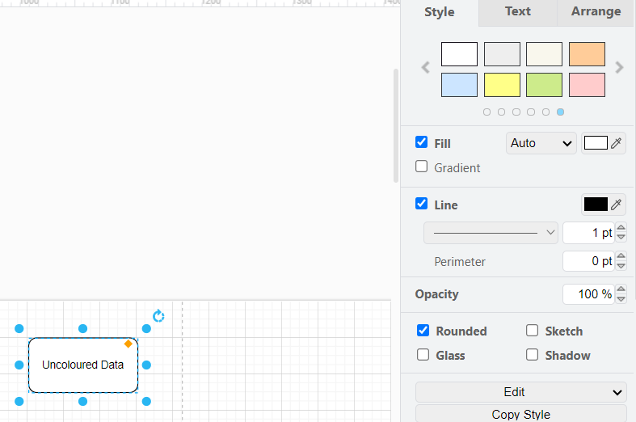

> b.
>
> 1. Select Element
> 2. Right Click
> 3. Select "Edit Style"
> 4. Assign "fillColor=" + the according hexcode for the colour


### Select Default Properties for an Element

The default properties offer numerous option to alter the same element or a composition of multiple elements. For the scope of this work, especially the `Tree Folding`, `Ignore Edges`, as well as the `Container` and `Collapsible` properties. Tree Folding and Ignore Edges are elaborated in more detail in the [requirements](#req). Regarding the Container and Collapsible properties, the Container allows other elements to be stored inside the "container element" (e.g. the system container). The Collapsible property adds the little **+** icon at the top left, which collapses/expands the container element when clicked.

The collapsible property

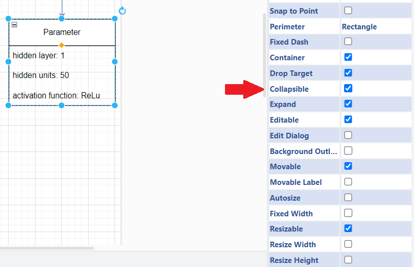

Example of collapsed and expanded elements:

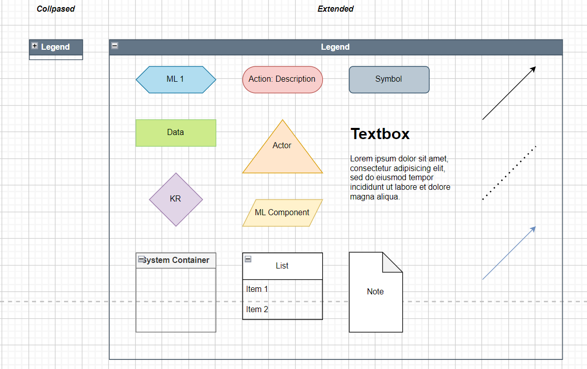

> a.
>
> 1. Select Element
> 2. In the menu on the right: Click **"Property"**


> b.
>
> 1. Select Element
> 2. Right Click
> 3. Select "Edit Style"
> 4. Assign the required parameters with the according value


### Assign Custom Properties

Custom properties are used to append information that is not always considered relevant for display in the diagram, but still contains information that should be kept available in the output file. Custom properties are visible by hovering over the element and can still be used when exporting a dynamic version of the diagram (e.g. a HTML document). They are also one of the main distinguishing features in that they are also stored as an individual property in the XML file, rather than as a string like style properties.

Example of displaying custom properties in an interactive diagram:

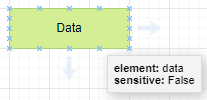

> a.
>
> 1. Select Element
> 2. Right Click
> 3. Select "Edit Data"
> 4. Assign the required custom properties

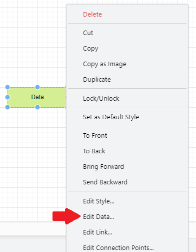

> b.
>
> 1. Select Element
> 2. Keyboard Shortcut: ctrl + M


## Quick Start Examples <a name="qs_ex"></a>

As there is a lot of detail to cover, this section covers the bare essentials to start creating diagrams. Two examples are given, one showing elements of the original Boxology and the other the proposed elements for extending the Boxology notation.

Please note that only the elements from the library should be used if no custom additions are made. These standard elements already have some properties set up (Said properties can be seen by hovering over the element in the editor). To see how custom elements can be used, please refer to the requirements [requirements](#req).

> Example of using the original Boxology (Legend and colour are not part of the original Boxology and were used to test "backwards compatibility"):

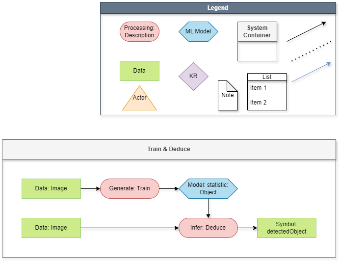

> Example using additional elements to annotate details:


## Original Boxology Elements <a name="og_elems"></a>

This section provides a brief overview of the individual original boxology elements. 

|Name|Symbol Purpose|In Draw.io|
|--|--|--|
|`Rectangle`|Data or Symbol||
|`Hexagon`|ML Model|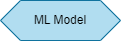|
|`Triangle`|Actor|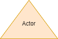|
|`Processing`|Processing Task like Data Preparation||
|`Connectors`|Connectors between workflow elements||
|`Grey container `|ML System or component of ML System|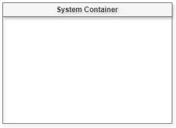|


## Proposed Extensions <a name="ext"></a>

### Elements <a name="ext_elems"></a>

|Name|Purpose|In Draw.io|
|--|--|--|
|`List/Enumeration `|Attaching textual information to an elemnt||
|`Note`|Comments||
|`Connectors (Directed Arrows) with the property "ignore edge: True"`|Connection between workflow elements||
|`Connectors in light blue without the property "ignore edge: True" or "ignore edge: False"`|Connection  from element to detail||
|`Dotted Connector`|A connection that is not relevant to the workflow and is not a direct detail of an element, but is associated with the linked element. (e.g., for attaching notes)||

Please note that in the library, some default options can be found as well. Concretely, these elements have attached some default properties listed below, which can be folded/unfolded. Said elements are named: ***{element name} w. Default Properties***.

One example:


### Attaching further Details to Elements <a name="ext_det"></a>

With all elements cover to design a diagram, the rationale of some design decisions is to be elaborated in a bit more detail.

As shown in the examples, as well as the elements, the type of connector is used to distinguish between the main workflow and further information attached to an element. While the black solid connector with an arrowhead pointing to the next target element is used to mark workflows, two additional connectors have been introduced.

The first one would be the `Information Attachement Connector`. This connector is used to attach any details to an element that are easier to understand with a visual rather than a textual description.


Elements having such details attached, usually receive the `Tree Folding` property, which allows to fold/unfold each target element of the "main element".

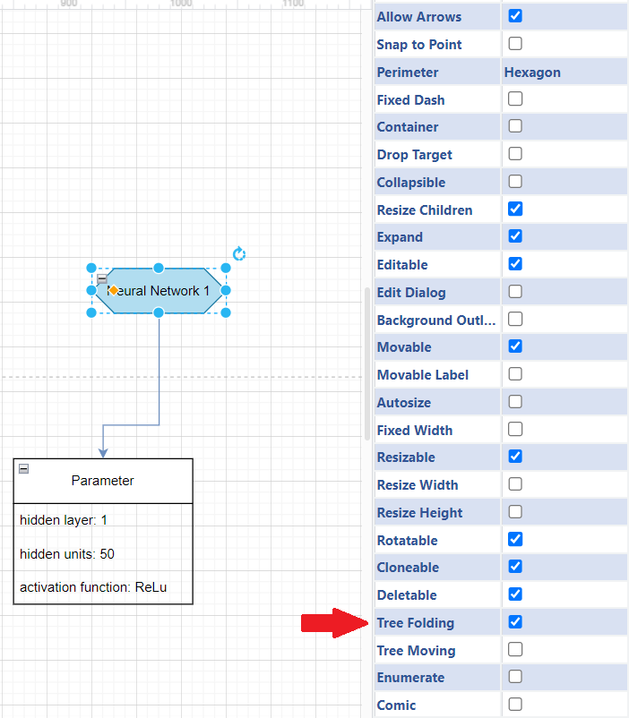

 

To prevent other workflow elements that are a target of the element from having the foldable tree property, the workflow connectors are assigned the `Ignore Edge` property.

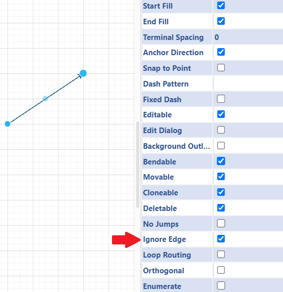

The blue colour is mainly used to help diagram reviewers quickly understand which elements belong to the main workflow and which elements should be considered details.


## Requirements <a name="req"></a>

Finally, this section covers all the minimum requirements for creating a valid diagram. For validation, it should be noted that some sort of "ETL" process has been going on in the background to allow automatic extraction of the model for further processing. Thus, some requirements may not necessarily be directed at the visual notation, but rather at allowing automatic processing of the XML file that can be exported from Draw.io. 


### Legend

The legend is a crucial element to include in the diagram and defines the purpose of each shape. Therefore, each shape used must be found once in the legend. If multiple instances of the same shape occur, the meaning of the shape with the ID with the highest sequential number is used. Conversely, if any shape is not listed in the legend, the element is considered non-existent (this is particularly important for compound/grouped shapes, as each shape in the compound must be labeled separately). Per convention, the legend **shall not change the shapes of the original boxology** in order to allow the original Boxology to function properly as before.

Each diagram must feature a legend. It is also important to note that, by default, the legend must obey several special rules. First, the legend **must not be located in a container or part of another system component**. The program is designed to search for the (general) legend as the first task after the element tree has been constructed. While it is possible to mark the legend as such, even if it is inside a container, the shapes the legend describes would be understood as elements of the system the legend is part of, without any way of distinguishing them from actual system components. Furthermore, in future development, it might be necessary to assign different meanings to the same shape in the same overall system. Although the first drawback just described still applies, it would still be easier to assign a general meaning to a shape and "overwrite" this meaning if necessary.

As for letting the legend be recognized as such, the property **"element: legend"** should be assigned to the container. 


#### Element recognition

Each element (apart from all elements in the legend) must posess the following distinctive characteristics:

1. The shape assigned in the legend
2. The property "element" with the according shape label
3. The property "sensitive" with ***True*** or ***False*** set. Sensitive describes whether or not sensitive data can be found when the workflow is at the element in question.

#### Connections between elements

The flow of boxology needs to be marked in some way. Draw.io offers the simple solution of drawing arrows. The important aspect here is the source and the target to which the arrow points. These two points are represented in the XML file in the form of properties with the IDs of the source and target as values. They are also used to draw "inferences" on the diagram. These conclusions are relevant for two scenarios in particular. Firstly, the flow of the system structure can be displayed and queried by following the "chain of ids". If not, the second scenario seems to be the case. This second scenario would be that the arrows are a connection to more elements that are part of a ***foldable tree***, which will be explained in the next paragraph.

Example snippet of an output XML file:

```xml
<mxCell id="..." value="" style="endArrow=classic;html=1;rounded=0;" 
  parent="..." 
  source="id-41" 
  target="id-45" edge="1"> <!-- Example of source and target properties-->
  <mxGeometry width="50" height="50" relative="1" as="geometry">
    <mxPoint x="440" y="490" as="sourcePoint" />
    <mxPoint x="490" y="440" as="targetPoint" />
    </mxGeometry>
</mxCell>
```

### Requirements for Custom Elements <a name="cust_req"></a>

For the inofrmation extraction process, the focus was on keeping the mandatory requirements to a minimum. This results in an open system and the possibility to implement own elements. The code will only check for the legend, if there is at least one system, at least one workflow in the system, and if every element can unambiguously be identified.

Otherwise, the notation is designed to be customized as needed. New shapes can be introduced by adding them to the legend. Existing elements, which are not part of the original boxology, can also be adapted as required. 


## References <a name="ref"></a>

[1] van Bekkum, M., de Boer, M., van Harmelen, F., Meyer-Vitali, A., & Teije, A. T. (2021). Modular design patterns for hybrid learning and reasoning systems: a taxonomy, patterns and use cases. Applied Intelligence, 51(9), 6528-6546. <a name="van_bekkum"></a>

[2] Königstorfer, F., & Thalmann, S. (2022). AI Documentation: A path to accountability. Journal of Responsible Technology, 11, 100043. <a name="koenig23"></a>

[3] Micheli, M., Hupont, I., Delipetrev, B., & Soler-Garrido, J. (2023). The landscape of data and AI documentation approaches in the European policy context. Ethics and Information Technology, 25(4), 56. <a name="mich23"></a>

[4] Koukovini, M. N., Papagiannakopoulou, E. I., Lioudakis, G. V., Dellas, N., Kaklamani, D. I., & Venieris, I. S. (2014). An ontology‐based approach towards comprehensive workflow modelling. IET software, 8(2), 73-85. <a name="kuok14"></a>

[5] Draw.io (2023). JGraph Ltd. Available at: https://www.drawio.com/ <a name="drawio"></a>

[6] mxGraph (2020).  JGraph Ltd. Available at: https://jgraph.github.io/mxgraph/


## Library <a name="lib"></a>

```xml
<mxlibrary>[
  {
    "xml": "&lt;mxGraphModel&gt;&lt;root&gt;&lt;mxCell id=\"0\"/&gt;&lt;mxCell id=\"1\" parent=\"0\"/&gt;&lt;object label=\"ML Model\" element=\"MlModel\" sensitive=\"False\" id=\"2\"&gt;&lt;mxCell style=\"shape=hexagon;perimeter=hexagonPerimeter2;whiteSpace=wrap;html=1;fixedSize=1;fillColor=#b1ddf0;strokeColor=#10739e;\" vertex=\"1\" parent=\"1\"&gt;&lt;mxGeometry width=\"120\" height=\"40\" as=\"geometry\"/&gt;&lt;/mxCell&gt;&lt;/object&gt;&lt;/root&gt;&lt;/mxGraphModel&gt;",
    "w": 120,
    "h": 40,
    "aspect": "fixed",
    "title": "Ml Model"
  },
  {
    "xml": "&lt;mxGraphModel&gt;&lt;root&gt;&lt;mxCell id=\"0\"/&gt;&lt;mxCell id=\"1\" parent=\"0\"/&gt;&lt;object label=\"Processing: Description\" element=\"processing\" sensitive=\"False\" id=\"2\"&gt;&lt;mxCell style=\"rounded=1;whiteSpace=wrap;html=1;arcSize=50;fillColor=#f8cecc;strokeColor=#b85450;\" vertex=\"1\" parent=\"1\"&gt;&lt;mxGeometry width=\"120\" height=\"40\" as=\"geometry\"/&gt;&lt;/mxCell&gt;&lt;/object&gt;&lt;/root&gt;&lt;/mxGraphModel&gt;",
    "w": 120,
    "h": 40,
    "aspect": "fixed",
    "title": "Processing"
  },
  {
    "xml": "&lt;mxGraphModel&gt;&lt;root&gt;&lt;mxCell id=\"0\"/&gt;&lt;mxCell id=\"1\" parent=\"0\"/&gt;&lt;object label=\"Data\" element=\"data\" sensitive=\"False\" id=\"2\"&gt;&lt;mxCell style=\"rounded=0;whiteSpace=wrap;html=1;fillColor=#cdeb8b;strokeColor=#97D077;\" vertex=\"1\" parent=\"1\"&gt;&lt;mxGeometry width=\"120\" height=\"40\" as=\"geometry\"/&gt;&lt;/mxCell&gt;&lt;/object&gt;&lt;/root&gt;&lt;/mxGraphModel&gt;",
    "w": 120,
    "h": 40,
    "aspect": "fixed",
    "title": "Data"
  },
  {
    "xml": "&lt;mxGraphModel&gt;&lt;root&gt;&lt;mxCell id=\"0\"/&gt;&lt;mxCell id=\"1\" parent=\"0\"/&gt;&lt;object label=\"Actor\" element=\"actor\" sensitive=\"False\" id=\"2\"&gt;&lt;mxCell style=\"verticalLabelPosition=middle;verticalAlign=middle;html=1;shape=mxgraph.basic.acute_triangle;dx=0.5;labelPosition=center;align=center;fillColor=#ffe6cc;strokeColor=#d79b00;\" vertex=\"1\" parent=\"1\"&gt;&lt;mxGeometry width=\"100\" height=\"80\" as=\"geometry\"/&gt;&lt;/mxCell&gt;&lt;/object&gt;&lt;/root&gt;&lt;/mxGraphModel&gt;",
    "w": 100,
    "h": 80,
    "aspect": "fixed",
    "title": "Actor"
  },
  {
    "xml": "&lt;mxGraphModel&gt;&lt;root&gt;&lt;mxCell id=\"0\"/&gt;&lt;mxCell id=\"1\" parent=\"0\"/&gt;&lt;object label=\"System Container\" element=\"system\" sensitive=\"False\" id=\"2\"&gt;&lt;mxCell style=\"swimlane;whiteSpace=wrap;html=1;fillColor=#f5f5f5;fontColor=#333333;strokeColor=#666666;startSize=40;shadow=1;\" vertex=\"1\" parent=\"1\"&gt;&lt;mxGeometry width=\"90\" height=\"120\" as=\"geometry\"/&gt;&lt;/mxCell&gt;&lt;/object&gt;&lt;/root&gt;&lt;/mxGraphModel&gt;",
    "w": 90,
    "h": 120,
    "aspect": "fixed",
    "title": "System"
  },
  {
    "xml": "&lt;mxGraphModel&gt;&lt;root&gt;&lt;mxCell id=\"0\"/&gt;&lt;mxCell id=\"1\" parent=\"0\"/&gt;&lt;object label=\"Note\" element=\"note\" sensitive=\"False\" id=\"2\"&gt;&lt;mxCell style=\"shape=note;whiteSpace=wrap;html=1;backgroundOutline=1;darkOpacity=0.05;size=22;shadow=1;\" vertex=\"1\" parent=\"1\"&gt;&lt;mxGeometry width=\"60\" height=\"70\" as=\"geometry\"/&gt;&lt;/mxCell&gt;&lt;/object&gt;&lt;/root&gt;&lt;/mxGraphModel&gt;",
    "w": 60,
    "h": 70,
    "aspect": "fixed",
    "title": "NOte"
  },
  {
    "xml": "&lt;mxGraphModel&gt;&lt;root&gt;&lt;mxCell id=\"0\"/&gt;&lt;mxCell id=\"1\" parent=\"0\"/&gt;&lt;object label=\"\" element=\"worfklow_connector\" sensitive=\"False\" id=\"2\"&gt;&lt;mxCell style=\"endArrow=classic;html=1;rounded=0;ignoreEdge=1;shadow=1;\" edge=\"1\" parent=\"1\"&gt;&lt;mxGeometry width=\"50\" height=\"50\" relative=\"1\" as=\"geometry\"&gt;&lt;mxPoint y=\"40\" as=\"sourcePoint\"/&gt;&lt;mxPoint x=\"80\" as=\"targetPoint\"/&gt;&lt;/mxGeometry&gt;&lt;/mxCell&gt;&lt;/object&gt;&lt;/root&gt;&lt;/mxGraphModel&gt;",
    "w": 80,
    "h": 40,
    "aspect": "fixed",
    "title": "Workflow Connector"
  },
  {
    "xml": "&lt;mxGraphModel&gt;&lt;root&gt;&lt;mxCell id=\"0\"/&gt;&lt;mxCell id=\"1\" parent=\"0\"/&gt;&lt;object label=\"\" element=\"dotted_connector\" sensitive=\"False\" id=\"2\"&gt;&lt;mxCell style=\"endArrow=none;dashed=1;html=1;dashPattern=1 3;strokeWidth=2;rounded=0;shadow=1;\" edge=\"1\" parent=\"1\"&gt;&lt;mxGeometry width=\"50\" height=\"50\" relative=\"1\" as=\"geometry\"&gt;&lt;mxPoint y=\"40\" as=\"sourcePoint\"/&gt;&lt;mxPoint x=\"80\" as=\"targetPoint\"/&gt;&lt;/mxGeometry&gt;&lt;/mxCell&gt;&lt;/object&gt;&lt;/root&gt;&lt;/mxGraphModel&gt;",
    "w": 80,
    "h": 40,
    "aspect": "fixed",
    "title": "Dotted Connector"
  },
  {
    "xml": "&lt;mxGraphModel&gt;&lt;root&gt;&lt;mxCell id=\"0\"/&gt;&lt;mxCell id=\"1\" parent=\"0\"/&gt;&lt;object label=\"\" element=\"info_attach_con\" sensitive=\"False\" id=\"2\"&gt;&lt;mxCell style=\"endArrow=classic;html=1;rounded=0;strokeColor=#6c8ebf;fillColor=#dae8fc;shadow=1;\" edge=\"1\" parent=\"1\"&gt;&lt;mxGeometry width=\"50\" height=\"50\" relative=\"1\" as=\"geometry\"&gt;&lt;mxPoint y=\"40\" as=\"sourcePoint\"/&gt;&lt;mxPoint x=\"80\" as=\"targetPoint\"/&gt;&lt;/mxGeometry&gt;&lt;/mxCell&gt;&lt;/object&gt;&lt;/root&gt;&lt;/mxGraphModel&gt;",
    "w": 80,
    "h": 40,
    "aspect": "fixed",
    "title": "Information Attachement Connector"
  },
  {
    "xml": "&lt;mxGraphModel&gt;&lt;root&gt;&lt;mxCell id=\"0\"/&gt;&lt;mxCell id=\"1\" parent=\"0\"/&gt;&lt;object label=\"Legend\" element=\"legend\" sensitive=\"False\" id=\"2\"&gt;&lt;mxCell style=\"swimlane;whiteSpace=wrap;html=1;fillColor=#647687;strokeColor=#314354;fontColor=#ffffff;shadow=1;\" vertex=\"1\" parent=\"1\"&gt;&lt;mxGeometry width=\"570\" height=\"270\" as=\"geometry\"/&gt;&lt;/mxCell&gt;&lt;/object&gt;&lt;object label=\"Data\" element=\"data\" sensitive=\"False\" id=\"3\"&gt;&lt;mxCell style=\"rounded=0;whiteSpace=wrap;html=1;fillColor=#cdeb8b;strokeColor=#97D077;\" vertex=\"1\" parent=\"2\"&gt;&lt;mxGeometry x=\"40\" y=\"120\" width=\"120\" height=\"40\" as=\"geometry\"/&gt;&lt;/mxCell&gt;&lt;/object&gt;&lt;object label=\"KR\" element=\"kr\" sensitive=\"False\" id=\"4\"&gt;&lt;mxCell style=\"rhombus;whiteSpace=wrap;html=1;fillColor=#e1d5e7;strokeColor=#9673a6;\" vertex=\"1\" parent=\"2\"&gt;&lt;mxGeometry x=\"60\" y=\"172.5\" width=\"80\" height=\"80\" as=\"geometry\"/&gt;&lt;/mxCell&gt;&lt;/object&gt;&lt;object label=\"\" element=\"worfklow_connector\" sensitive=\"False\" id=\"5\"&gt;&lt;mxCell style=\"endArrow=classic;html=1;rounded=0;ignoreEdge=1;shadow=1;\" edge=\"1\" parent=\"2\"&gt;&lt;mxGeometry width=\"50\" height=\"50\" relative=\"1\" as=\"geometry\"&gt;&lt;mxPoint x=\"440\" y=\"80\" as=\"sourcePoint\"/&gt;&lt;mxPoint x=\"520\" y=\"40\" as=\"targetPoint\"/&gt;&lt;/mxGeometry&gt;&lt;/mxCell&gt;&lt;/object&gt;&lt;object label=\"System Container\" element=\"system\" sensitive=\"False\" id=\"6\"&gt;&lt;mxCell style=\"swimlane;whiteSpace=wrap;html=1;fillColor=#f5f5f5;fontColor=#333333;strokeColor=#666666;startSize=40;shadow=1;\" vertex=\"1\" parent=\"2\"&gt;&lt;mxGeometry x=\"340\" y=\"40\" width=\"90\" height=\"120\" as=\"geometry\"/&gt;&lt;/mxCell&gt;&lt;/object&gt;&lt;object label=\"List\" element=\"list\" sensitive=\"False\" id=\"7\"&gt;&lt;mxCell style=\"swimlane;fontStyle=0;childLayout=stackLayout;horizontal=1;startSize=15;horizontalStack=0;resizeParent=1;resizeParentMax=0;resizeLast=0;collapsible=1;marginBottom=0;whiteSpace=wrap;html=1;shadow=1;\" vertex=\"1\" parent=\"2\"&gt;&lt;mxGeometry x=\"440\" y=\"180\" width=\"120\" height=\"75\" as=\"geometry\"/&gt;&lt;/mxCell&gt;&lt;/object&gt;&lt;mxCell id=\"8\" value=\"Item 1\" style=\"text;strokeColor=none;fillColor=none;align=left;verticalAlign=middle;spacingLeft=4;spacingRight=4;overflow=hidden;points=[[0,0.5],[1,0.5]];portConstraint=eastwest;rotatable=0;whiteSpace=wrap;html=1;\" vertex=\"1\" parent=\"7\"&gt;&lt;mxGeometry y=\"15\" width=\"120\" height=\"30\" as=\"geometry\"/&gt;&lt;/mxCell&gt;&lt;mxCell id=\"9\" value=\"Item 2\" style=\"text;strokeColor=none;fillColor=none;align=left;verticalAlign=middle;spacingLeft=4;spacingRight=4;overflow=hidden;points=[[0,0.5],[1,0.5]];portConstraint=eastwest;rotatable=0;whiteSpace=wrap;html=1;\" vertex=\"1\" parent=\"7\"&gt;&lt;mxGeometry y=\"45\" width=\"120\" height=\"30\" as=\"geometry\"/&gt;&lt;/mxCell&gt;&lt;object label=\"Note\" element=\"note\" sensitive=\"False\" id=\"10\"&gt;&lt;mxCell style=\"shape=note;whiteSpace=wrap;html=1;backgroundOutline=1;darkOpacity=0.05;size=22;shadow=1;\" vertex=\"1\" parent=\"2\"&gt;&lt;mxGeometry x=\"340\" y=\"182.5\" width=\"60\" height=\"70\" as=\"geometry\"/&gt;&lt;/mxCell&gt;&lt;/object&gt;&lt;object label=\"\" element=\"dotted_connector\" sensitive=\"False\" id=\"11\"&gt;&lt;mxCell style=\"endArrow=none;dashed=1;html=1;dashPattern=1 3;strokeWidth=2;rounded=0;shadow=1;\" edge=\"1\" parent=\"2\"&gt;&lt;mxGeometry width=\"50\" height=\"50\" relative=\"1\" as=\"geometry\"&gt;&lt;mxPoint x=\"440\" y=\"120\" as=\"sourcePoint\"/&gt;&lt;mxPoint x=\"520\" y=\"80\" as=\"targetPoint\"/&gt;&lt;/mxGeometry&gt;&lt;/mxCell&gt;&lt;/object&gt;&lt;object label=\"\" element=\"info_attach_con\" sensitive=\"False\" id=\"12\"&gt;&lt;mxCell style=\"endArrow=classic;html=1;rounded=0;strokeColor=#6c8ebf;fillColor=#dae8fc;shadow=1;\" edge=\"1\" parent=\"2\"&gt;&lt;mxGeometry width=\"50\" height=\"50\" relative=\"1\" as=\"geometry\"&gt;&lt;mxPoint x=\"440\" y=\"160\" as=\"sourcePoint\"/&gt;&lt;mxPoint x=\"520\" y=\"120\" as=\"targetPoint\"/&gt;&lt;/mxGeometry&gt;&lt;/mxCell&gt;&lt;/object&gt;&lt;object label=\"ML Model\" element=\"MlModel\" sensitive=\"False\" id=\"13\"&gt;&lt;mxCell style=\"shape=hexagon;perimeter=hexagonPerimeter2;whiteSpace=wrap;html=1;fixedSize=1;fillColor=#b1ddf0;strokeColor=#10739e;\" vertex=\"1\" parent=\"2\"&gt;&lt;mxGeometry x=\"200\" y=\"80\" width=\"120\" height=\"40\" as=\"geometry\"/&gt;&lt;/mxCell&gt;&lt;/object&gt;&lt;object label=\"Processing: Description\" element=\"processing\" sensitive=\"False\" id=\"14\"&gt;&lt;mxCell style=\"rounded=1;whiteSpace=wrap;html=1;arcSize=50;fillColor=#f8cecc;strokeColor=#b85450;\" vertex=\"1\" parent=\"2\"&gt;&lt;mxGeometry x=\"40\" y=\"40\" width=\"120\" height=\"40\" as=\"geometry\"/&gt;&lt;/mxCell&gt;&lt;/object&gt;&lt;object label=\"Actor\" element=\"actor\" sensitive=\"False\" id=\"15\"&gt;&lt;mxCell style=\"verticalLabelPosition=middle;verticalAlign=middle;html=1;shape=mxgraph.basic.acute_triangle;dx=0.5;labelPosition=center;align=center;fillColor=#ffe6cc;strokeColor=#d79b00;\" vertex=\"1\" parent=\"2\"&gt;&lt;mxGeometry x=\"200\" y=\"150\" width=\"100\" height=\"80\" as=\"geometry\"/&gt;&lt;/mxCell&gt;&lt;/object&gt;&lt;/root&gt;&lt;/mxGraphModel&gt;",
    "w": 570,
    "h": 270,
    "aspect": "fixed",
    "title": "Legend"
  },
  {
    "xml": "&lt;mxGraphModel&gt;&lt;root&gt;&lt;mxCell id=\"0\"/&gt;&lt;mxCell id=\"1\" parent=\"0\"/&gt;&lt;object label=\"List\" element=\"list\" sensitive=\"False\" id=\"2\"&gt;&lt;mxCell style=\"swimlane;fontStyle=0;childLayout=stackLayout;horizontal=1;startSize=15;horizontalStack=0;resizeParent=1;resizeParentMax=0;resizeLast=0;collapsible=1;marginBottom=0;whiteSpace=wrap;html=1;shadow=1;\" vertex=\"1\" parent=\"1\"&gt;&lt;mxGeometry width=\"120\" height=\"75\" as=\"geometry\"/&gt;&lt;/mxCell&gt;&lt;/object&gt;&lt;mxCell id=\"3\" value=\"Item 1\" style=\"text;strokeColor=none;fillColor=none;align=left;verticalAlign=middle;spacingLeft=4;spacingRight=4;overflow=hidden;points=[[0,0.5],[1,0.5]];portConstraint=eastwest;rotatable=0;whiteSpace=wrap;html=1;\" vertex=\"1\" parent=\"2\"&gt;&lt;mxGeometry y=\"15\" width=\"120\" height=\"30\" as=\"geometry\"/&gt;&lt;/mxCell&gt;&lt;mxCell id=\"4\" value=\"Item 2\" style=\"text;strokeColor=none;fillColor=none;align=left;verticalAlign=middle;spacingLeft=4;spacingRight=4;overflow=hidden;points=[[0,0.5],[1,0.5]];portConstraint=eastwest;rotatable=0;whiteSpace=wrap;html=1;\" vertex=\"1\" parent=\"2\"&gt;&lt;mxGeometry y=\"45\" width=\"120\" height=\"30\" as=\"geometry\"/&gt;&lt;/mxCell&gt;&lt;/root&gt;&lt;/mxGraphModel&gt;",
    "w": 120,
    "h": 75,
    "aspect": "fixed",
    "title": "List"
  },
  {
    "xml": "&lt;mxGraphModel&gt;&lt;root&gt;&lt;mxCell id=\"0\"/&gt;&lt;mxCell id=\"1\" parent=\"0\"/&gt;&lt;object label=\"Data\" element=\"data\" sensitive=\"False\" id=\"2\"&gt;&lt;mxCell style=\"rounded=0;whiteSpace=wrap;html=1;fillColor=#cdeb8b;strokeColor=#97D077;treeFolding=1;\" vertex=\"1\" parent=\"1\"&gt;&lt;mxGeometry x=\"20\" width=\"120\" height=\"40\" as=\"geometry\"/&gt;&lt;/mxCell&gt;&lt;/object&gt;&lt;object label=\"\" element=\"info_attachement_connector\" sensitive=\"False\" id=\"3\"&gt;&lt;mxCell style=\"endArrow=classic;html=1;rounded=0;strokeColor=#6c8ebf;fillColor=#dae8fc;shadow=1;\" edge=\"1\" source=\"2\" target=\"4\" parent=\"1\"&gt;&lt;mxGeometry width=\"50\" height=\"50\" relative=\"1\" as=\"geometry\"&gt;&lt;mxPoint x=\"310\" y=\"170\" as=\"sourcePoint\"/&gt;&lt;mxPoint x=\"320\" y=\"80\" as=\"targetPoint\"/&gt;&lt;/mxGeometry&gt;&lt;/mxCell&gt;&lt;/object&gt;&lt;object label=\"Properties\" element=\"list\" sensitive=\"False\" id=\"4\"&gt;&lt;mxCell style=\"swimlane;fontStyle=0;childLayout=stackLayout;horizontal=1;startSize=20;horizontalStack=0;resizeParent=1;resizeParentMax=0;resizeLast=0;collapsible=1;marginBottom=0;whiteSpace=wrap;html=1;treeFolding=1;shadow=1;\" vertex=\"1\" parent=\"1\"&gt;&lt;mxGeometry y=\"80\" width=\"160\" height=\"340\" as=\"geometry\"&gt;&lt;mxRectangle x=\"260\" y=\"240\" width=\"100\" height=\"30\" as=\"alternateBounds\"/&gt;&lt;/mxGeometry&gt;&lt;/mxCell&gt;&lt;/object&gt;&lt;mxCell id=\"5\" value=\"+ license\" style=\"text;strokeColor=none;fillColor=none;align=left;verticalAlign=middle;spacingLeft=4;spacingRight=4;overflow=hidden;points=[[0,0.5],[1,0.5]];portConstraint=eastwest;rotatable=0;whiteSpace=wrap;html=1;\" vertex=\"1\" parent=\"4\"&gt;&lt;mxGeometry y=\"20\" width=\"160\" height=\"30\" as=\"geometry\"/&gt;&lt;/mxCell&gt;&lt;mxCell id=\"6\" value=\"+ version\" style=\"text;strokeColor=none;fillColor=none;align=left;verticalAlign=middle;spacingLeft=4;spacingRight=4;overflow=hidden;points=[[0,0.5],[1,0.5]];portConstraint=eastwest;rotatable=0;whiteSpace=wrap;html=1;\" vertex=\"1\" parent=\"4\"&gt;&lt;mxGeometry y=\"50\" width=\"160\" height=\"30\" as=\"geometry\"/&gt;&lt;/mxCell&gt;&lt;mxCell id=\"7\" value=\"+ type: Datatype&amp;amp;nbsp;\" style=\"text;strokeColor=none;fillColor=none;align=left;verticalAlign=middle;spacingLeft=4;spacingRight=4;overflow=hidden;points=[[0,0.5],[1,0.5]];portConstraint=eastwest;rotatable=0;whiteSpace=wrap;html=1;\" vertex=\"1\" parent=\"4\"&gt;&lt;mxGeometry y=\"80\" width=\"160\" height=\"20\" as=\"geometry\"/&gt;&lt;/mxCell&gt;&lt;mxCell id=\"8\" value=\"+ wasGeneratedBy\" style=\"text;strokeColor=none;fillColor=none;align=left;verticalAlign=middle;spacingLeft=4;spacingRight=4;overflow=hidden;points=[[0,0.5],[1,0.5]];portConstraint=eastwest;rotatable=0;whiteSpace=wrap;html=1;\" vertex=\"1\" parent=\"4\"&gt;&lt;mxGeometry y=\"100\" width=\"160\" height=\"30\" as=\"geometry\"/&gt;&lt;/mxCell&gt;&lt;mxCell id=\"9\" value=\"+ description\" style=\"text;strokeColor=none;fillColor=none;align=left;verticalAlign=middle;spacingLeft=4;spacingRight=4;overflow=hidden;points=[[0,0.5],[1,0.5]];portConstraint=eastwest;rotatable=0;whiteSpace=wrap;html=1;\" vertex=\"1\" parent=\"4\"&gt;&lt;mxGeometry y=\"130\" width=\"160\" height=\"30\" as=\"geometry\"/&gt;&lt;/mxCell&gt;&lt;mxCell id=\"10\" value=\"+ format\" style=\"text;strokeColor=none;fillColor=none;align=left;verticalAlign=middle;spacingLeft=4;spacingRight=4;overflow=hidden;points=[[0,0.5],[1,0.5]];portConstraint=eastwest;rotatable=0;whiteSpace=wrap;html=1;\" vertex=\"1\" parent=\"4\"&gt;&lt;mxGeometry y=\"160\" width=\"160\" height=\"30\" as=\"geometry\"/&gt;&lt;/mxCell&gt;&lt;mxCell id=\"11\" value=\"+ downloadURL\" style=\"text;strokeColor=none;fillColor=none;align=left;verticalAlign=middle;spacingLeft=4;spacingRight=4;overflow=hidden;points=[[0,0.5],[1,0.5]];portConstraint=eastwest;rotatable=0;whiteSpace=wrap;html=1;\" vertex=\"1\" parent=\"4\"&gt;&lt;mxGeometry y=\"190\" width=\"160\" height=\"30\" as=\"geometry\"/&gt;&lt;/mxCell&gt;&lt;mxCell id=\"12\" value=\"+ publisher\" style=\"text;strokeColor=none;fillColor=none;align=left;verticalAlign=middle;spacingLeft=4;spacingRight=4;overflow=hidden;points=[[0,0.5],[1,0.5]];portConstraint=eastwest;rotatable=0;whiteSpace=wrap;html=1;\" vertex=\"1\" parent=\"4\"&gt;&lt;mxGeometry y=\"220\" width=\"160\" height=\"30\" as=\"geometry\"/&gt;&lt;/mxCell&gt;&lt;mxCell id=\"13\" value=\"+ releaseDate\" style=\"text;strokeColor=none;fillColor=none;align=left;verticalAlign=middle;spacingLeft=4;spacingRight=4;overflow=hidden;points=[[0,0.5],[1,0.5]];portConstraint=eastwest;rotatable=0;whiteSpace=wrap;html=1;\" vertex=\"1\" parent=\"4\"&gt;&lt;mxGeometry y=\"250\" width=\"160\" height=\"30\" as=\"geometry\"/&gt;&lt;/mxCell&gt;&lt;mxCell id=\"14\" value=\"+ keyword\" style=\"text;strokeColor=none;fillColor=none;align=left;verticalAlign=middle;spacingLeft=4;spacingRight=4;overflow=hidden;points=[[0,0.5],[1,0.5]];portConstraint=eastwest;rotatable=0;whiteSpace=wrap;html=1;\" vertex=\"1\" parent=\"4\"&gt;&lt;mxGeometry y=\"280\" width=\"160\" height=\"30\" as=\"geometry\"/&gt;&lt;/mxCell&gt;&lt;mxCell id=\"15\" value=\"+ title\" style=\"text;strokeColor=none;fillColor=none;align=left;verticalAlign=middle;spacingLeft=4;spacingRight=4;overflow=hidden;points=[[0,0.5],[1,0.5]];portConstraint=eastwest;rotatable=0;whiteSpace=wrap;html=1;\" vertex=\"1\" parent=\"4\"&gt;&lt;mxGeometry y=\"310\" width=\"160\" height=\"30\" as=\"geometry\"/&gt;&lt;/mxCell&gt;&lt;object label=\"DataType\" element=\"list\" sensitive=\"False\" id=\"16\"&gt;&lt;mxCell style=\"swimlane;fontStyle=0;childLayout=stackLayout;horizontal=1;startSize=25;horizontalStack=0;resizeParent=1;resizeParentMax=0;resizeLast=0;collapsible=1;marginBottom=0;whiteSpace=wrap;html=1;shadow=1;\" vertex=\"1\" parent=\"1\"&gt;&lt;mxGeometry x=\"200\" y=\"192.5\" width=\"160\" height=\"115\" as=\"geometry\"/&gt;&lt;/mxCell&gt;&lt;/object&gt;&lt;mxCell id=\"17\" value=\"+ Structured\" style=\"text;strokeColor=none;fillColor=none;align=left;verticalAlign=middle;spacingLeft=4;spacingRight=4;overflow=hidden;points=[[0,0.5],[1,0.5]];portConstraint=eastwest;rotatable=0;whiteSpace=wrap;html=1;\" vertex=\"1\" parent=\"16\"&gt;&lt;mxGeometry y=\"25\" width=\"160\" height=\"30\" as=\"geometry\"/&gt;&lt;/mxCell&gt;&lt;mxCell id=\"18\" value=\"+ semi-structured\" style=\"text;strokeColor=none;fillColor=none;align=left;verticalAlign=middle;spacingLeft=4;spacingRight=4;overflow=hidden;points=[[0,0.5],[1,0.5]];portConstraint=eastwest;rotatable=0;whiteSpace=wrap;html=1;\" vertex=\"1\" parent=\"16\"&gt;&lt;mxGeometry y=\"55\" width=\"160\" height=\"30\" as=\"geometry\"/&gt;&lt;/mxCell&gt;&lt;mxCell id=\"19\" value=\"+ unstructured\" style=\"text;strokeColor=none;fillColor=none;align=left;verticalAlign=middle;spacingLeft=4;spacingRight=4;overflow=hidden;points=[[0,0.5],[1,0.5]];portConstraint=eastwest;rotatable=0;whiteSpace=wrap;html=1;\" vertex=\"1\" parent=\"16\"&gt;&lt;mxGeometry y=\"85\" width=\"160\" height=\"30\" as=\"geometry\"/&gt;&lt;/mxCell&gt;&lt;object label=\"\" element=\"info_attachement_connector\" sensitive=\"False\" id=\"20\"&gt;&lt;mxCell style=\"endArrow=classic;html=1;rounded=0;strokeColor=#6c8ebf;fillColor=#dae8fc;shadow=1;\" edge=\"1\" source=\"4\" target=\"16\" parent=\"1\"&gt;&lt;mxGeometry width=\"50\" height=\"50\" relative=\"1\" as=\"geometry\"&gt;&lt;mxPoint x=\"230\" y=\"90\" as=\"sourcePoint\"/&gt;&lt;mxPoint x=\"350\" y=\"10\" as=\"targetPoint\"/&gt;&lt;/mxGeometry&gt;&lt;/mxCell&gt;&lt;/object&gt;&lt;/root&gt;&lt;/mxGraphModel&gt;",
    "w": 360,
    "h": 420,
    "aspect": "fixed",
    "title": "Data w. Default Properties"
  },
  {
    "xml": "&lt;mxGraphModel&gt;&lt;root&gt;&lt;mxCell id=\"0\"/&gt;&lt;mxCell id=\"1\" parent=\"0\"/&gt;&lt;object label=\"ML Model\" element=\"ml_model\" sensitive=\"False\" id=\"2\"&gt;&lt;mxCell style=\"shape=hexagon;perimeter=hexagonPerimeter2;whiteSpace=wrap;html=1;fixedSize=1;fillColor=#b1ddf0;strokeColor=#10739e;treeFolding=1;portConstraint=none;connectable=1;\" vertex=\"1\" parent=\"1\"&gt;&lt;mxGeometry x=\"20\" width=\"120\" height=\"40\" as=\"geometry\"/&gt;&lt;/mxCell&gt;&lt;/object&gt;&lt;object label=\"Properties\" element=\"list\" sensitive=\"False\" id=\"3\"&gt;&lt;mxCell style=\"swimlane;fontStyle=0;childLayout=stackLayout;horizontal=1;startSize=20;horizontalStack=0;resizeParent=1;resizeParentMax=0;resizeLast=0;collapsible=1;marginBottom=0;whiteSpace=wrap;html=1;treeFolding=1;shadow=1;\" vertex=\"1\" parent=\"1\"&gt;&lt;mxGeometry y=\"80\" width=\"160\" height=\"190\" as=\"geometry\"/&gt;&lt;/mxCell&gt;&lt;/object&gt;&lt;mxCell id=\"4\" value=\"+ statisticalModel\" style=\"text;strokeColor=none;fillColor=none;align=left;verticalAlign=middle;spacingLeft=4;spacingRight=4;overflow=hidden;points=[[0,0.5],[1,0.5]];portConstraint=eastwest;rotatable=0;whiteSpace=wrap;html=1;\" vertex=\"1\" parent=\"3\"&gt;&lt;mxGeometry y=\"20\" width=\"160\" height=\"30\" as=\"geometry\"/&gt;&lt;/mxCell&gt;&lt;mxCell id=\"5\" value=\"+ version\" style=\"text;strokeColor=none;fillColor=none;align=left;verticalAlign=middle;spacingLeft=4;spacingRight=4;overflow=hidden;points=[[0,0.5],[1,0.5]];portConstraint=eastwest;rotatable=0;whiteSpace=wrap;html=1;\" vertex=\"1\" parent=\"3\"&gt;&lt;mxGeometry y=\"50\" width=\"160\" height=\"30\" as=\"geometry\"/&gt;&lt;/mxCell&gt;&lt;mxCell id=\"6\" value=\"+ evaluationMetrics\" style=\"text;strokeColor=none;fillColor=none;align=left;verticalAlign=middle;spacingLeft=4;spacingRight=4;overflow=hidden;points=[[0,0.5],[1,0.5]];portConstraint=eastwest;rotatable=0;whiteSpace=wrap;html=1;\" vertex=\"1\" parent=\"3\"&gt;&lt;mxGeometry y=\"80\" width=\"160\" height=\"30\" as=\"geometry\"/&gt;&lt;/mxCell&gt;&lt;mxCell id=\"7\" value=\"+ parameter\" style=\"text;strokeColor=none;fillColor=none;align=left;verticalAlign=middle;spacingLeft=4;spacingRight=4;overflow=hidden;points=[[0,0.5],[1,0.5]];portConstraint=eastwest;rotatable=0;whiteSpace=wrap;html=1;\" vertex=\"1\" parent=\"3\"&gt;&lt;mxGeometry y=\"110\" width=\"160\" height=\"30\" as=\"geometry\"/&gt;&lt;/mxCell&gt;&lt;mxCell id=\"8\" value=\"+ mlTask: MlTask\" style=\"text;strokeColor=none;fillColor=none;align=left;verticalAlign=middle;spacingLeft=4;spacingRight=4;overflow=hidden;points=[[0,0.5],[1,0.5]];portConstraint=eastwest;rotatable=0;whiteSpace=wrap;html=1;\" vertex=\"1\" parent=\"3\"&gt;&lt;mxGeometry y=\"140\" width=\"160\" height=\"50\" as=\"geometry\"/&gt;&lt;/mxCell&gt;&lt;object label=\"\" element=\"info_attachement_connector\" sensitive=\"False\" id=\"9\"&gt;&lt;mxCell style=\"endArrow=classic;html=1;rounded=0;strokeColor=#6c8ebf;fillColor=#dae8fc;shadow=1;\" edge=\"1\" source=\"2\" target=\"3\" parent=\"1\"&gt;&lt;mxGeometry width=\"50\" height=\"50\" relative=\"1\" as=\"geometry\"&gt;&lt;mxPoint x=\"280\" y=\"170\" as=\"sourcePoint\"/&gt;&lt;mxPoint x=\"400\" y=\"90\" as=\"targetPoint\"/&gt;&lt;/mxGeometry&gt;&lt;/mxCell&gt;&lt;/object&gt;&lt;object label=\"MlTask\" element=\"list\" sensitive=\"False\" id=\"10\"&gt;&lt;mxCell style=\"swimlane;fontStyle=0;childLayout=stackLayout;horizontal=1;startSize=25;horizontalStack=0;resizeParent=1;resizeParentMax=0;resizeLast=0;collapsible=1;marginBottom=0;whiteSpace=wrap;html=1;shadow=1;\" vertex=\"1\" parent=\"1\"&gt;&lt;mxGeometry x=\"200\" y=\"87.5\" width=\"160\" height=\"175\" as=\"geometry\"/&gt;&lt;/mxCell&gt;&lt;/object&gt;&lt;mxCell id=\"11\" value=\"+ multi-target prediction\" style=\"text;strokeColor=none;fillColor=none;align=left;verticalAlign=middle;spacingLeft=4;spacingRight=4;overflow=hidden;points=[[0,0.5],[1,0.5]];portConstraint=eastwest;rotatable=0;whiteSpace=wrap;html=1;\" vertex=\"1\" parent=\"10\"&gt;&lt;mxGeometry y=\"25\" width=\"160\" height=\"30\" as=\"geometry\"/&gt;&lt;/mxCell&gt;&lt;mxCell id=\"12\" value=\"+ multi-label classification\" style=\"text;strokeColor=none;fillColor=none;align=left;verticalAlign=middle;spacingLeft=4;spacingRight=4;overflow=hidden;points=[[0,0.5],[1,0.5]];portConstraint=eastwest;rotatable=0;whiteSpace=wrap;html=1;\" vertex=\"1\" parent=\"10\"&gt;&lt;mxGeometry y=\"55\" width=\"160\" height=\"30\" as=\"geometry\"/&gt;&lt;/mxCell&gt;&lt;mxCell id=\"13\" value=\"+ time-series prediction\" style=\"text;strokeColor=none;fillColor=none;align=left;verticalAlign=middle;spacingLeft=4;spacingRight=4;overflow=hidden;points=[[0,0.5],[1,0.5]];portConstraint=eastwest;rotatable=0;whiteSpace=wrap;html=1;\" vertex=\"1\" parent=\"10\"&gt;&lt;mxGeometry y=\"85\" width=\"160\" height=\"30\" as=\"geometry\"/&gt;&lt;/mxCell&gt;&lt;mxCell id=\"14\" value=\"+ hierarchical classification\" style=\"text;strokeColor=none;fillColor=none;align=left;verticalAlign=middle;spacingLeft=4;spacingRight=4;overflow=hidden;points=[[0,0.5],[1,0.5]];portConstraint=eastwest;rotatable=0;whiteSpace=wrap;html=1;\" vertex=\"1\" parent=\"10\"&gt;&lt;mxGeometry y=\"115\" width=\"160\" height=\"30\" as=\"geometry\"/&gt;&lt;/mxCell&gt;&lt;mxCell id=\"15\" value=\"+ regression flat classification\" style=\"text;strokeColor=none;fillColor=none;align=left;verticalAlign=middle;spacingLeft=4;spacingRight=4;overflow=hidden;points=[[0,0.5],[1,0.5]];portConstraint=eastwest;rotatable=0;whiteSpace=wrap;html=1;\" vertex=\"1\" parent=\"10\"&gt;&lt;mxGeometry y=\"145\" width=\"160\" height=\"30\" as=\"geometry\"/&gt;&lt;/mxCell&gt;&lt;object label=\"\" element=\"info_attachement_connector\" sensitive=\"False\" id=\"16\"&gt;&lt;mxCell style=\"endArrow=classic;html=1;rounded=0;strokeColor=#6c8ebf;fillColor=#dae8fc;shadow=1;\" edge=\"1\" source=\"3\" target=\"10\" parent=\"1\"&gt;&lt;mxGeometry width=\"50\" height=\"50\" relative=\"1\" as=\"geometry\"&gt;&lt;mxPoint x=\"230\" y=\"380\" as=\"sourcePoint\"/&gt;&lt;mxPoint x=\"350\" y=\"300\" as=\"targetPoint\"/&gt;&lt;/mxGeometry&gt;&lt;/mxCell&gt;&lt;/object&gt;&lt;/root&gt;&lt;/mxGraphModel&gt;",
    "w": 360,
    "h": 270,
    "aspect": "fixed",
    "title": "Ml Model&amp;nbsp;&amp;nbsp;w. Default Properties"
  },
  {
    "xml": "&lt;mxGraphModel&gt;&lt;root&gt;&lt;mxCell id=\"0\"/&gt;&lt;mxCell id=\"1\" parent=\"0\"/&gt;&lt;object label=\"Actor\" element=\"actor\" sensitive=\"False\" id=\"2\"&gt;&lt;mxCell style=\"triangle;whiteSpace=wrap;html=1;rotation=-90;horizontal=1;textDirection=vertical-lr;fillColor=#ffe6cc;strokeColor=#d79b00;\" vertex=\"1\" parent=\"1\"&gt;&lt;mxGeometry x=\"40\" width=\"80\" height=\"90\" as=\"geometry\"/&gt;&lt;/mxCell&gt;&lt;/object&gt;&lt;object label=\"Properties\" element=\"list\" sensitive=\"False\" id=\"3\"&gt;&lt;mxCell style=\"swimlane;fontStyle=0;childLayout=stackLayout;horizontal=1;startSize=20;horizontalStack=0;resizeParent=1;resizeParentMax=0;resizeLast=0;collapsible=1;marginBottom=0;whiteSpace=wrap;html=1;shadow=1;\" vertex=\"1\" parent=\"1\"&gt;&lt;mxGeometry y=\"120\" width=\"160\" height=\"80\" as=\"geometry\"/&gt;&lt;/mxCell&gt;&lt;/object&gt;&lt;mxCell id=\"4\" value=\"+ name\" style=\"text;strokeColor=none;fillColor=none;align=left;verticalAlign=middle;spacingLeft=4;spacingRight=4;overflow=hidden;points=[[0,0.5],[1,0.5]];portConstraint=eastwest;rotatable=0;whiteSpace=wrap;html=1;\" vertex=\"1\" parent=\"3\"&gt;&lt;mxGeometry y=\"20\" width=\"160\" height=\"30\" as=\"geometry\"/&gt;&lt;/mxCell&gt;&lt;mxCell id=\"5\" value=\"+ organisation\" style=\"text;strokeColor=none;fillColor=none;align=left;verticalAlign=middle;spacingLeft=4;spacingRight=4;overflow=hidden;points=[[0,0.5],[1,0.5]];portConstraint=eastwest;rotatable=0;whiteSpace=wrap;html=1;\" vertex=\"1\" parent=\"3\"&gt;&lt;mxGeometry y=\"50\" width=\"160\" height=\"30\" as=\"geometry\"/&gt;&lt;/mxCell&gt;&lt;object label=\"\" element=\"info_attachement_connector\" sensitive=\"False\" id=\"6\"&gt;&lt;mxCell style=\"endArrow=classic;html=1;rounded=0;strokeColor=#6c8ebf;fillColor=#dae8fc;\" edge=\"1\" source=\"2\" target=\"3\" parent=\"1\"&gt;&lt;mxGeometry width=\"50\" height=\"50\" relative=\"1\" as=\"geometry\"&gt;&lt;mxPoint x=\"-180\" y=\"360\" as=\"sourcePoint\"/&gt;&lt;mxPoint x=\"-60\" y=\"280\" as=\"targetPoint\"/&gt;&lt;/mxGeometry&gt;&lt;/mxCell&gt;&lt;/object&gt;&lt;/root&gt;&lt;/mxGraphModel&gt;",
    "w": 160,
    "h": 200,
    "aspect": "fixed",
    "title": "Actor&amp;nbsp;w. Default Properties"
  },
  {
    "xml": "&lt;mxGraphModel&gt;&lt;root&gt;&lt;mxCell id=\"0\"/&gt;&lt;mxCell id=\"1\" parent=\"0\"/&gt;&lt;object label=\"Processing: Description\" element=\"process\" sensitive=\"False\" id=\"2\"&gt;&lt;mxCell style=\"rounded=1;whiteSpace=wrap;html=1;arcSize=50;fillColor=#f8cecc;strokeColor=#b85450;treeFolding=1;treeMoving=1;\" vertex=\"1\" parent=\"1\"&gt;&lt;mxGeometry x=\"20\" width=\"120\" height=\"40\" as=\"geometry\"/&gt;&lt;/mxCell&gt;&lt;/object&gt;&lt;object label=\"\" element=\"info_attachement_connector\" sensitive=\"False\" id=\"3\"&gt;&lt;mxCell style=\"endArrow=classic;html=1;rounded=0;strokeColor=#6c8ebf;fillColor=#dae8fc;shadow=1;\" edge=\"1\" source=\"2\" target=\"4\" parent=\"1\"&gt;&lt;mxGeometry width=\"50\" height=\"50\" relative=\"1\" as=\"geometry\"&gt;&lt;mxPoint x=\"20\" y=\"270\" as=\"sourcePoint\"/&gt;&lt;mxPoint x=\"40\" y=\"80\" as=\"targetPoint\"/&gt;&lt;/mxGeometry&gt;&lt;/mxCell&gt;&lt;/object&gt;&lt;object label=\"Properties\" element=\"list\" sensitive=\"False\" id=\"4\"&gt;&lt;mxCell style=\"swimlane;fontStyle=0;childLayout=stackLayout;horizontal=1;startSize=20;horizontalStack=0;resizeParent=1;resizeParentMax=0;resizeLast=0;collapsible=0;marginBottom=0;whiteSpace=wrap;html=1;treeFolding=1;shadow=1;\" vertex=\"1\" parent=\"1\"&gt;&lt;mxGeometry y=\"80\" width=\"160\" height=\"90\" as=\"geometry\"/&gt;&lt;/mxCell&gt;&lt;/object&gt;&lt;mxCell id=\"5\" value=\"+ actionType: EnigneeringTask\" style=\"text;strokeColor=none;fillColor=none;align=left;verticalAlign=middle;spacingLeft=4;spacingRight=4;overflow=hidden;points=[[0,0.5],[1,0.5]];portConstraint=eastwest;rotatable=0;whiteSpace=wrap;html=1;treeFolding=0;\" vertex=\"1\" collapsed=\"1\" parent=\"4\"&gt;&lt;mxGeometry y=\"20\" width=\"160\" height=\"40\" as=\"geometry\"/&gt;&lt;/mxCell&gt;&lt;mxCell id=\"6\" value=\"+ timestamp\" style=\"text;strokeColor=none;fillColor=none;align=left;verticalAlign=middle;spacingLeft=4;spacingRight=4;overflow=hidden;points=[[0,0.5],[1,0.5]];portConstraint=eastwest;rotatable=0;whiteSpace=wrap;html=1;\" vertex=\"1\" parent=\"4\"&gt;&lt;mxGeometry y=\"60\" width=\"160\" height=\"30\" as=\"geometry\"/&gt;&lt;/mxCell&gt;&lt;object label=\"EngineeringTask\" element=\"list\" sensitive=\"False\" id=\"7\"&gt;&lt;mxCell style=\"swimlane;fontStyle=0;childLayout=stackLayout;horizontal=1;startSize=20;horizontalStack=0;resizeParent=1;resizeParentMax=0;resizeLast=0;collapsible=1;marginBottom=0;whiteSpace=wrap;html=1;shadow=1;\" vertex=\"1\" parent=\"1\"&gt;&lt;mxGeometry x=\"200\" y=\"25\" width=\"160\" height=\"200\" as=\"geometry\"&gt;&lt;mxRectangle x=\"260\" y=\"650\" width=\"140\" height=\"40\" as=\"alternateBounds\"/&gt;&lt;/mxGeometry&gt;&lt;/mxCell&gt;&lt;/object&gt;&lt;mxCell id=\"8\" value=\"+ DataPreparation\" style=\"text;strokeColor=none;fillColor=none;align=left;verticalAlign=middle;spacingLeft=4;spacingRight=4;overflow=hidden;points=[[0,0.5],[1,0.5]];portConstraint=eastwest;rotatable=0;whiteSpace=wrap;html=1;\" vertex=\"1\" parent=\"7\"&gt;&lt;mxGeometry y=\"20\" width=\"160\" height=\"30\" as=\"geometry\"/&gt;&lt;/mxCell&gt;&lt;mxCell id=\"9\" value=\"+ DataAnalysis\" style=\"text;strokeColor=none;fillColor=none;align=left;verticalAlign=middle;spacingLeft=4;spacingRight=4;overflow=hidden;points=[[0,0.5],[1,0.5]];portConstraint=eastwest;rotatable=0;whiteSpace=wrap;html=1;\" vertex=\"1\" parent=\"7\"&gt;&lt;mxGeometry y=\"50\" width=\"160\" height=\"30\" as=\"geometry\"/&gt;&lt;/mxCell&gt;&lt;mxCell id=\"10\" value=\"+ DataCleaning\" style=\"text;strokeColor=none;fillColor=none;align=left;verticalAlign=middle;spacingLeft=4;spacingRight=4;overflow=hidden;points=[[0,0.5],[1,0.5]];portConstraint=eastwest;rotatable=0;whiteSpace=wrap;html=1;\" vertex=\"1\" parent=\"7\"&gt;&lt;mxGeometry y=\"80\" width=\"160\" height=\"30\" as=\"geometry\"/&gt;&lt;/mxCell&gt;&lt;mxCell id=\"11\" value=\"+ DataMovement\" style=\"text;strokeColor=none;fillColor=none;align=left;verticalAlign=middle;spacingLeft=4;spacingRight=4;overflow=hidden;points=[[0,0.5],[1,0.5]];portConstraint=eastwest;rotatable=0;whiteSpace=wrap;html=1;\" vertex=\"1\" parent=\"7\"&gt;&lt;mxGeometry y=\"110\" width=\"160\" height=\"30\" as=\"geometry\"/&gt;&lt;/mxCell&gt;&lt;mxCell id=\"12\" value=\"+ DataRetrieval\" style=\"text;strokeColor=none;fillColor=none;align=left;verticalAlign=middle;spacingLeft=4;spacingRight=4;overflow=hidden;points=[[0,0.5],[1,0.5]];portConstraint=eastwest;rotatable=0;whiteSpace=wrap;html=1;\" vertex=\"1\" parent=\"7\"&gt;&lt;mxGeometry y=\"140\" width=\"160\" height=\"30\" as=\"geometry\"/&gt;&lt;/mxCell&gt;&lt;mxCell id=\"13\" value=\"+ DataVisualization\" style=\"text;strokeColor=none;fillColor=none;align=left;verticalAlign=middle;spacingLeft=4;spacingRight=4;overflow=hidden;points=[[0,0.5],[1,0.5]];portConstraint=eastwest;rotatable=0;whiteSpace=wrap;html=1;\" vertex=\"1\" parent=\"7\"&gt;&lt;mxGeometry y=\"170\" width=\"160\" height=\"30\" as=\"geometry\"/&gt;&lt;/mxCell&gt;&lt;object label=\"\" element=\"info_attachement_connector\" sensitive=\"False\" id=\"14\"&gt;&lt;mxCell style=\"endArrow=classic;html=1;rounded=0;strokeColor=#6c8ebf;fillColor=#dae8fc;shadow=1;\" edge=\"1\" source=\"4\" target=\"7\" parent=\"1\"&gt;&lt;mxGeometry width=\"50\" height=\"50\" relative=\"1\" as=\"geometry\"&gt;&lt;mxPoint x=\"220\" y=\"80\" as=\"sourcePoint\"/&gt;&lt;mxPoint x=\"340\" as=\"targetPoint\"/&gt;&lt;/mxGeometry&gt;&lt;/mxCell&gt;&lt;/object&gt;&lt;/root&gt;&lt;/mxGraphModel&gt;",
    "w": 360,
    "h": 225,
    "aspect": "fixed",
    "title": "Processing&amp;nbsp;w. Default Properties"
  },
  {
    "xml": "&lt;mxGraphModel&gt;&lt;root&gt;&lt;mxCell id=\"0\"/&gt;&lt;mxCell id=\"1\" parent=\"0\"/&gt;&lt;object label=\"System Container\" element=\"system\" sensitive=\"False\" id=\"2\"&gt;&lt;mxCell style=\"swimlane;whiteSpace=wrap;html=1;fillColor=#f5f5f5;fontColor=#333333;strokeColor=#666666;treeFolding=0;shadow=1;\" vertex=\"1\" parent=\"1\"&gt;&lt;mxGeometry width=\"280\" height=\"200\" as=\"geometry\"&gt;&lt;mxRectangle x=\"520\" y=\"600\" width=\"140\" height=\"30\" as=\"alternateBounds\"/&gt;&lt;/mxGeometry&gt;&lt;/mxCell&gt;&lt;/object&gt;&lt;object label=\"\" element=\"info_attachement_connector\" sensitive=\"False\" id=\"3\"&gt;&lt;mxCell style=\"endArrow=classic;html=1;rounded=0;strokeColor=#6c8ebf;fillColor=#dae8fc;shadow=1;\" edge=\"1\" source=\"2\" target=\"4\" parent=\"1\"&gt;&lt;mxGeometry width=\"50\" height=\"50\" relative=\"1\" as=\"geometry\"&gt;&lt;mxPoint x=\"400\" y=\"230\" as=\"sourcePoint\"/&gt;&lt;mxPoint x=\"340\" y=\"100\" as=\"targetPoint\"/&gt;&lt;/mxGeometry&gt;&lt;/mxCell&gt;&lt;/object&gt;&lt;object label=\"Properties\" element=\"list\" sensitive=\"False\" id=\"4\"&gt;&lt;mxCell style=\"swimlane;fontStyle=0;childLayout=stackLayout;horizontal=1;startSize=20;horizontalStack=0;resizeParent=1;resizeParentMax=0;resizeLast=0;collapsible=1;marginBottom=0;whiteSpace=wrap;html=1;shadow=1;\" vertex=\"1\" parent=\"1\"&gt;&lt;mxGeometry x=\"320\" y=\"15\" width=\"160\" height=\"170\" as=\"geometry\"/&gt;&lt;/mxCell&gt;&lt;/object&gt;&lt;mxCell id=\"5\" value=\"+ task\" style=\"text;strokeColor=none;fillColor=none;align=left;verticalAlign=middle;spacingLeft=4;spacingRight=4;overflow=hidden;points=[[0,0.5],[1,0.5]];portConstraint=eastwest;rotatable=0;whiteSpace=wrap;html=1;\" vertex=\"1\" parent=\"4\"&gt;&lt;mxGeometry y=\"20\" width=\"160\" height=\"30\" as=\"geometry\"/&gt;&lt;/mxCell&gt;&lt;mxCell id=\"6\" value=\"+ domain\" style=\"text;strokeColor=none;fillColor=none;align=left;verticalAlign=middle;spacingLeft=4;spacingRight=4;overflow=hidden;points=[[0,0.5],[1,0.5]];portConstraint=eastwest;rotatable=0;whiteSpace=wrap;html=1;\" vertex=\"1\" parent=\"4\"&gt;&lt;mxGeometry y=\"50\" width=\"160\" height=\"30\" as=\"geometry\"/&gt;&lt;/mxCell&gt;&lt;mxCell id=\"7\" value=\"+ organisation\" style=\"text;strokeColor=none;fillColor=none;align=left;verticalAlign=middle;spacingLeft=4;spacingRight=4;overflow=hidden;points=[[0,0.5],[1,0.5]];portConstraint=eastwest;rotatable=0;whiteSpace=wrap;html=1;\" vertex=\"1\" parent=\"4\"&gt;&lt;mxGeometry y=\"80\" width=\"160\" height=\"30\" as=\"geometry\"/&gt;&lt;/mxCell&gt;&lt;mxCell id=\"8\" value=\"+ team\" style=\"text;strokeColor=none;fillColor=none;align=left;verticalAlign=middle;spacingLeft=4;spacingRight=4;overflow=hidden;points=[[0,0.5],[1,0.5]];portConstraint=eastwest;rotatable=0;whiteSpace=wrap;html=1;\" vertex=\"1\" parent=\"4\"&gt;&lt;mxGeometry y=\"110\" width=\"160\" height=\"30\" as=\"geometry\"/&gt;&lt;/mxCell&gt;&lt;mxCell id=\"9\" value=\"+ risks\" style=\"text;strokeColor=none;fillColor=none;align=left;verticalAlign=middle;spacingLeft=4;spacingRight=4;overflow=hidden;points=[[0,0.5],[1,0.5]];portConstraint=eastwest;rotatable=0;whiteSpace=wrap;html=1;\" vertex=\"1\" parent=\"4\"&gt;&lt;mxGeometry y=\"140\" width=\"160\" height=\"30\" as=\"geometry\"/&gt;&lt;/mxCell&gt;&lt;/root&gt;&lt;/mxGraphModel&gt;",
    "w": 480,
    "h": 200,
    "aspect": "fixed",
    "title": "System&amp;nbsp;w. Default Properties"
  }
]</mxlibrary>
```